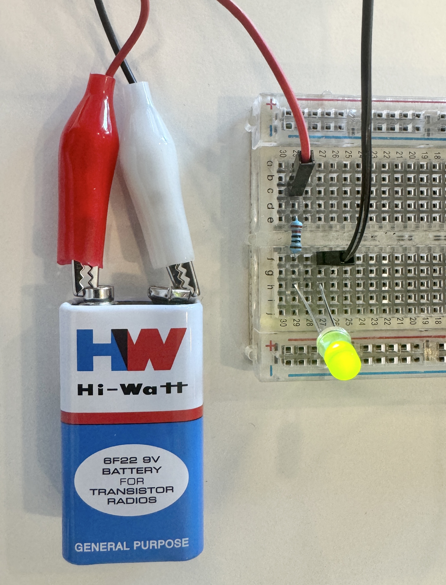
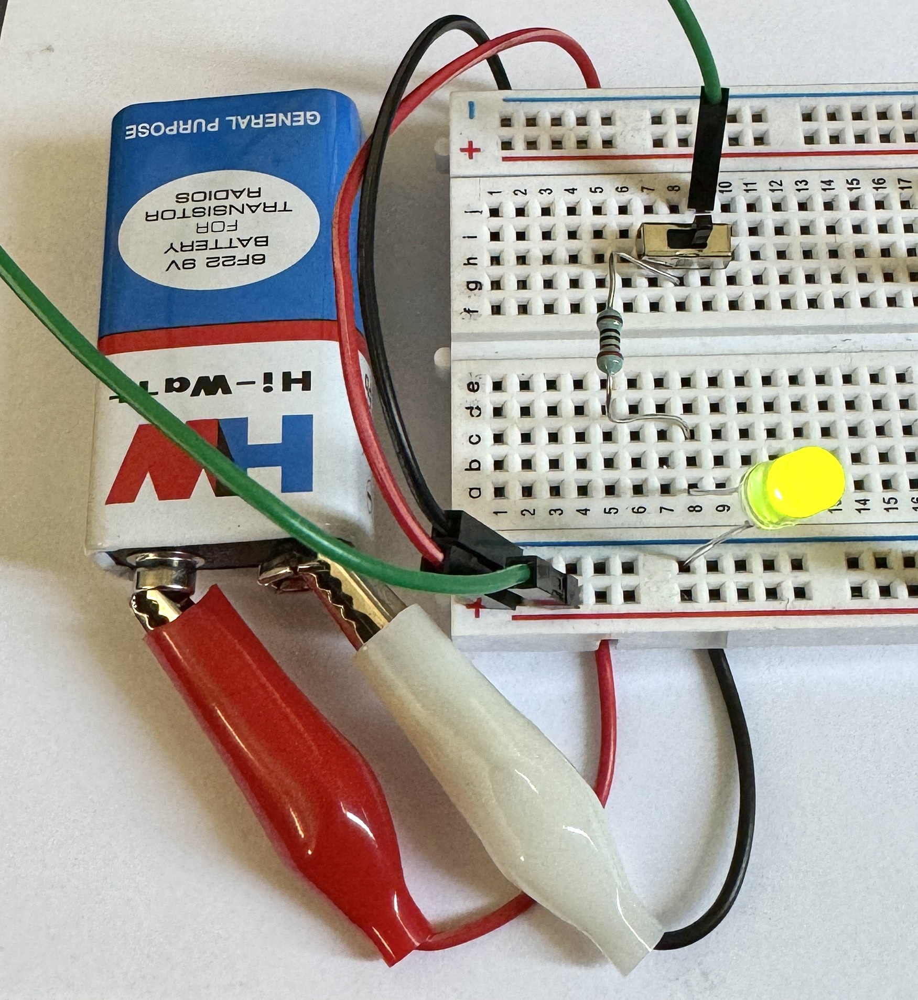

We are going to get started understanding digital systems, building up from some basic understanding of electronics.

The [Build Electronic Circuits](https://www.build-electronic-circuits.com) website has some great articles to help you get started with this.

- Start with the [Understanding Basic Electronics](https://www.build-electronic-circuits.com/basic-electronics/) page. This will give you a quick overview of electronic systems.
- Next read the page on [Basic Electronic Components Used in Circuits](https://www.build-electronic-circuits.com/basic-electronic-components/) followed by the [Identify Electronic Components (Quick Reference)](https://www.build-electronic-circuits.com/identify-electronic-components/). You want to be able to identify:
  - 9V Batteries and Alligator Clips
  - Breadboard
  - Breadboard wires
  - Light-Emitting Diode (LED)
  - Resistors
  - Push buttons, and
  - Transistor

:::note
Throughout the modules you will be using 220 ohm resistors and NPN transistors. Can you identify why we are using 220 ohm resistors?

Hint: Ohm's Law

:::

## First Circuit

:::tip[Activity]

With these basics in hand, you should now be ready to build your first electronic circuit - connecting a light.

:::

For this you will need:

- Battery
- Breadboard
- Jumper cables
- Alligator Clips
- Light-Emitting Diode (LED)
- Resistor

Connect the battery to the resistor, then to the LED, and back to the battery. The [Simple LED Circuit](https://circuitdigest.com/electronic-circuits/simplle-led-circuit-diagram) instructions on Circuit Digest can guide you through this. The end circuit should look similar to this:

## Second Circuit

To wrap up this module, let's add in a push button or switch to control when the light is active. The [Push Button LED Circuit](https://circuitdigest.com/electronic-circuits/push-button-led-circuit) will guide you through these steps. You can either use the push button or the switch provided.

