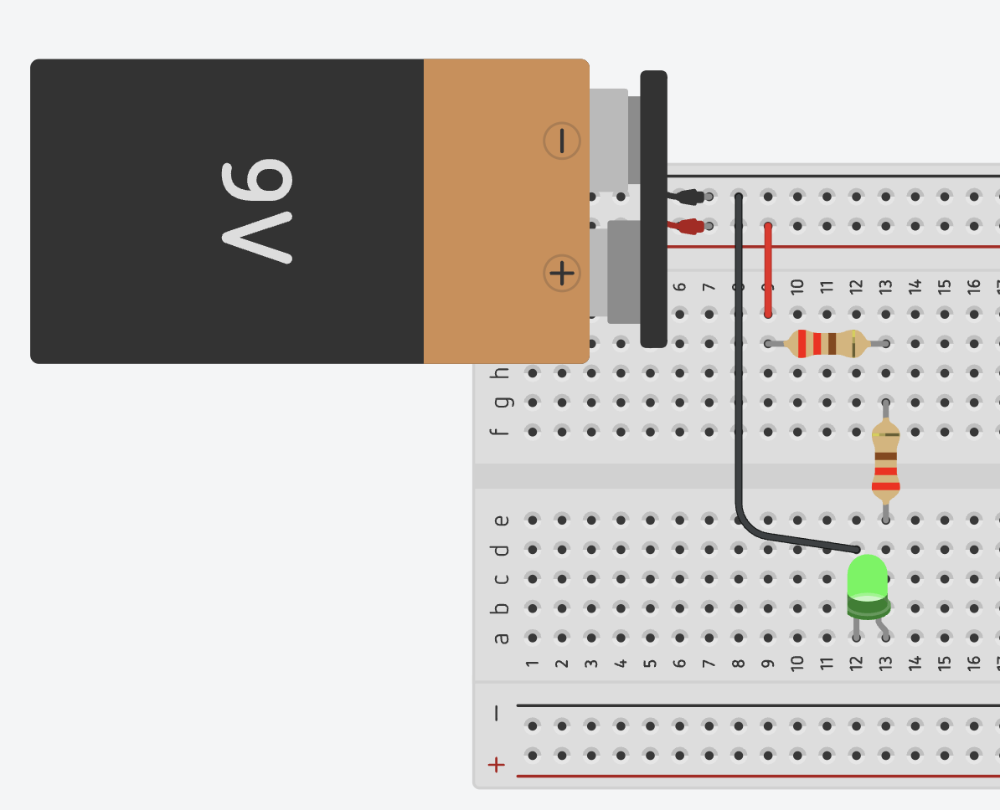
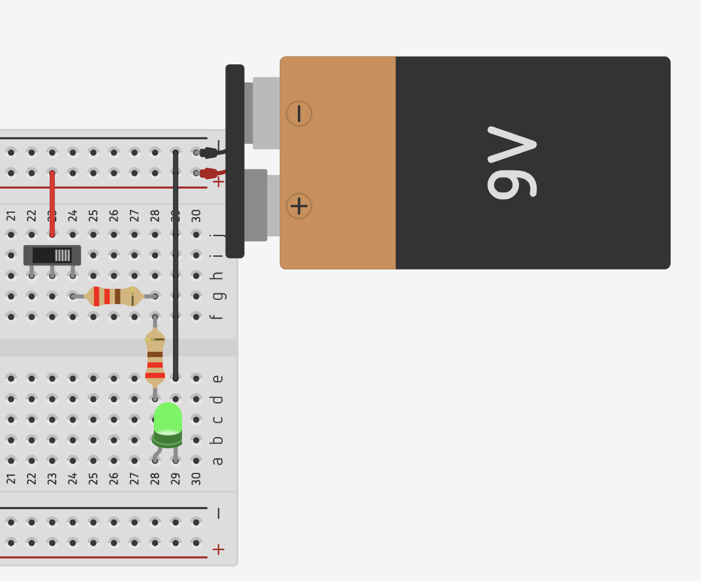

import { YouTube } from 'astro-embed';

Now that you are able to identify digital systems and their uses, we are going to explore how these digital systems are made and function.

Think about a robot as a digital system. Robots do not understand words like we do, they only understand 1s and 0s (on and off, like a light switch). Everything in a computer, phone, or even a game console is made up of tiny parts called electronic circuits that use these 1s and 0s to do maths, store information, and execute tasks.

Think of electronic components as the building blocks that make up a digital systems, similar to Lego bricks are used to build a Lego car. These components include tiny parts like transistors, resistors, and capacitors that control electricity. When these components are combined, they create circuits that can process signals (on/off, 1s and 0s). A digital system is made by combining many electronic circuits to perform a task.

First, we are going to look at the basics of electronics.

The [Build Electronic Circuits](https://www.build-electronic-circuits.com) website has some great articles to help you get started.

- Start with the [Understanding Basic Electronics](https://www.build-electronic-circuits.com/basic-electronics/) page, which will give you a quick overview of electronic systems.
- Next read the page on [Basic Electronic Components Used in Circuits](https://www.build-electronic-circuits.com/basic-electronic-components/) followed by the [Identify Electronic Components (Quick Reference)](https://www.build-electronic-circuits.com/identify-electronic-components/). You should be able to identify:
  - 9V Batteries and Alligator Clips
  - Breadboard
  - Breadboard wires
  - Light-Emitting Diode (LED)
  - Resistors
  - Push buttons
  - Transistor
- As you have already noticed, we will be using breadboards to build circuits. A breadboard is a simple tool for creating temporary electronic circuits. Read the page on [How To Use A Breadboard – The Beginner’s Guide](https://www.build-electronic-circuits.com/breadboard/) to understand how the breadboard works and how its lines are connected. 
  
- The basic operation of circuits and electronic devices relies on a stable power source (from a battery/ power supply) that supplies both voltage and current. Electronic components require a certain amount of voltage and current to operate properly. This means that sometimes we need to add some resistance to a circuit to ensure the correct voltage and current reach each electronic component. 
- 
- Ohm's law defines the relationship between current, voltage and resistance. If you didn't review Ohm's law in the[Understanding Basic Electronics](https://www.build-electronic-circuits.com/basic-electronics/) page, then watch the following video to understand the basics of Ohm's law.
  

  <YouTube id="HsLLq6Rm5tU" params="fs=1&modestbranding=1&rel=0&autoplay=1"/>

:::note
The provided electronics kit includes 220 ohm resistors and NPN transistors. 220 ohm resistors are widely used in LED projects and when working with household batteries. Can you identify why?

Hint: [Ohm's Law](https://www.build-electronic-circuits.com/ohms-law/)
:::

## Simple Circuit

:::tip[Activity: Your first circuit]

With these basics in hand, you should now be ready to build your first electronic circuit - connecting a light.

For this you will need:

- Battery
- Breadboard
- Jumper cables
- Alligator Clips
- Light-Emitting Diode (LED)
- Resistor

Connect the battery to the resistor, then to the LED, and back to the battery. The [Simple LED Circuit](https://circuitdigest.com/electronic-circuits/simplle-led-circuit-diagram) instructions on Circuit Digest can guide you through this. The final circuit should look similar to this:

:::

## Controlled Circuit

:::tip[Activity]

Now, let's add in a push button or switch to control when the light is active. The [Push Button LED Circuit](https://circuitdigest.com/electronic-circuits/push-button-led-circuit) will guide you through these steps. You can either use the push button or the switch provided.

:::
