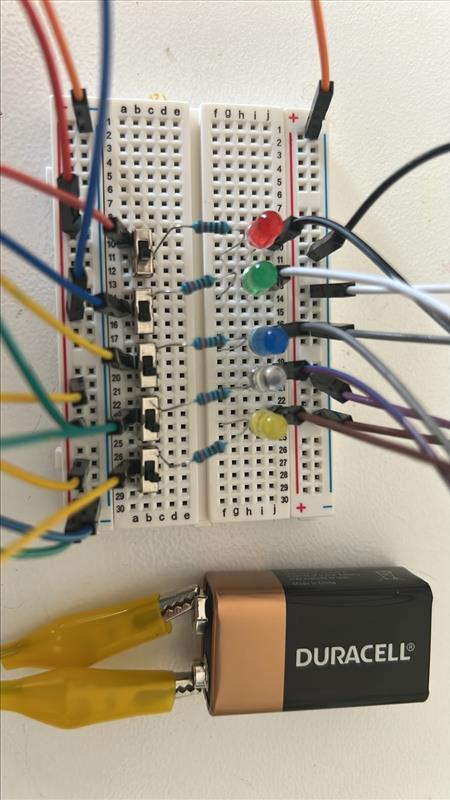

The fundamental concept of computing is using electronic circuits to represent and process information. By developing a method to represent information, we have enabled the creation of machines that can process and utilise it. To get to digital systems, we need a way of representing information in data that electronics can understand or represent.

How does this happen?

## Thinking about Current

The LED circuit with the button is a great starting point for thinking about this. The button circuit is great for demonstrating that electronic components behave differently depending on the presence or absence of current.

Think of the LED. When there is current, the LED is on. When there is no current, the LED if off.

Can this behaviour be used somehow to create information?

## Understanding Binary Systems

The fundamental concept behind communication between computers using binary is simple:

Electric current can represent two states:

- "ON" (1)
- "OFF" (0)

:::note
In a 5V system such as Raspberry Pi (RPi) or modern computers:

- 3.5V-5V = logical "1"
- 0V-1.5V = logical "0"
- 1.5V-3.5V = undefined (avoided in normal operation)

  :::

The binary number system is key to digital communication. It uses only two digits: 0 and 1. These can be combined to represent any number. By _thinking_ of the presence of current as 1 and the absence of current as 0, we have the basis for creating a system that can represent information.

**This is the foundation of all digital systems!**

Digital systems only understand 1s and 0s.

:::note
Read about the [Binary Number System](https://www.mathsisfun.com/binary-number-system.html) on Maths is Fun to familiarise yourself with the binary number system.

Watch [How Computers Work: Binary & Data](https://www.youtube.com/watch?v=USCBCmwMCDA&ab_channel=Code.org) from Code.org to understand how computers and binary work together.
:::

The next step is to explore how to use these binary concepts to represent various types of information. We will start by looking at common ways of representing binary in shorter formats, and then using learn how to use binary to represent text. These ideas extended to represent other types of data, like colours, images, sounds, and more.

## A 5-bit Visualization

:::tip[Activity: A 5-bit visualizer]

In computing a single binary digit is called a bit. So, let's create a simple 5-bit visualization using the electronics we reviewed in the last page. Connect up to 5 LEDs to switches so that you can turn each LED on or off individually. You can then use this to visualise binary values by thinking of each LED as a binary digit. When the LED is on, then the digit is 1, when it is off, then the digit is a 0.

### Required Materials

For the activity in this module, you will need:

- Breadboard
- Jumper wires
- 5 LEDs (any colour)
- 5 Resistors (220 ohms for each LED)
- 9V battery with battery clip (preferred)/ 5V power supply
- 5 Push-button switches

### Resources

- [ASCII Table](https://www.ascii-code.com/)
- [ASCII To BINARY converter](https://www.rapidtables.com/convert/number/ascii-to-binary.html)

### Steps

1. Connect 5 LEDs in parallel rows on the breadboard, each with a resistor in series
2. Use jumper wires to connect each LED to the power supply via separate inputs (push buttons)
3. Leave the negative ends of the LEDs connected to the ground
4. Manually turn each LED ON/OFF to verify the connections

You can use the 9V battery provided to setup the power. Your circuit should look like this:

### Understanding Bit Positions

Binary numbers are essential in computer science and digital electronics because they can be easily represented and processed in electronic circuits. As you have noticed already, The binary number system is a base-2 numerical system that consists of only two symbols: 0 and 1.
Each LED in your circuit represents a specific bit position:

- LED1 (rightmost) = 2^0 = 1
- LED2 = 2^1 = 2
- LED3 = 2^2 = 4
- LED4 = 2^3 = 8
- LED5 (leftmost) = 2^4 = 16

### Binary Number Examples

Lighting LEDs in specific patterns represents different binary numbers:

- 0 0 0 0 1 = 1

  Working => 16 X 0 + 8 X 0 + 4 X 0 + 2 X 0 + 1 X 1 = 0 + 0 + 0 + 0 + 1 = 1

- 00011 = 3

  Working => 16 X 0 + 8 X 0 + 4 X 0 + 2 X 1 + 1 X 1 = 0 + 0 + 0 + 2 + 1 = 3

- 10101 = 21

  Working => 16 X 1 + 8 X 0 + 4 X 1 + 2 X 0 + 1 X 1 = 16 + 0 + 4 + 0 + 1 = 21

**Activity:** Take turns in groups to send and decode values. Use some values from the [Binary Number System](https://www.mathsisfun.com/binary-number-system.html) page.

:::note
Remember to always verify your connections before applying power to the circuit. Double-check your resistor values to protect your LEDs from damage.
:::

:::

:::note

In this activity you may encounter an interesting issue: determining which light represents the first digit. This is also an issue in computing known as [endianness](https://www.techtarget.com/searchnetworking/definition/big-endian-and-little-endian#:~:text=The%20term%20endianness%20describes%20the,to%20the%20value%20stored%20first.). There is no right or wrong way to read these values, the key is to agree on an order before you begin. 

:::

Now that we have a way of representing numbers using binary digits, let's consider how to use this system to represent other types of information.
