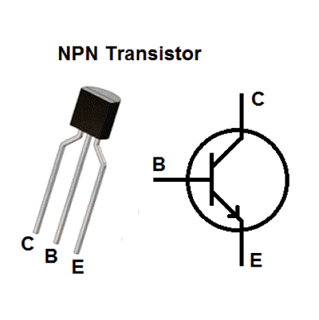
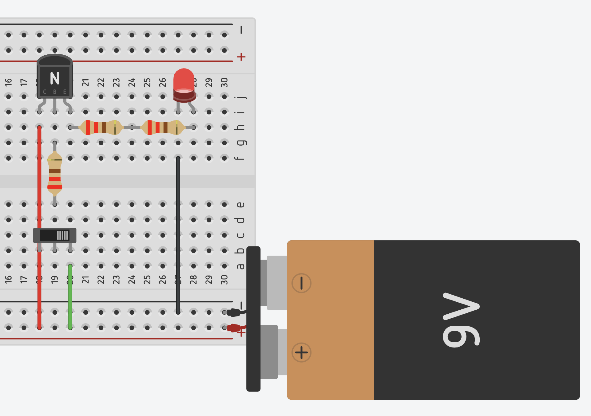

import { YouTube } from 'astro-embed';

In the previous Chapter, we saw that circuits relied on manual switches to control the flow of electricity. When you turned on a LED, you had to physically press a switch to complete the circuit. However, modern digital systems, from computers to smartphones, require switching at speeds far beyond human capability.

This is where transistors come in. A transistor acts as an electronic switch, allowing current to flow when a small voltage is applied to its control terminal. By replacing manual switches with transistors, we can automate the control of current, enabling the creation of logic circuits, processors, and entire digital systems. In addition to their switching function, transistors can also amplify signals. Understanding transistors is the key to unlocking how computers think, process information, and make decisions without human intervention.

## Basic Transistor Structure

Watch the following video to learn about how transistors work, their basic functions, and the different types of transistors.

  <YouTube id='J4oO7PT_nzQ' params='fs=1&modestbranding=1&rel=0&autoplay=1' />

As explained in the above video, a transistor has three essential parts, to build your own circuits with transistors, you need to understand these. The three parts of the transistor are:

1. Base (Controls the switch)

   - Acts as the control terminal
   - Regulates current flow
   - Creates amplification effect

2. Collector

   - Receives incoming current
   - Collects majority carriers
   - Connects to power supply in amplifier circuits

3. Emitter
   - Outputs current flow
   - Releases majority carriers
   - Tipically connected to ground

:::note
Think of a transistor like a water valve: just a small amount of water (base current) can control a much larger flow (collector-emitter current), a transistor regulates electrical current.

**We are using NPN transistors in our activities. This means the current flows from Collector to the Emitter.**

:::

:::tip[Activity: Building Your First Transistor Circuit]
In digital electronics, transistors are fundamental components that can act as electronic switches. This is particularly important as these switches can be controlled electronically without the need for physical intervention. Let's create a simple transistor circuit to understand this concept.

#### Required Materials

For building this transistor circuit, you will need:
* Breadboard
* Jumper wires
* NPN Transistor
* LED
* Resistors (3 x 220Ω)
* 9V battery with alligator clips
* Push-button or slide switch

#### Circuit Construction

1. Place the NPN transistor on the breadboard, ensuring proper orientation (C-B-E pins).
2. Connect the power rail (marked with red line) to the positive terminal of the battery.
3. Install current-limiting resistors to protect both the LED and transistor.
4. Connect the LED with correct polarity.
5. Add the ground connections to complete the circuit.

Your circuit should look similar to this:

#### How It Works
The LED should be off by default. The transistor in this circuit operates as follows:
* When voltage is applied to the base (B) pin through a resistor, current flows from collector (C) to emitter (E). This turns the LED on.
* Note that without base voltage, the transistor stops conducting, and the LED remains off.

:::

:::note
Even when "off", transistors have a tiny leakage current, typically in the nanoampere (nA) range. While usually negligible, this becomes important in:

- Low power designs
- High precision measurements
- Battery-operated devices
- High temperature applications
  :::
