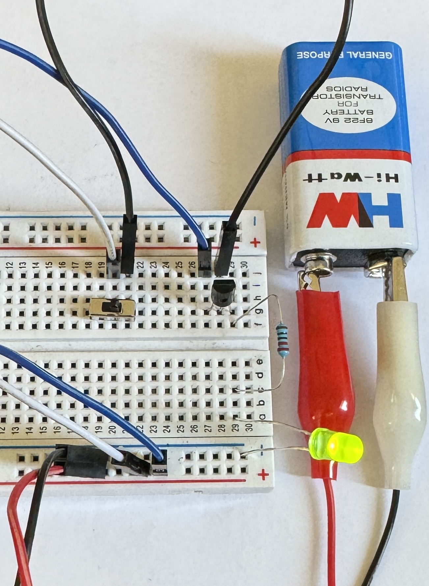

import { YouTube } from 'astro-embed';

In the previous Chapter, we saw that circuits relied on manual switches to control the flow of electricity. When you turned on a LED, you had to physically press a switch to complete the circuit. However, modern digital systems, from computers to smartphones, require switching at speeds far beyond human capability.

This is where transistors come in. A transistor acts as an electronic switch, allowing current to flow when a small voltage is applied to its control terminal. By replacing manual switches with transistors, we can automate the control of current, enabling the creation of logic circuits, processors, and entire digital systems. In addition to their switching function, transistors can also amplify signals. Understanding transistors is the key to unlocking how computers think, process information, and make decisions without human intervention.

## Basic Transistor Structure

Watch the following video to learn about how transistors work, their basic functions, and the different types of transistors.

  <YouTube id='J4oO7PT_nzQ' params='fs=1&modestbranding=1&rel=0&autoplay=1' />

As explained in the above video, a transistor has three essential parts, to build your own circuits with transistors, you need to understand these. The three parts of the transistor are:

1. Base (Controls the switch)

   - Acts as the control terminal
   - Regulates current flow
   - Creates amplification effect

2. Collector

   - Receives incoming current
   - Collects majority carriers
   - Connects to power supply in amplifier circuits

3. Emitter
   - Outputs current flow
   - Releases majority carriers
   - Tipically connected to ground

:::Note
Think of a transistor like a water valve: just a small amount of water (base current) can control a much larger flow (collector-emitter current), a transistor regulates electrical current.
:::

:::tip[Activity: Building Your First Transistor Circuit]

1. Connect the LED and resistor to the collector and power supply.
2. Connect the base of the transistor to a manual switch (You can use a high resistance resistor for base to limit the current that flows through the base).
3. Observe how a small base current controls the LED.

Your circuit should look similar to this:

The LED should be off by default. When the switch is turned on, the LED should turn on.

:::

:::note
Even when "off", transistors have a tiny leakage current, typically in the nanoampere (nA) range. While usually negligible, this becomes important in:

- Low power designs
- High precision measurements
- Battery-operated devices
- High temperature applications
  :::
