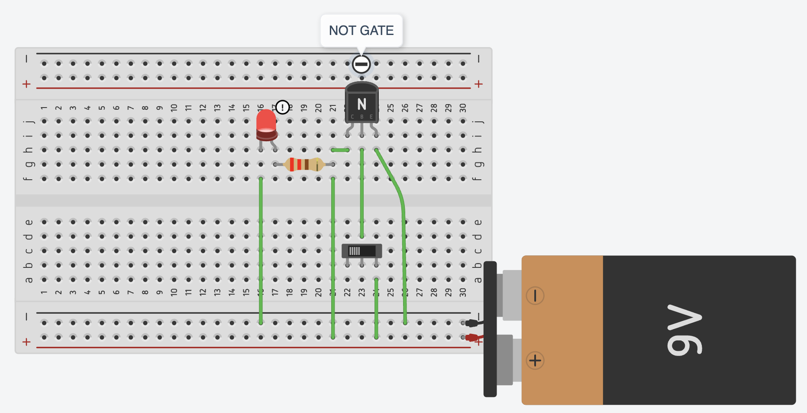

import { YouTube } from 'astro-embed';

In Chapter I, you built a simple circuit using a manual switch to turn an LED on and off. Later, you replaced the switch with a transistor to control the LED instead of a physical press. This was the first step toward automation, using signals, instead of physical actions, to determine how circuits behave. But what if we want to build something more complex than just turning an LED on or off?

Imagine you have two switches instead of one, and you want to set up a rule where the LED only turns on if both switches (Switch 1 **and** Switch 2) are pressed at the same time. This requires a circuit capable of making a logical decision. In digital electronics this is exactly what an AND gate does. Instead of manual switches, transistors control the flow of electricity, creating a simple logic circuit.

By combining multiple transistors in different ways, we can create logic gates—the basic decision-makers of every digital system. Logic gates form the foundation of processors, memory, and automation, enabling everything from simple calculations to complex AI algorithms. Just as letters form words and words create sentences, transistors form logic gates, and logic gates build the circuits that make up computers.

Watch the following video to explore how computers use circuits and how logic gates are used to perform complex tasks.

  <YouTube id='ZoqMiFKspAA' params='fs=1&modestbranding=1&rel=0&autoplay=1' />

There are different types of logic gates that can be used to perform different functions. The output of a logic gate depends on the input it receives. The digital logic that is implemented by these logic gates (Boolean circuits) is also called **combinational logic** as the output is dependant on the input. To list all the possible combinations of inputs and their corresponding outputs, we use a simple table called **Truth Table**.
The truth table explains how the output changes with different input logic level combinations.

Watch the following video to learn about different types of logic gates and their truth tables.

  <YouTube id='INEtYZqtjTo' params='fs=1&modestbranding=1&rel=0&autoplay=1' />

:::tip[Activity: Building a Simple NOT Logic Gate]

In this activity, you are building a simple NOT Gate (Inverter) with a transistor to understand its behaviour.

Required components:

- 1 NPN transistor
- 1 LED
- 2 Resistors
- 1 Push-button or switch

**Setup the circuit as shown below. A tinkercad circuit diagram is provided to help you easily replicate it.**

**Discuss:**

When the input is HIGH (button pressed/ switch turned on), why does the LED turn OFF? How does this relate to the NOT gate's truth table?
:::

:::tip[Activity: Building an OR Gate]

In this activity, you are building a simple OR Gate with two transistors to understand its behaviour.

Required components:

- 2 NPN transistors
- 1 LED
- 3 Resistors
- 2 Push-button switches

**Setup the circuit as shown below. A tinkercad circuit diagram is provided to help you easily replicate it.**

**Discuss:**

What does the OR gate do? How does its truth table coincide with its functioning? Where can we use a OR gate?

:::

:::note[Think about this]
How can we build the AND, NOR, and XOR gates? Identify the requirements for these gates, their truth tables and how can we achieve this using groups of transistors.
:::
