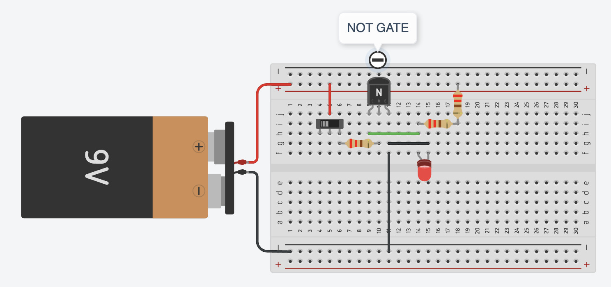
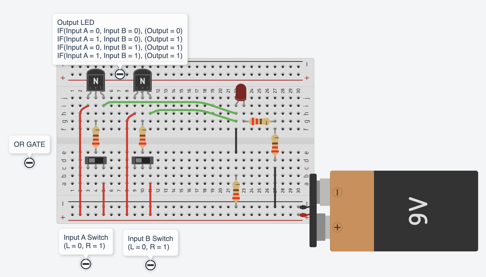
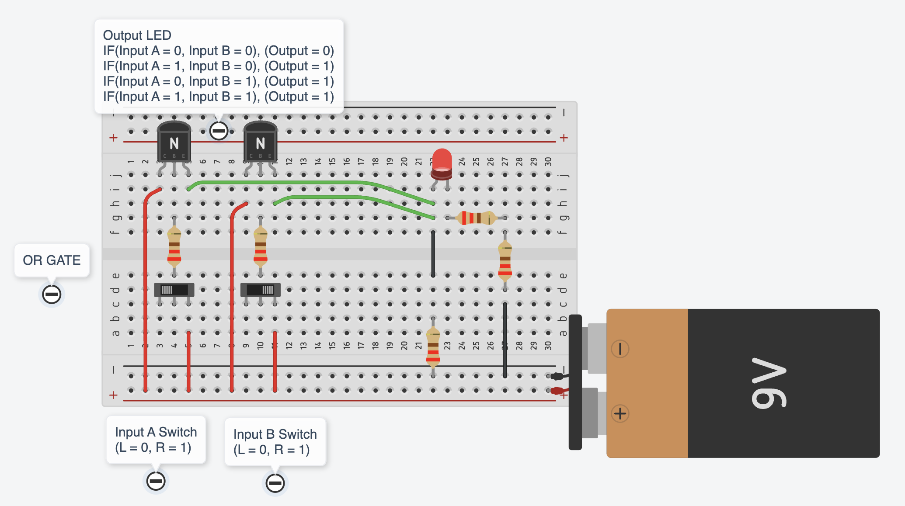
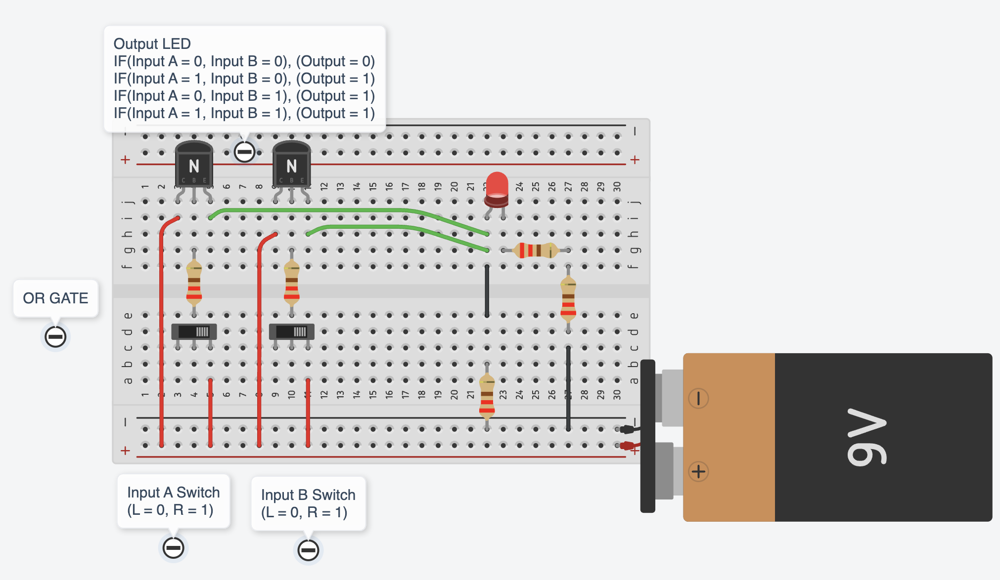

import { YouTube } from 'astro-embed';

In Chapter I, you built a simple circuit using a manual switch to turn an LED on and off. Later, you replaced the switch with a transistor to control the LED instead of a physical press. This was the first step toward automation, using signals, instead of physical actions, to determine how circuits behave. But what if we want to build something more complex than just turning an LED on or off?

Imagine you have two switches instead of one, and you want to set up a rule where the LED only turns on if both switches (Switch 1 **and** Switch 2) are pressed at the same time. This requires a circuit capable of making a logical decision. In digital electronics this is exactly what an AND gate does. Instead of manual switches, transistors control the flow of electricity, creating a simple logic circuit.

By combining multiple transistors in different ways, we can create logic gates—the basic decision-makers of every digital system. Logic gates form the foundation of processors, memory, and automation, enabling everything from simple calculations to complex AI algorithms. Just as letters form words and words create sentences, transistors form logic gates, and logic gates build the circuits that make up computers.

Watch the following video to explore how computers use circuits and how logic gates are used to perform complex tasks.

  <YouTube id='ZoqMiFKspAA' params='fs=1&modestbranding=1&rel=0&autoplay=1' />

There are different types of logic gates that can be used to perform different functions. The output of a logic gate depends on the input it receives. The digital logic that is implemented by these logic gates (Boolean circuits) is also called **combinational logic** as the output is dependant on the input. To list all the possible combinations of inputs and their corresponding outputs, we use a simple table called **Truth Table**.
The truth table explains how the output changes with different input logic level combinations.

Watch the following video to learn about different types of logic gates and their truth tables.

  <YouTube id='INEtYZqtjTo' params='fs=1&modestbranding=1&rel=0&autoplay=1' />

:::tip[Activity: Building a NOT Logic Gate]

A NOT gate, also known as an inverter, is one of the fundamental logic gates in digital electronics. It performs a basic but crucial function: inverting an input signal to produce its opposite output.

#### What is a NOT Gate?

A NOT gate performs logical inversion:

- When the input is HIGH (1), the output is LOW (0)
- When the input is LOW (0), the output is HIGH (1)

#### Required Materials

To build this NOT gate circuit, you'll need:

- Breadboard
- NPN Transistor
- LED
- Resistors (3 x 220 ohm)
- 9V battery with alligatorclip
- Jumper wires

#### Circuit Construction

1. Set up the power rails on the breadboard (red line for positive, black for ground).
2. Place the NPN transistor, ensuring correct C-B-E pin orientation.
3. Connect the collector through a resistor to the positive power supply. Collector should also connect to the positive end of the LED.
4. Add the input resistor to the transistor's base.
5. Complete ground connections as shown in the image to the emitter and the negative end of the LED.

**A tinkercad circuit diagram is provided to help you easily replicate it. Test the circuit by sliding the switch on and off.**

**Discuss:**

- When the input is HIGH (switch turned on), why does the LED turn OFF?

- How does this relate to the NOT gate's truth table?
:::

:::tip[Activity: Building an OR Logic Gate]

An OR gate is a digital logic gate that implements logical disjunction. In this activity, you are building a simple OR Gate with two transistors to understand its behaviour.

#### What is an OR Gate?

An OR gate performs the following logical operation:
* Outputs HIGH (1) if any input is HIGH (1)
* Outputs LOW (0) only when all inputs are LOW (0)
* Used extensively in digital circuits for decision making

## Required Materials

To build this OR gate circuit, you'll need:
* Breadboard
* 2 NPN Transistors
* LED for output indication
* Resistors (4 x 220 ohms)
* 2 Switches for inputs A and B
* 9V battery with alligator clip
* Jumper wires

#### Circuit Construction Steps

1. Set up the power rails (red line for positive, black for ground)
2. Place both NPN transistors on the breadboard
3. Connect Input A switch to the first transistor
4. Connect Input B switch to the second transistor
5. Wire the collectors to the positive power supply.
5. Connect the emitters to the positive end of the LED.
6. Add a 2 x 220 ohm resistor connection to the ground from the negative end of the LED.
7. Add input resistors to protect the transistor bases.
8. Connect the positive end of the LED to ground through a resistor as well.

**Setup the circuit as shown below. A tinkercad circuit diagram with different scenarios is provided to help you easily replicate it.**

**Discuss:**

* What does the OR gate do? 
* How does its truth table coincide with its functioning? 
* Where can we use a OR gate?

:::

:::note[Think about this]
How can we build the AND, NOR, and XOR gates? Identify the requirements for these gates, their truth tables and how can we achieve this using groups of transistors.
:::
