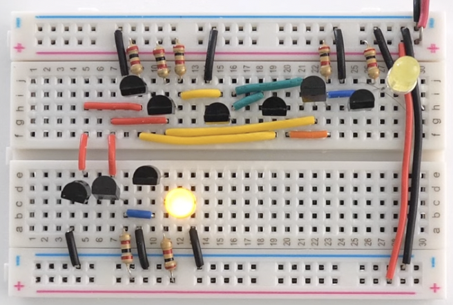
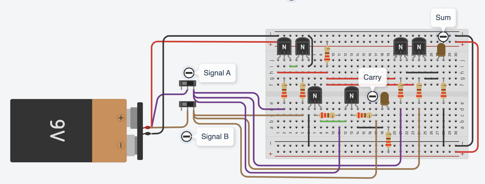
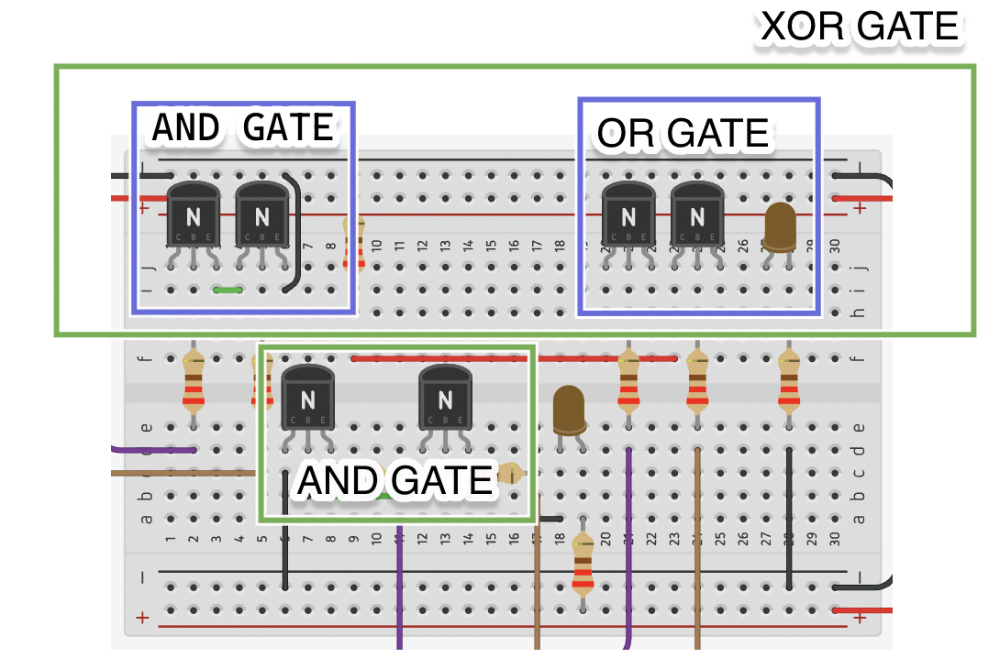
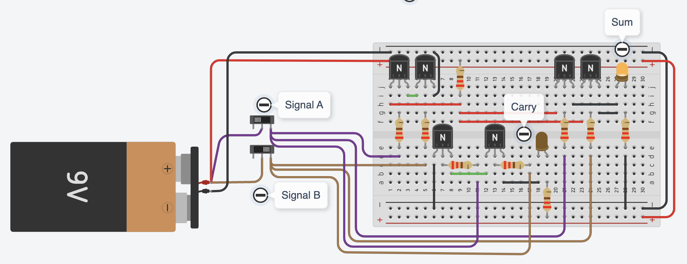
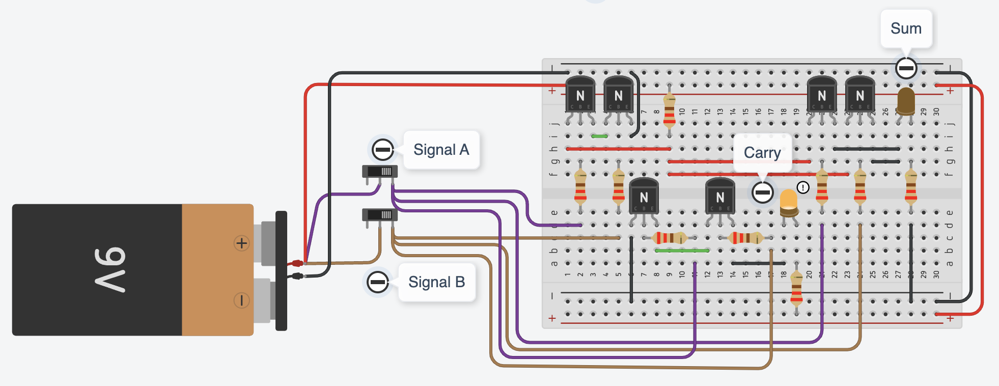
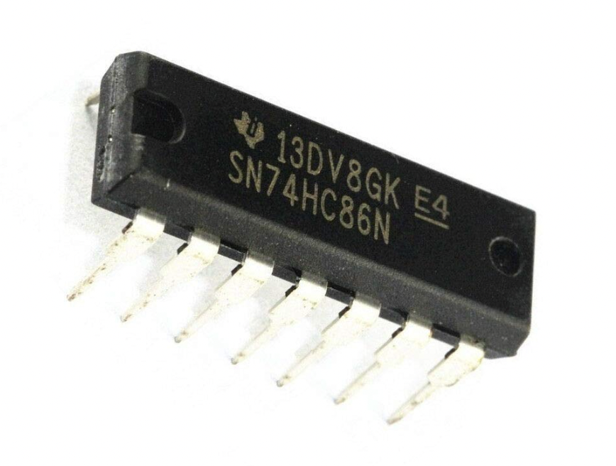
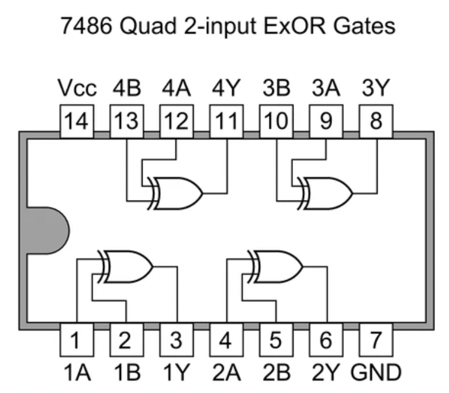

Now that we understand logic gates, we can start combining them to build more powerful circuits. A single AND, OR, or NOT gate can make simple decisions, but real-world computing requires multiple gates working together to process and manipulate data. This is where we need to combine multiple logic gates in one circuit to perform complex operations.

One of the simple circuits that uses multiple logic gates to perform a simple arithmetic operation is called the half adder. This circuit provides a fundamental step toward building a computer’s ability to perform calculations. Next, we are going to explore this circuit.

Imagine you want to add two binary numbers, 0 + 1 or 1 + 1. A half adder is a simple circuit that uses an XOR gate and an AND gate to calculate the sum and carry-over, just like how we carry numbers when adding in decimal. This is the foundation of arithmetic in computers. When we combine multiple adders, we can create a full adder, which then scales up to an ALU (Arithmetic Logic Unit)—a core part of the computer’s processor.

Read the page on [Half Adder Circuit – How it Works](https://www.build-electronic-circuits.com/half-adder/) for more details on the half-adder circuit before the next activity.

:::tip[Activity: Building a Half-Adder]

In this activity you will build a half adder circuit which adds two binary bits (A and B) to produce a Sum and Carry.

Truth Table:

```
A  B  Sum  Carry
0  0   0     0
0  1   1     0
1  0   1     0
1  1   0     1
```

Note:

The half-adder combines **XOR gate** for Sum output and **AND gate** for Carry output

Building Steps:

1. Build XOR gate using combination of basic gates
2. Build AND gate for Carry
3. Connect inputs A and B via pushbuttons
4. Use LEDs to display Sum and Carry
5. Test all input combinations

Your half-adder circuit should look like this:



**Developing the circuit one step at a time will help improve your understanding. A tinkercad circuit diagram along with different sub-gates that make up a half-adder circuit is provided below.**



The half adder is built using a **XOR gate** and a **AND gate**. You can build a **XOR gate** directly using minimum 6 transistors for output but we will be further dividing it into the basic logic gates discussed previously. An **XOR gate** can be built using an **AND gate** and **OR gate**. The **XOR gate** is used to calculate the **sum** and the extra **AND gate** is used to calculate the **carry**.


Below are the few scenarios and the expected outputs when you vary the signals. **Think about how these compare to the truth table provided above**





:::

Fantastic, now we know how computers add two binary numbers. But computers don’t just add numbers. The computers store and process data, make decisions, and execute instructions. To handle these tasks efficiently, we group logic circuits together on a single chip—an integrated circuit (IC). A single chip can contain millions or even billions of transistors working together, enabling everything from simple memory storage to powerful processors that run our modern devices.

:::note[Did you know?]

<div style='display: flex; gap: 10px;'>
  <div style='width: 300px'></div>
  <div style='width: 300px'></div>
</div>

There are many ICs developed that specialize in performing certain tasks. For example, the 7846 (also known as 74LS86 or 74HC86) is a quadruple 2-input XOR gate integrated circuit. This means it contains **4 XOR gates** internally. This IC is commonly used in Digital comparators (for comparing two binary numbers). Assuming each **XOR gate** is built from **6-10** transistors, this one single IC contains around **24-40** transistors.
:::
:::tip[Exercise: Thinking beyond]

If a single logic gate can make a simple decision, how do millions of gates working together in a chip enable a computer to run complex applications like video games, AI, or even self-driving cars?

:::
