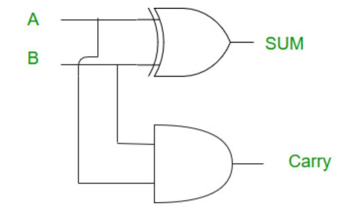
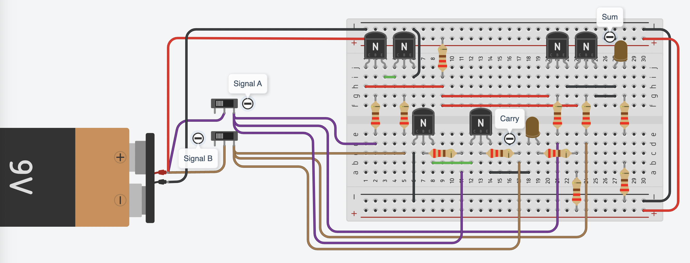
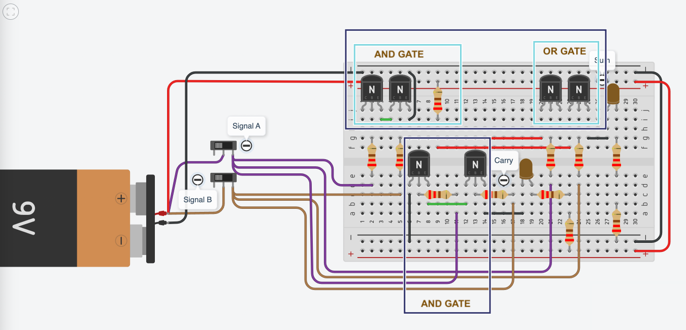
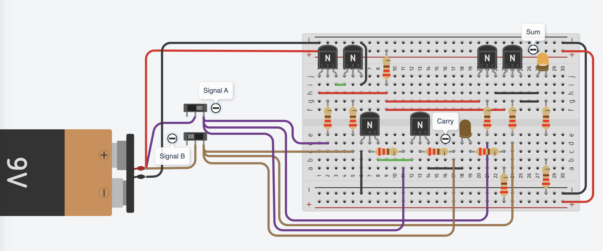
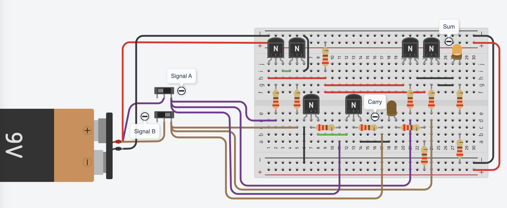
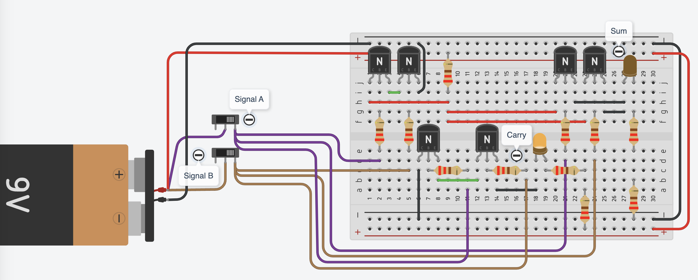
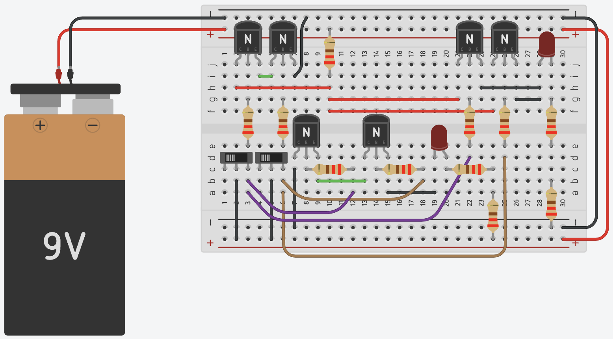

import { YouTube } from 'astro-embed';

Now that we know what logic gates are and how they work, we can start combining them to build more powerful circuits. A single AND, OR, or NOT gate can make simple decisions, but real-world computing requires multiple gates working together to process and manipulate data. To perform complex operations, we need to combine multiple logic gates within a single circuit.

One of the simplest circuits that use multiple logic gates to perform a simple arithmetic operation is the half adder. This circuit is a fundamental step toward enabling computers to perform calculations. Next, we will explore it works.

Imagine you want to add two binary numbers, 0 + 1 or 1 + 1. A half adder is a simple circuit that uses an XOR gate and an AND gate to calculate the sum and carry-over, just like how carrying numbers when adding in decimal. This forms the foundation of arithmetic in computers. By combining multiple adders, we can create a full adder, which then scales up to an Arithmetic Logic Unit (ALU)—a core component of the computer’s processor.

Read the page on [Half Adder Circuit – How it Works](https://www.build-electronic-circuits.com/half-adder/) for more details on the half-adder circuit before proceeding to the next activity.

To learn more about adding binary numbers, watch the following video.

<div class='not-content'>
  <YouTube id='RgklPQ8rbkg' params='fs=1&modestbranding=1&rel=0&autoplay=1' />
</div>

:::note
Remember to always use current-limiting resistors with LEDs and base resistors for transistor protection.
:::

:::tip[Activity: Building a Half-Adder]

A Half Adder is a fundamental digital circuit that performs binary addition. Let's break down its construction and operation in detail.

#### Understanding the Half Adder

A Half Adder performs binary addition of two single bits (A and B), producing:

- Sum output (result of adding bits)
- Carry output (overflow when both inputs are 1)

#### Truth Table

```text
A  B  Sum  Carry
0  0   0     0
0  1   1     0
1  0   1     0
1  1   0     1
```

#### Circuit Components

The Half Adder consists of two main logic gates:

- **XOR gate** - Generates the Sum output
- **AND gate** - Generates the Carry output

#### Required Materials

- Breadboard
- 6 NPN Transistors
- 2 LEDs (Sum and Carry)
- Multiple 220 ohm Resistors
- 2 Push slide switches for inputs
- 9V battery with alligator clip
- Jumper wires (various colors)

#### Detailed Construction Steps

##### 1. Building the XOR Gate for Sum

- XOR can be constructed using basic gates
- Requires combination of AND and OR gates
- Output is 1 when inputs are different
- Output is 0 when inputs are same

##### 2. Building the AND Gate for Carry

- Simpler construction than XOR
- Uses two transistors in series
- Output is 1 only when both inputs are 1
- Determines when number carries over

##### 3. Input Setup

- Connect slide switches for inputs A and B
- Connect both the inputs to all the 3 logic gates (2 x AND gates and a OR gate)
- Connect to power rail and ground through current-limiting resistors

##### 4. Output Display

- Connect LEDs with appropriate current-limiting resistors
- Sum LED shows result of XOR operation
- Carry LED shows result of AND operation

**Developing the circuit one step at a time will help improve your understanding. A Tinkercad circuit diagram along with different sub-gates that make up a half-adder circuit is presented below. The logical implementation of Half adder is also shown in the below diagram.**





The half adder is built using a **XOR gate** and an **AND gate**. While a **XOR gate** can be built directly using minimum 6 transistors, we will instead break it down into the basic logic gates discussed earlier. An **XOR gate** can be built using a combination of **AND gate** and **OR gate**. In the half-adder, the **XOR gate** calculates the **sum**, while the additional **AND gate** determines the **carry**.


#### Testing Scenarios

Below are a few scenarios and their expected outputs when you vary the signals. **Consider how these compare to the truth table provided above**

#### Scenario 1: Only Signal A Active



- Input A = 1, Input B = 0
- Expected outputs:
  - Sum = 1 (XOR output)
  - Carry = 0 (AND output)

#### Scenario 2: Only Signal B Active



- Input A = 0, Input B = 1
- Expected outputs:
  - Sum = 1 (XOR output)
  - Carry = 0 (AND output)

#### Scenario 3: Both Signals Active



- Input A = 1, Input B = 1
- Expected outputs:
  - Sum = 0 (XOR output)
  - Carry = 1 (AND output)

:::

:::note

The above Half-Adder has switches off the board. This is an adjusted version that will be easier to build.



:::

Fantastic! Now we know how computers add two binary numbers. But computers do much more than additions, they store and process data, make decisions, and execute instructions. To handle these tasks efficiently, logic circuits are grouped together on a single chip, known as an integrated circuit (IC). A single chip can contain millions or even billions of transistors working together, powering everything from simple memory storage to the advanced processors that run our modern devices.

:::note[Did you know?]

<div style='display: flex; gap: 10px;'>
  <div style='width: 300px'></div>
  <div style='width: 300px'></div>
</div>

There are ICs that specialize in performing specific tasks. For example, the 7846 (also known as 74LS86 or 74HC86) is a quadruple 2-input XOR gate integrated circuit. This means it contains **4 XOR gates** internally. This IC is commonly used in digital comparators (for comparing two binary numbers). Assuming each **XOR gate** is built from **6-10** transistors, this single IC contains around **24-40** transistors.
:::

:::note[Exercise: Thinking beyond]

If a single logic gate can make a simple decision, how do millions of gates working together in a chip power complex applications like video games, AI, or even self-driving cars?

:::
