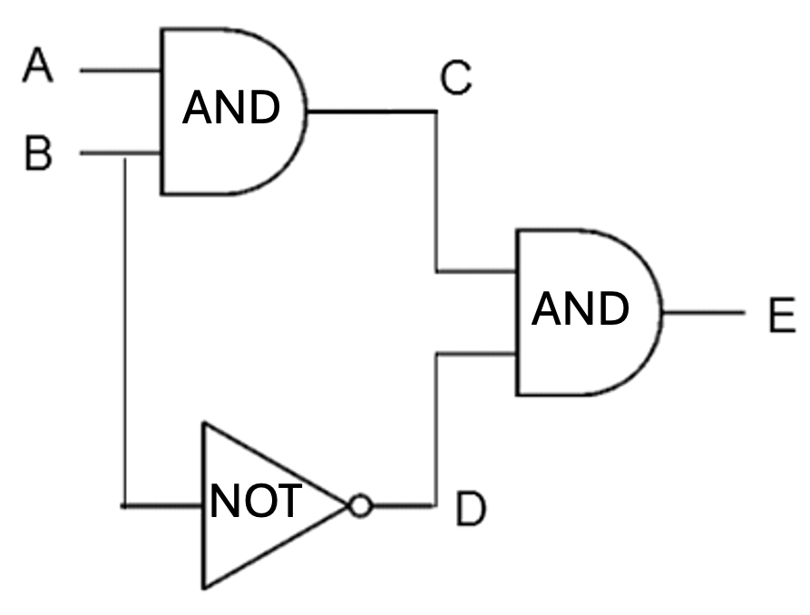

Before the complex circuits are build and tested, they are designed in a simulation environment. One simple platform used to simulate circuits is Tinkercad. You can access this simulation tool via [Tinkercad](https://www.tinkercad.com/circuits) to explore how to create and test circuits.

**Check whether you can build a simple circuit in Tinkercad.**

:::note[Advanced Projects]
For additional challenge:

- Build a full adder
- Create a simple calculator
- Build a simple latch circuit (memory circuit) using transistors

:::
Let's try to refresh our memory on Logic Gates by completing the following activity. 

:::tip[Activity: Logic Gates Review]

Answer the following questions.

- Why do we need different logic gates?
- Can you write a truth table of XOR logic gate which provides exclusive OR operation (output is true if and only if the inputs differ)?
- Can you write the truth table for the following combination of logic gates?
  

:::