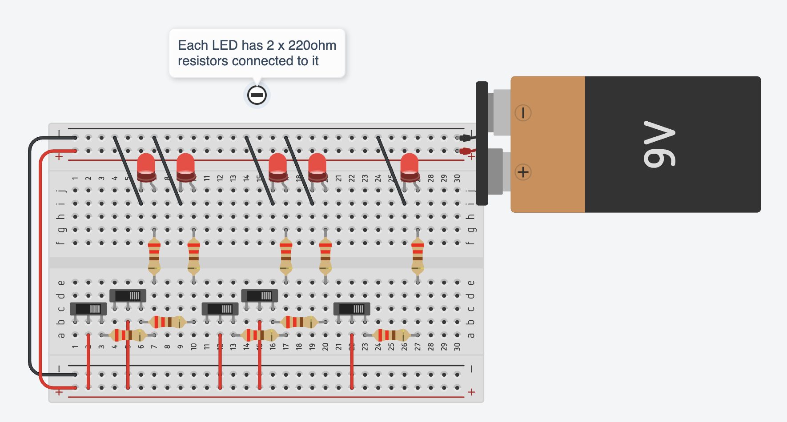

Consider these questions:

- How could we extend this to a full adder?
- How do millions of transistors form integrated circuits?
- What real-world devices use these principles?
- What else could we build with transistors and logic gates?

:::tip[Advanced Projects]
For additional challenge:

- Build a full adder
- Create a simple calculator
- Simulate larger circuits in TinkerCAD
  :::

## Resources

- [Half Adder Reference](https://www.gsnetwork.com/half-adder/)
- Circuit simulation software
- Digital logic simulators

:::note
Remember to always use current-limiting resistors with LEDs and base resistors for transistor protection.
:::
