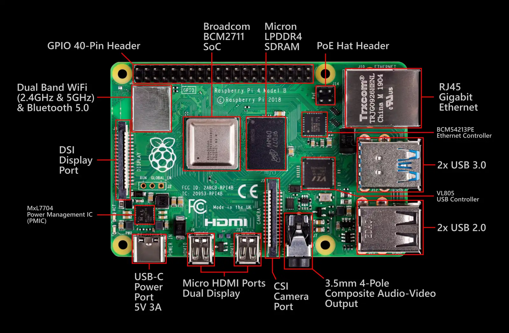
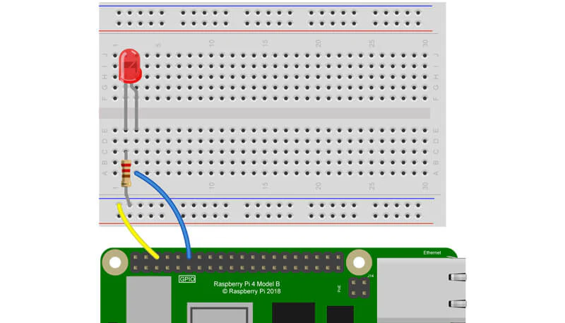

So far, we have explored the building blocks of computer architecture including memory, processors, and the components that make up a functioning computer. We have discussed how data moves through a system, how instructions are processed, and how a computer executes tasks. Though we understand these concepts now, the best way to grasp how a computer works is to interact with one at its core level—beyond the user interface.  

Yes, we are going to use Raspberry Pi. Unlike a traditional desktop or laptop, a Raspberry Pi is a compact, programmable computer that gives us direct access to the fundamental parts of a computing system. This credit card-sized computer packs all the essential components of a full-sized computer onto a single circuit board, making it a perfect learning tool and platform for creative projects.

### What Makes It Special?

Unlike traditional computers that spread their components across multiple boards and parts, the Raspberry Pi is what is known as a Single Board Computer (SBC). Imagine having your processor, memory, graphics, and input/output connections all integrated onto one compact board, that is what makes the Pi special. This all-in-one design not only keeps costs down (typically ranging from $35-75) but also makes it easier to understand how different computer components work together.

With the Raspberry Pi we can connect and control hardware components like LEDs, buttons, and sensors to see how input and output devices work, interact with memory and processor by writing programs that manipulate data, execute commands, and perform calculations and explore operating systems and networking to understand how a computer manages processes and connects to other devices.

### Some Applications

You can use the Raspberry Pi as,

* **Desktop Computer**: Perfect for basic computing tasks like web browsing, document editing, and email management. Its compact size makes it ideal for creating space-efficient workstations.

* **Learning Platform**: An excellent tool for learning programming languages, understanding electronics, and exploring computer science concepts. The hands-on nature of the Pi makes abstract computing concepts tangible.

* **Project Hub**: Serves as the brain for countless DIY projects, from home automation systems to weather stations. Its GPIO pins allow direct interaction with sensors, motors, and other electronic components.

* **Media Centre**: Can transform any TV into a smart entertainment system, capable of streaming media, running retro games, and managing digital content libraries.

### Components of Raspberry Pi



The Raspberry Pi 4 Model B board consists of all the components needed for a fully functioning computer:

1. **Broadcom BCM2711 SoC (System on Chip)**
   - The brain of the Raspberry Pi
   - Contains the CPU, GPU, and other essential processing components
   - Quad-core processor designed specifically for the Pi 4

2. **Micron LPDDR4 SDRAM**
   - The main memory (RAM) of the system
   - LPDDR4 indicates it's low-power DDR4 memory
   - Used for running programs and temporary data storage

3. **GPIO 40-Pin Header**
   - General Purpose Input/Output pins
   - Allows connection to various electronic components, sensors, and displays
   - Essential for hardware projects and prototyping

4. **USB Ports**
   - 2x USB 3.0 ports (Blue)
   - 2x USB 2.0 ports
   - VL805 USB Controller manages these connections
   - Supports keyboards, mice, external drives, etc.

5. **Network Connectivity**
   - RJ45 Gigabit Ethernet port
   - BCM54213PE Ethernet Controller
   - Dual Band WiFi (2.4GHz & 5GHz)
   - Bluetooth 5.0
   - PoE (Power over Ethernet) Hat Header for network power

6. **Display Connections**
   - 2x Micro HDMI ports for dual display output
   - DSI Display Port for official Raspberry Pi touchscreen
   - CSI Camera Port for Raspberry Pi camera modules
   - 3.5mm 4-Pole Composite Audio-Video Output

You can read the full specifications of the RPi 4B at this [datacapturecontrol blog post](https://datacapturecontrol.com/articles/io-devices/single-board-computers/raspberry-pi-4b) and [RPi official documentation](https://www.raspberrypi.com/products/raspberry-pi-4-model-b/specifications/).

:::tip[Activity: Identify the Components]
Open the cover of the Raspberry Pi and identify the components. Take a picture and label the GPIO Pins, CPU, RAM, WiFi module, and other input and output ports.
:::

## Basic GPIO Projects

In our earlier activity, we used transistors to control LEDs, turning it on and off by controlling the flow of current. This demonstrated an essential principle of digital electronics where transistors form the foundation of computing by controlling electrical signals.

Now, we will use a Raspberry Pi to control the LED programmatically. This transition helps us understand how modern computers automate tasks using logic and code.

:::note[Hardware Setup]
Before starting:
1. Make sure your SD card is properly formatted or have a working operating system.
2. Connect display via HDMI.
3. Connect keyboard and mouse.
4. Power up using appropriate power supply.

If you want to refresh your memory on how to do the hardware setup, you can refer to [Build my Raspberry Pi in Programmer's Field Guide](https://programmers.guide/book/appendix/0-installation/2-2-pi-computer/)
:::

### Project 1: LED Control
:::tip[Activity: LED Blinking]

We will be controlling an LED using the GPIO pins on the RPi.

Materials needed:
- LED
- 220Ω resistor
- Jumper wires
- Breadboard

Steps: Follow the steps given in the [blog post here](https://thepihut.com/blogs/raspberry-pi-tutorials/27968772-turning-on-an-led-with-your-raspberry-pis-gpio-pins)

We will use GPIO 18 to connect the LED. Please check [the Raspberry Pi GPIO pinout] (https://raspberrytips.com/raspberry-pi-gpio-pinout/) before you build the circuit and the circuit should look like this:



Run the following Python code:
```python
import RPi.GPIO as GPIO
import time

GPIO.setmode(GPIO.BCM)
GPIO.setup(18, GPIO.OUT)

while True:
    GPIO.output(18, GPIO.HIGH)
    time.sleep(1)
    GPIO.output(18, GPIO.LOW)
    time.sleep(1)
```

Once you run the code, your LED should start blinking. Congratulations, you have successfully controlled an external component using the GPIO pins.

:::

### Project 2: Input and Output
:::tip[Activity]
**Button-Controlled LED**
Build upon the previous project by:
1. Adding a push button
2. Using button press to control LED
3. Implementing different lighting patterns
:::