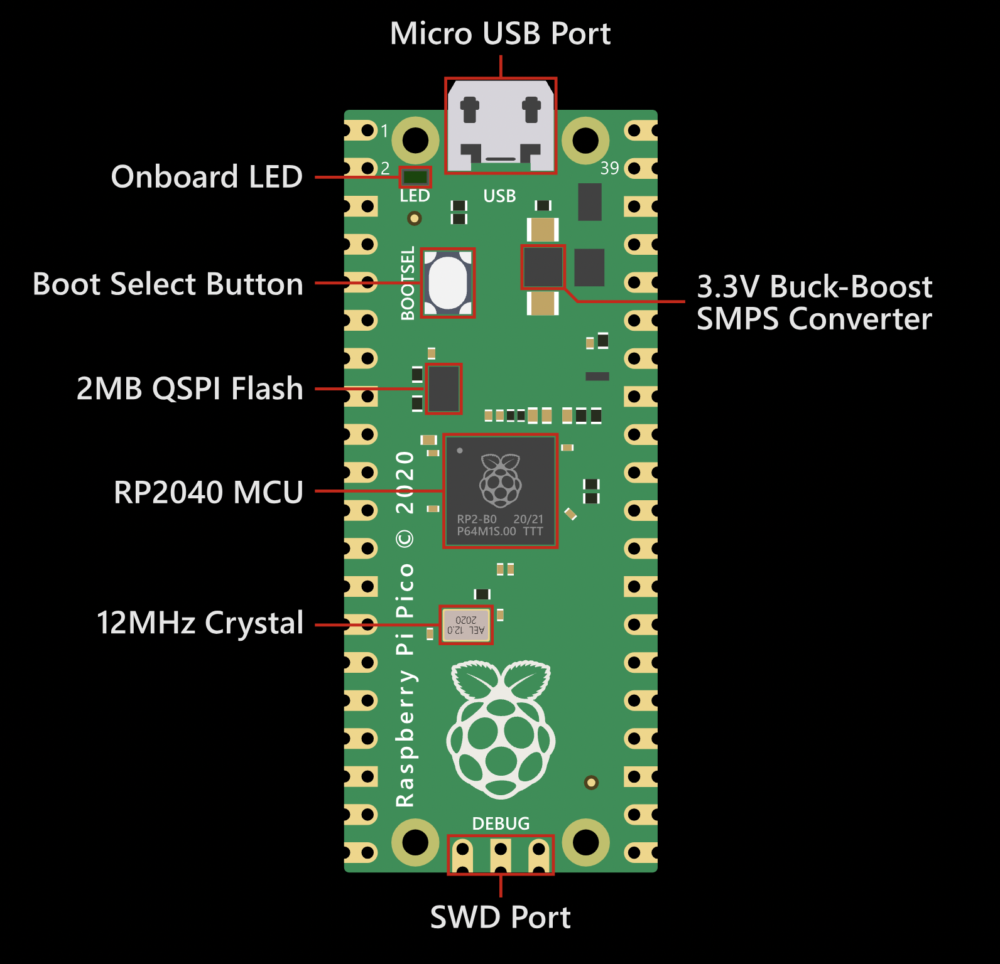

import { YouTube } from 'astro-embed';

## Introduction to Pico



The Raspberry Pi Pico 2 W, represents a significant upgrade to the Pico family, bringing enhanced wireless capabilities and performance improvements. There are many core components improvements in the new pico:

- **RP2040 Microcontroller**:

  - Dual-core ARM Cortex M0+ still at heart, but with optimized performance
  - Clock speed maintained at 133MHz
  - Same reliable architecture as original Pico

- **Memory**:
  - 264KB of SRAM
  - 16MB of Flash storage (8x more than original Pico W)
  - Significant storage upgrade for more complex applications

- **Infineon CYW43439 Wireless Chip**:
  - 2.4GHz WiFi 4 (802.11n)
  - Bluetooth 5.2 support
  - Enhanced wireless range compared to Pico W
  - Lower power consumption during wireless operations

- **USB 1.1 Port**:

  - For programming and power delivery
  - Can act as USB host or device
  - Supports CircuitPython and MicroPython

- **GPIO and Interfaces**:

  - 26 multi-function GPIO pins
  - 2× UART, 2× SPI, 2× I2C
  - 16× PWM channels
  - 4× ADC channels

- **Power Management**:
  - Improved power efficiency
  - Better sleep mode capabilities
  - USB power or battery operation

### Applications

- **IoT Devices**: Perfect for connected sensor networks and smart home devices
- **Wireless Control Systems**: Remote control applications and robotics
- **Data Logging**: Capable of storing more data with larger flash memory
- **Mesh Networks**: Can be used in Bluetooth mesh networking
- **Educational Projects**: Enhanced capabilities while maintaining ease of use

### Development Environment

- RPi Pico 2 W now supports multiple programming languages:
  - MicroPython
  - CircuitPython
  - C/C++
  - Arduino IDE support
- Extensive documentation and community support
- Compatible with existing Pico libraries and most hardware

:::note

The Raspberry Pi Pico is a microcontroller that's perfect for learning about:

- Direct hardware control
- Real-time operations
- Embedded systems
- Basic computer architecture

:::

:::note[Pico vs Raspberry Pi]
While the Raspberry Pi is a complete computer, the Pico is a microcontroller designed for specific tasks and direct hardware interaction.
:::

## Getting Started with Pico

### Setup

1. Install MicroPython on your Pico (follow the steps on [this blog post](https://www.raspberrypi.com/documentation/microcontrollers/micropython.html))

2. Connect to your computer (in our case, we are using the RPi 4B)
3. Set up Thonny IDE (watch the video below)

<div class='not-content'>
  <YouTube id='_ouzuI_ZPLs' params='fs=1&modestbranding=1&rel=0&autoplay=1' />
</div>

4. Test basic functionality

### Basic LED Project

Follow the blogpost at [this link](https://projects.raspberrypi.org/en/projects/getting-started-with-the-pico/0). You should be able to get the LED blinking in the Pico.

```python
from machine import Pin
import time

led = Pin(25, Pin.OUT)    # Onboard LED on GPIO 25

while True:
    led.toggle()
    time.sleep(0.5)
```