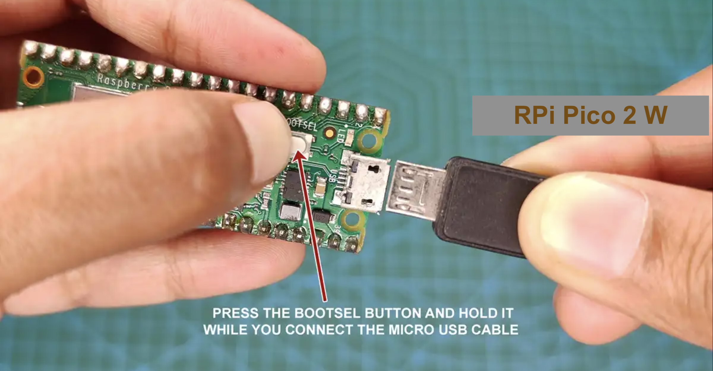
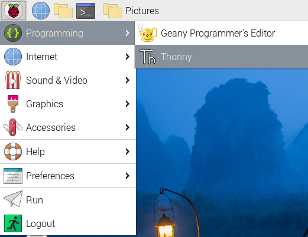
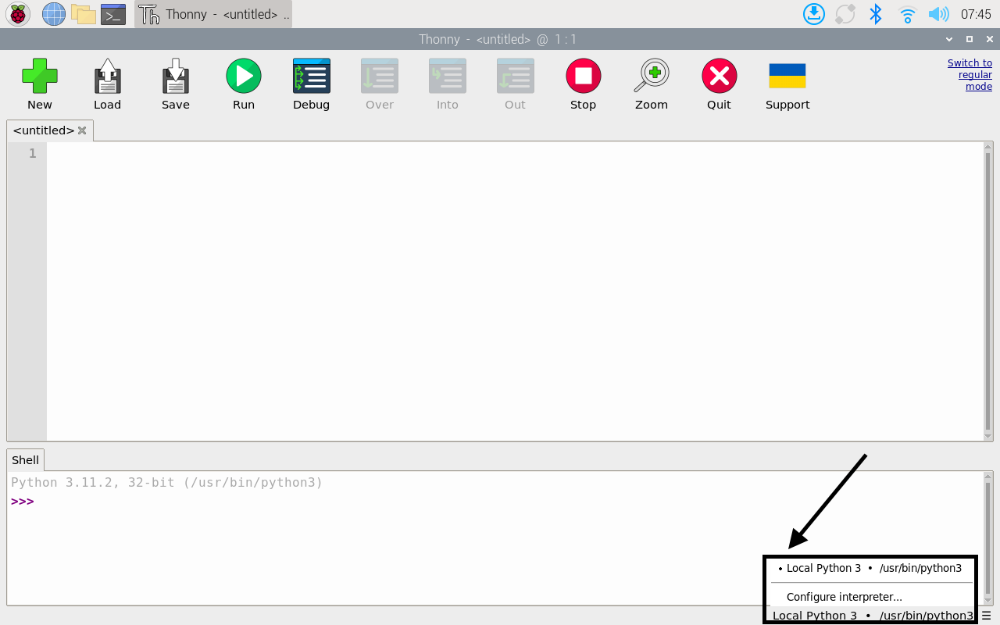
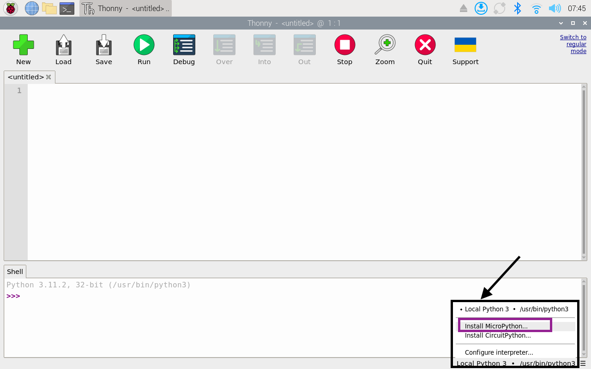
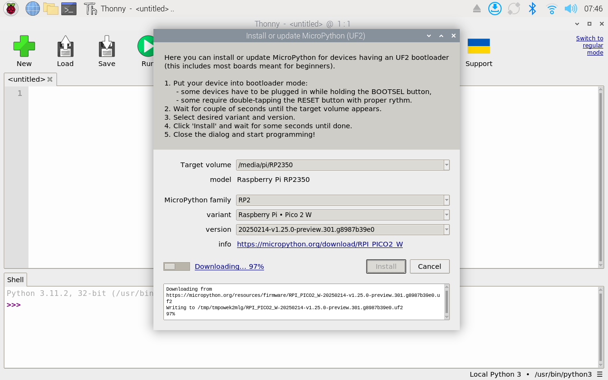
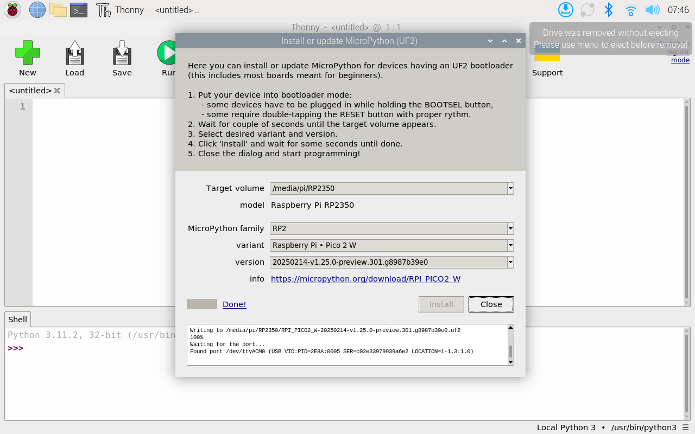
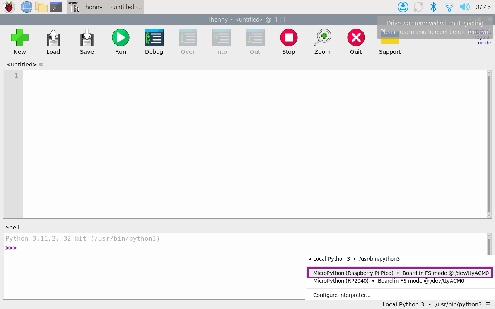
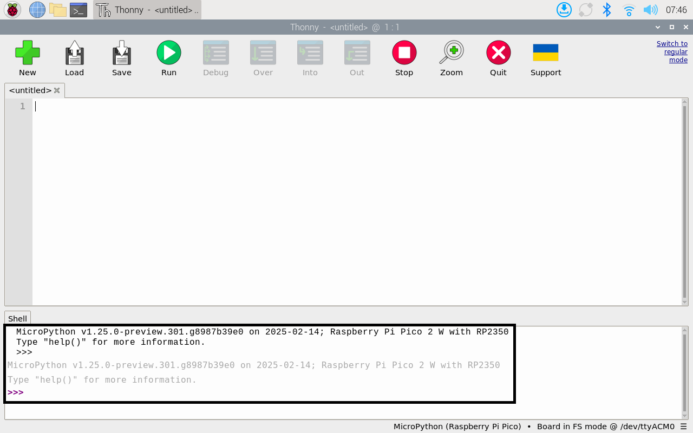
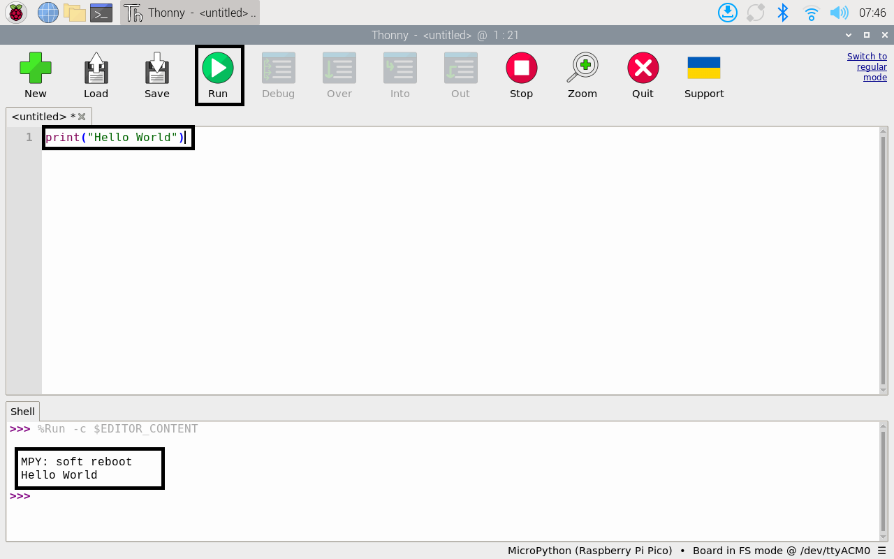
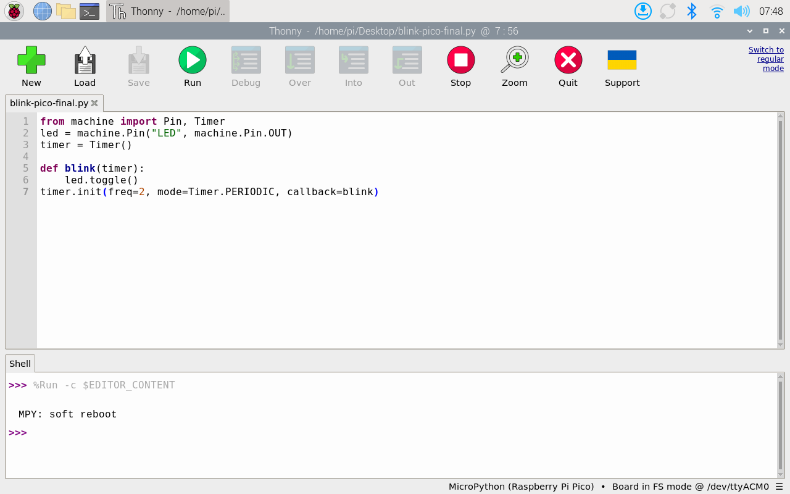

import { YouTube } from 'astro-embed';

After exploring the Raspberry Pi 4B as a single-board computer, let's dive into the world of microcontrollers with the Raspberry Pi Pico 2W. While the Pi 4B is a complete computer system, the Pico 2W is a microcontroller board designed for specific tasks and embedded applications. This makes it perfect for learning about low-level programming and hardware control.

### What Makes It Special?

The Raspberry Pi Pico 2W is a powerful microcontroller board that builds upon the success of the original Pico. What sets it apart is:

- **RP2040 Microcontroller**: Custom-designed by Raspberry Pi, featuring dual ARM Cortex-M0+ cores
- **Wireless Connectivity**: Built-in 2.4GHz wireless capabilities for WiFi and Bluetooth
- **Low Power Consumption**: Perfect for battery-powered projects
- **Affordable**: Typically costs around $6-8
- **Programmable in MicroPython or C/C++**: Flexibility in programming approaches

### Key Applications

The Pico 2W excels in:

- **IoT Projects**: Its wireless capabilities make it perfect for Internet of Things applications
- **Embedded Systems**: Ideal for standalone control systems and automation
- **Educational Projects**: Great for learning microcontroller programming and electronics
- **Sensor Networks**: Can collect and process data from various sensors
- **Remote Control**: Can be controlled wirelessly through its WiFi capabilities

### Components of Raspberry Pi Pico 2W


Key components include:

1. **RP2040 Microcontroller**

   - Dual-core ARM Cortex-M0+ processor running at up to 133 MHz
   - 264KB of SRAM
   - 16MB of Flash storage (8x more than original Pico W)

2. **GPIO Pins**

   - 26 multi-function GPIO pins
   - 2 SPI, 2 I2C, 2 UART controllers
   - 3 ADC inputs
   - 16 PWM channels

3. **USB 1.1 Controller**

   - Micro USB port for power and programming
   - Can appear as a USB drive for easy programming

4. **Wireless Module**

   - 2.4GHz wireless interface
   - Supports IEEE 802.11b/g/n
   - Bluetooth 5.2

5. **Built-in LED**
   - Programmable LED for testing and status indication
   - Additional WS2812 RGB LED

### Why to use Pico 2W?

- RPi Pico 2 W supports multiple programming languages:
  - MicroPython
  - CircuitPython
  - C/C++
  - Arduino IDE support
- RPi Pico 2 W has extensive documentation and community support
- RPi Pico 2 W is compatible with existing Pico libraries and most hardware

### Getting Started with Pico

#### Pre-Setup: Installing MicroPython

Before we can start programming the Pico 2W, we need to install MicroPython. Unlike the Raspberry Pi 4B, the Pico 2W comes with no operating system or interpreter installed. Follow these steps carefully:

1. **Prepare the Pico 2W for Installation**

   - Locate the BOOTSEL button on your Pico 2W
   - Hold down the BOOTSEL button while connecting the USB cable
   - Ignore any pop-up dialogs about opening file explorer when connecting the Pico 2W.

   
   _Press and hold the BOOTSEL button while connecting the Micro USB cable_

2. **Open Thonny IDE**

   - Thonny comes pre-installed on Raspberry Pi OS
     

3. **Access Interpreter Settings**

   - Click on the interpreter name in the bottom-right corner
   - Look for "Install MicroPython" option

   

   - If you don't see it, disconnect and reconnect while holding BOOTSEL



4. **Install MicroPython**
   :::note

   You will need internet connection on the RPi 4B in order to perform this step. The latest version of the micropython is downloaded and installed for the hardware that you selected.

   :::

- Select "Install MicroPython" from the menu
- Verify that the target volume shows as "RPxxxx"
- Choose "RP2" as the MicroPython family
- Select "Pico 2 W" as the variant
- Click Install



- Once it downloads and complets the installation, the Pico 2W should automatically reset and you should see a successful message. Close the dialog.



5. **Verify Installation**

   - After installation, click the interpreter name again
   - Select "MicroPython (Raspberry Pi Pico)". If you don't see the option, repeats the steps 1-4 again.
   - You should see the MicroPython version and hardware info in the shell

   
   
   _Successful MicroPython installation showing version information_

6. **Test Installation**
   
   - Once all the steps are completed, you can test the interpretor by running a basic Hello World python code in Thonny IDE.

   

:::note[Important Note]
The Pico 2W's flash memory does not persist your Python files permanently. Always save your code on the Raspberry Pi 4B, not on the Pico. If you need to reinstall MicroPython, follow these setup steps again.
:::

**Congratulations, you have successfully setup your Pico 2W and can now start developing!** We have installed the MicroPython interpreter that helps us:

- Translate Python code into instructions the Pico can understand
- Directly interact with the Pico's hardware through simple Python commands
- Test and debug code in real-time using the Thonny shell
- Access special MicroPython libraries designed for microcontroller operations

This means you can now write Python code to control LEDs, read sensors, create displays, and build all sorts of exciting embedded projects. The interpreter acts as a bridge between your code and the Pico's hardware, making it much easier to program compared to traditional bare-metal programming.

{/* Follow the blogpost at [this link](https://projects.raspberrypi.org/en/projects/getting-started-with-the-pico/0). You should be able to get the LED blinking in the Pico. */}

:::tip[Activity: Controlling LED on Pico 2W]

In this activity, we'll use the Raspberry Pi 4B as our development platform to program the Pico 2W. This setup demonstrates how we can use one computer to program another device, a common practice in embedded systems development.

Before starting, make sure you have:

1. Raspberry Pi 4B with Raspberry Pi OS installed
2. Raspberry Pi Pico 2W
3. Micro USB cable
4. Thonny IDE (pre-installed on Raspberry Pi OS)

##### Setup Steps

1. **Connect the Hardware**

   - Plug the Micro USB cable into the Pico W 2
   - Connect the other end to the Raspberry Pi 4B

2. **Prepare the IDE**
   - Open Thonny on the Raspberry Pi
   - Go to Tools → Options → Interpreter
   - Select "MicroPython (Raspberry Pi Pico)"
   - Click OK
   - If you don't see the interpretor, follow the steps in the previous task again to reinstall micropython on Pico 2W

##### The Code

```python
# Import necessary classes for hardware control
from machine import Pin, Timer
# Create a Pin object for the onboard LED
led = machine.Pin("LED", machine.Pin.OUT)
# Create a timer object for periodic execution
timer = Timer()

# Define the function that will be called by the timer
def blink(timer):
    # Switch the LED state between on and off
    led.toggle()

# Initialize the timer with 2Hz frequency (blinks twice per second)
timer.init(freq=2, mode=Timer.PERIODIC, callback=blink)
```

##### Running the Program

1. Open Thonny IDE and choose the Pico 2W micropython interpretor in Thonny
2. Copy and paste the code
3. Click the "Run" button
4. The onboard LED should start blinking
5. To stop, click the "Stop" button in Thonny

   

**Congratulations! You have just controlled an LED on a microcontroller from another computer.** This might seem like a simple achievement, but you've actually accomplished several important concepts in embedded systems:

1. **Cross-Device Development**: You've used the Raspberry Pi 4B as a development platform to program the Pico 2W, demonstrating a real-world embedded development workflow.

2. **Hardware Control**: Through simple Python code, you've directly manipulated hardware by controlling the GPIO pins that interface with the LED.

3. **Real-time Programming**: Your program uses a timer and callback function to create precise timing for the LED blinking, introducing you to real-time control concepts.

This foundational exercise opens the door to more complex projects. You can now:
* Control multiple LEDs to create light patterns
* Add sensors to make the LED respond to environmental changes
* Use the wireless capabilities to control the LED remotely
* Build more complex embedded systems using the same principles

**Remember:** Every sophisticated embedded system, from smart home devices to industrial controllers, builds upon these same basic concepts of hardware control and programming that you've just mastered!
:::


:::note[Think about it!]

While both activites (this and the one in last task) involved LED control, there are important differences between the results:

1. **Hardware Level**: 
   * Pi 4B uses Linux-based GPIO control
   * Pico uses direct microcontroller register access

2. **Programming Environment**:
   * Pi 4B uses full Python
   * Pico uses MicroPython, optimized for microcontrollers

3. **Memory Usage**:
   * Pi 4B has abundant RAM and storage
   * Pico has limited resources, requiring efficient code

4. **Operating System**:
   * Pi 4B runs a full OS
   * Pico runs bare metal code

Understanding these differences helps grasp the distinction between general-purpose computers and microcontrollers in embedded systems.
:::