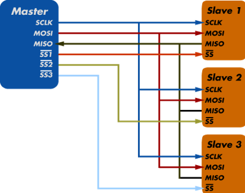

import { YouTube } from 'astro-embed';

In our interconnected digital world, devices need standardized ways to exchange information. These standardized methods are called **communication protocols** - the digital languages that allow hardware and software to talk to each other regardless of manufacturer or purpose.

Understanding protocols is essential for anyone working with digital systems, from simple microcontrollers to complex networks of computers and IoT devices.

:::note[Think about It: Communication Everywhere]

- How many different types of digital communication do you use daily?
- What happens when two devices don't "speak the same language"?
- Why might some protocols be better suited for certain applications than others?
- How have communication protocols evolved over time?

:::

## What are Communication Protocols?

Communication protocols are standardized rules that allow electronic devices to exchange data. They define everything from the physical connection between devices to the format of the data being exchanged.

Think of protocols like human languages - they have grammar rules (syntax), meaning (semantics), and conversation etiquette (synchronization and error handling).

## Serial vs. Parallel Communication

There are two fundamental ways to transmit digital data. More information can be found [here](https://www.geeksforgeeks.org/difference-between-serial-and-parallel-transmission/)

| Serial Communication                          | Parallel Communication             |
| --------------------------------------------- | ---------------------------------- |
| Sends data one bit at a time                  | Sends multiple bits simultaneously |
| Requires fewer wires                          | Requires multiple data lines       |
| Can achieve higher speeds over long distances | Faster over short distances        |
| Examples: UART, SPI, I²C, USB                 | Examples: PATA, PCI, Memory bus    |

_Serial communication uses a single data line, while parallel uses multiple lines_

:::note[Historical Shift]
Historically, computers used parallel ports for peripherals like printers because they were faster over short distances. However, as signals need to be synchronized, parallel communication becomes problematic over longer distances. Modern systems have largely shifted to high-speed serial protocols like USB, HDMI, and Ethernet.
:::

## Common Serial Protocols

### UART (Universal Asynchronous Receiver/Transmitter)

UART is one of the simplest serial communication methods, using just two wires for data.

**Key Characteristics:**

- **Asynchronous**: No clock signal; devices must agree on timing (baud rate)
- **Simplicity**: Easy to implement in hardware and software
- **Directness**: Designed for point-to-point communication
- **Ubiquity**: Found in virtually all microcontrollers and computers

**How it Works:**

- Devices connect TX (transmit) to RX (receive) and share a common ground
- Data frames include start and stop bits to synchronize transmission
- Common baud rates: 9600, 115200 bits per second

_UART uses TX (transmit) and RX (receive) lines between devices_

### SPI (Serial Peripheral Interface)

SPI is a synchronous protocol commonly used for communicating with sensors, displays, and memory devices.

**Key Characteristics:**

- **Synchronous**: Uses a clock signal to coordinate data transfer
- **Full-Duplex**: Can send and receive simultaneously
- **Higher Speed**: Typically faster than UART or I²C
- **Hardware Select**: Uses separate select lines for each device

**How it Works:**

- Requires at least 4 wires:
  - MOSI (Master Out, Slave In): Data from controller to peripheral
  - MISO (Master In, Slave Out): Data from peripheral to controller
  - SCLK (Serial Clock): Timing signal
  - CS/SS (Chip Select/Slave Select): Activates specific device

_SPI allows one master to communicate with multiple slave devices_

### I²C (Inter-Integrated Circuit)

I²C combines the best aspects of UART and SPI, using a two-wire bus with addressing.

**Key Characteristics:**

- **Synchronous**: Uses a clock signal (SCL)
- **Bus Topology**: Multiple devices share the same two wires
- **Addressing**: Each device has a unique address
- **Medium Speed**: Typically 100kHz, 400kHz, or 1MHz

**How it Works:**

- Uses two wires:
  - SDA (Serial Data): Bidirectional data line
  - SCL (Serial Clock): Timing signal
- Devices are addressed in software rather than with separate select lines
- Supports multiple masters and multiple slaves on the same bus

_I²C uses a bus architecture with device addressing_

## Higher-Level Communication Protocols

### USB (Universal Serial Bus)

USB has become the standard for connecting peripherals to computers.

**Key Characteristics:**

- **Versatility**: Supports everything from keyboards to storage devices
- **Power Delivery**: Provides power to connected devices
- **Hot-Swappable**: Devices can be connected/disconnected while running
- **Speed**: Ranges from 1.5 Mbps (USB 1.0) to 40 Gbps (USB4)

**How it Works:**

- Uses differential signaling for noise immunity
- Hub architecture allows connecting multiple devices
- Complex protocol stack handles device discovery, power management

### Ethernet

Ethernet is the foundation of most local area networks.

**Key Characteristics:**

- **Standardized**: Follows IEEE 802.3 standards
- **Scalable**: From small home networks to massive data centers
- **Speed**: Ranges from 10 Mbps to 400 Gbps
- **Addressing**: Uses MAC addresses for device identification

**How it Works:**

- Media Access Control (MAC) handles data frames
- CSMA/CD protocol manages channel access
- Switches and routers forward data to appropriate destinations

### Bluetooth

Bluetooth enables wireless communication between devices over short distances.

**Key Characteristics:**

- **Wireless**: No physical connection required
- **Low-Power**: Designed for battery-powered devices
- **Personal Area Networks**: Typically 10-meter range
- **Versatile**: Supports audio, data, control applications

**How it Works:**

- Uses 2.4 GHz radio frequency band
- Frequency-hopping spread spectrum for security and reliability
- Device pairing establishes trusted connections

### Wi-Fi

Wi-Fi provides wireless local area network connectivity.

**Key Characteristics:**

- **High Bandwidth**: Supports demanding applications like video streaming
- **Longer Range**: Typically 30+ meters indoors
- **Network-Oriented**: Designed for multi-device networks
- **Internet Connectivity**: Primary wireless internet access method

**How it Works:**

- Operates in 2.4 GHz and 5 GHz bands
- Uses SSID for network identification
- Security through WPA2/WPA3 encryption

## Protocol Comparison Table

| Protocol  | Wires        | Speed          | Multiple Devices        | Complexity | Distance   | Typical Use Cases                          |
| --------- | ------------ | -------------- | ----------------------- | ---------- | ---------- | ------------------------------------------ |
| UART      | 2 (TX/RX)    | Low to Medium  | No (point-to-point)     | Low        | Short      | Debugging, simple device communication     |
| SPI       | 4+           | High           | Yes (multiple CS lines) | Medium     | Very Short | Sensors, displays, memory chips            |
| I²C       | 2 (SDA/SCL)  | Medium         | Yes (addressing)        | Medium     | Short      | Multiple sensors, EEPROM, real-time clocks |
| USB       | 4            | Very High      | Yes (through hubs)      | High       | Medium     | Computer peripherals, storage              |
| Ethernet  | 8 (4 pairs)  | Extremely High | Yes (networking)        | High       | Long       | Networking, internet connectivity          |
| Bluetooth | 0 (wireless) | Medium         | Yes (pairing)           | High       | Medium     | Wireless audio, peripherals, IoT           |
| Wi-Fi     | 0 (wireless) | Very High      | Yes (networking)        | Very High  | Long       | Wireless networking, internet access       |

:::tip[Activity: Protocol Selection]
Consider everyday devices like smartphones, laptops, and smart home gadgets. For each, identify What protocols they use to communicate with each other. Provide a brief discussion on why those protocols have been used and what if those protocols were not available.
:::
