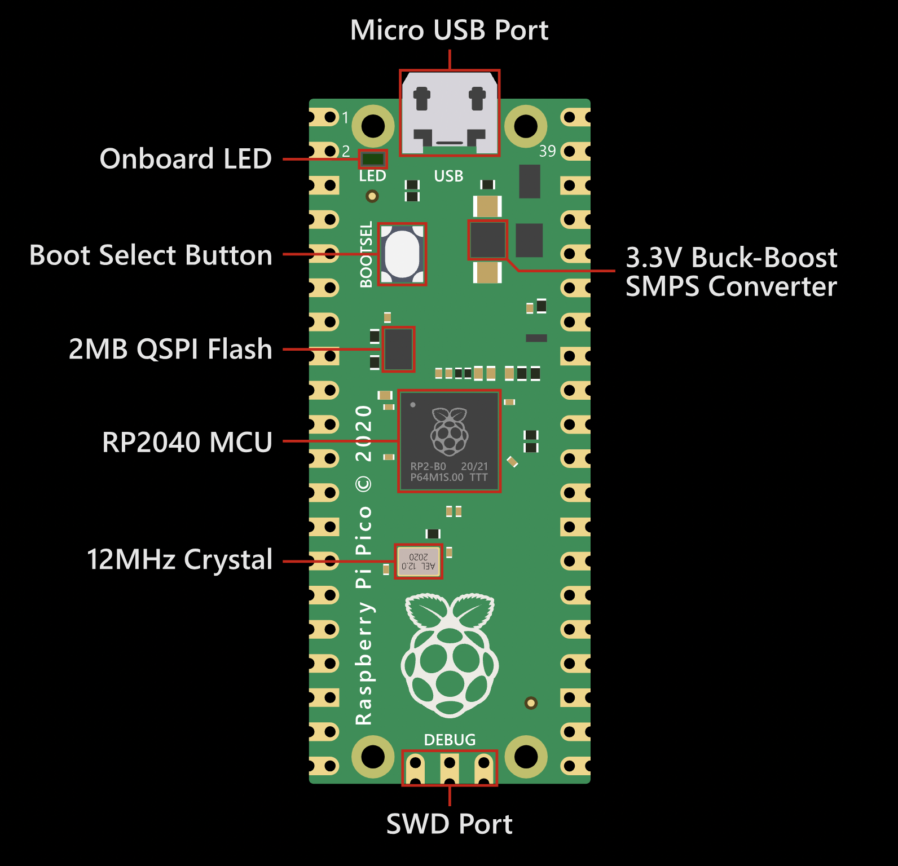

Now let's put theory into practice by connecting our Raspberry Pi 4B to the Pico 2W using different communication methods.

### Method 1: Direct UART Connection

UART is one of the simplest ways to connect two devices. We'll establish a serial connection between the Raspberry Pi 4B and the Pico 2W.

#### Hardware Setup

1. Connect the GPIO pins as follows:

| Raspberry Pi 4B | Pico 2W  |
| --------------- | -------- |
| GPIO 14 (TX)    | GP1 (RX) |
| GPIO 15 (RX)    | GP0 (TX) |
| GND             | GND      |


_UART connection between Raspberry Pi 4B and Pico 2W_

:::caution[Important!]
The Raspberry Pi operates at 3.3V logic levels. Make sure not to connect it to 5V systems without level shifting to avoid damage.
:::

#### Software Setup

**On the Raspberry Pi 4B:**

1. Enable the serial port by editing the config file:

   ```bash
   sudo nano /boot/config.txt
   ```

2. Add or uncomment this line:

   ```
   enable_uart=1
   ```

3. Save and exit (Ctrl+X, Y, Enter)

4. Reboot the Raspberry Pi:

   ```bash
   sudo reboot
   ```

5. Install the pyserial package:
   ```bash
   sudo apt update
   sudo apt install python3-pip
   pip3 install pyserial
   ```

**On the Pico 2W:**

1. Open Thonny IDE on the Raspberry Pi 4B
2. Make sure the Pico 2W is connected and MicroPython is installed
3. Create a new file on the Pico 2W for receiving data

:::tip[Activity: UART Communication]

In this activity, we'll send data from the Raspberry Pi 4B to the Pico 2W and have the Pico acknowledge receipt.

**Step 1: Program the Pico 2W (Receiver)**

```python
# Save this as main.py on your Pico 2W
from machine import UART, Pin
import time

# Initialize UART on GP0 (TX) and GP1 (RX)
uart = UART(0, baudrate=9600)  # UART0 uses GP0 and GP1

# LED for visual confirmation
led = Pin("LED", Pin.OUT)

while True:
    if uart.any():  # Check if data is available
        data = uart.read()  # Read data
        print("Received:", data.decode('utf-8'))

        # Blink LED to indicate receipt
        led.value(1)
        time.sleep(0.2)
        led.value(0)

        # Send acknowledgment
        uart.write("ACK: " + data.decode('utf-8'))

    time.sleep(0.1)  # Small delay
```

**Step 2: Program the Raspberry Pi 4B (Sender)**

Create a new file called `uart_sender.py` on your Raspberry Pi:

```python
import serial
import time

# Open serial port
ser = serial.Serial('/dev/ttyS0', 9600, timeout=1)

try:
    counter = 0
    while True:
        # Create message with counter
        message = f"Hello Pico! Count: {counter}"
        print(f"Sending: {message}")

        # Send message
        ser.write(message.encode('utf-8'))

        # Wait for response
        time.sleep(0.5)
        if ser.in_waiting > 0:
            response = ser.read(ser.in_waiting).decode('utf-8')
            print(f"Received: {response}")

        counter += 1
        time.sleep(2)  # Wait 2 seconds before next message

except KeyboardInterrupt:
    print("Communication stopped")
finally:
    ser.close()  # Close serial port
```

**Step 3: Run the Communication**

1. Make sure the Pico 2W is running its program (it will start automatically if saved as `main.py`)
2. Run the Python script on the Raspberry Pi:
   ```bash
   python3 uart_sender.py
   ```
3. Observe the messages being sent from the Pi and the acknowledgments coming back from the Pico
4. Watch the Pico's LED blink when messages are received

**What's Happening?**

- The Raspberry Pi is sending incremental counter messages via UART
- The Pico receives these messages, blinks its LED, and sends an acknowledgment
- The Raspberry Pi reads the acknowledgment and displays it

This demonstrates bidirectional serial communication between two different device types!
:::

### Method 2: SPI Communication

SPI is faster than UART and allows for more complex interactions. Let's connect our devices using SPI.

#### Hardware Setup

Connect the GPIO pins as follows:

| Raspberry Pi 4B | Pico 2W         |
| --------------- | --------------- |
| GPIO 10 (MOSI)  | GP19 (SPI0 TX)  |
| GPIO 9 (MISO)   | GP16 (SPI0 RX)  |
| GPIO 11 (SCLK)  | GP18 (SPI0 SCK) |
| GPIO 8 (CE0)    | GP17 (SPI0 CSN) |
| GND             | GND             |


_SPI connection between Raspberry Pi 4B and Pico 2W_

#### Software Setup

**On the Raspberry Pi 4B:**

1. Enable SPI interface:

   ```bash
   sudo raspi-config
   ```

   Navigate to "Interface Options" > "SPI" > "Yes"

2. Install the required Python library:
   ```bash
   sudo apt update
   sudo apt install python3-spidev
   ```

:::tip[Activity: SPI Temperature Monitor]

In this activity, we'll use the Pico 2W to read temperature data (using its internal temperature sensor) and send it to the Raspberry Pi 4B via SPI.

**Step 1: Program the Pico 2W (SPI Slave)**

```python
# Save this as main.py on your Pico 2W
from machine import Pin, SPI, ADC
import struct
import time

# Setup the temperature sensor
sensor_temp = ADC(4)
conversion_factor = 3.3 / (65535)

# Setup SPI as slave
spi = SPI(0,
          baudrate=100000,
          polarity=0,
          phase=0,
          bits=8,
          firstbit=SPI.MSB,
          sck=Pin(18),
          mosi=Pin(19),
          miso=Pin(16))

# CS pin as input
cs = Pin(17, Pin.IN)

# Status LED
led = Pin("LED", Pin.OUT)

# Buffer for data
buffer = bytearray(4)
response = bytearray(4)

def get_temperature():
    # Read the raw temperature value
    reading = sensor_temp.read_u16() * conversion_factor
    # Convert to temperature in Celsius
    temperature = 27 - (reading - 0.706) / 0.001721
    return temperature

while True:
    # Check if CS is active (low)
    if cs.value() == 0:
        led.value(1)  # Turn on LED to indicate activity

        # Read command from master
        spi.readinto(buffer)

        if buffer[0] == ord('T'):  # Temperature request
            # Get temperature
            temp = get_temperature()
            # Pack temperature as float into bytes
            struct.pack_into("f", response, 0, temp)
            # Send response
            spi.write(response)

        led.value(0)  # Turn off LED

    time.sleep(0.01)  # Small delay
```

**Step 2: Program the Raspberry Pi 4B (SPI Master)**

Create a new file called `spi_master.py` on your Raspberry Pi:

```python
import spidev
import time
import struct

# Initialize SPI
spi = spidev.SpiDev()
spi.open(0, 0)  # Bus 0, Device 0
spi.max_speed_hz = 100000
spi.mode = 0

def read_temperature():
    # Send temperature request command ('T')
    command = [ord('T'), 0, 0, 0]
    spi.xfer2(command)

    # Small delay to allow Pico to process
    time.sleep(0.01)

    # Read 4 bytes (float)
    response = spi.xfer2([0, 0, 0, 0])

    # Convert bytes to float
    temperature = struct.unpack('f', bytes(response))[0]
    return temperature

try:
    print("Reading temperature from Pico 2W via SPI...")
    print("Press Ctrl+C to exit")

    while True:
        temp = read_temperature()
        print(f"Current temperature: {temp:.2f}°C")
        time.sleep(2)

except KeyboardInterrupt:
    print("Measurement stopped")
finally:
    spi.close()  # Close SPI connection
```

**Step 3: Run the Communication**

1. Start the program on the Pico 2W
2. Run the Python script on the Raspberry Pi:
   ```bash
   python3 spi_master.py
   ```
3. Observe the temperature readings from the Pico's internal sensor
4. Try warming the Pico with your finger to see the temperature change

**What's Happening?**

- The Raspberry Pi acts as the SPI master and requests temperature data
- The Pico 2W acts as the SPI slave, reading its internal temperature sensor when requested
- Data is transferred via SPI protocol with proper framing and timing
- This demonstrates how to use SPI for sensor data collection in embedded systems
  :::