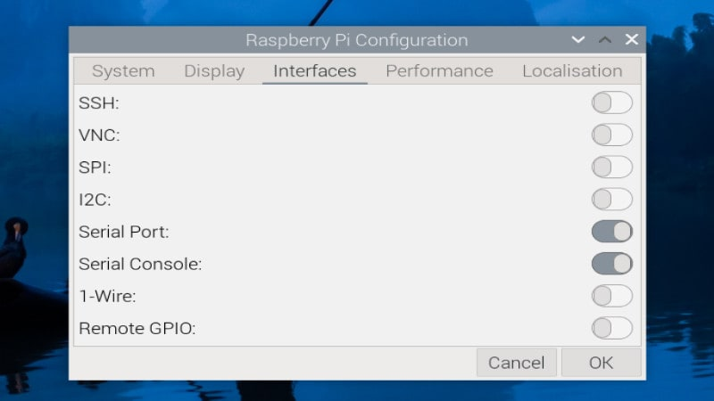

import { YouTube } from 'astro-embed';

In today's interconnected world, devices rarely operate in isolation. Whether it's a smart home system, robotics project, or industrial automation, the ability for different digital systems to communicate with each other is fundamental. Learning how to establish connections between devices provides a foundation for building more complex and interactive systems.

Serial communication is one of the most basic and reliable methods for devices to exchange information. By mastering this fundamental protocol, you will understand the principles that underpin many modern communication systems, from USB to Ethernet and beyond.

In this module, we will establish a wired serial connection between our Raspberry Pi 4B and Raspberry Pi Pico 2W. This will allow us to send commands from the Raspberry Pi to control the Pico, collect sensor data from the Pico and process it on the Raspberry Pi, build interactive systems with components distributed across multiple devices, and understand the fundamentals of how devices "talk" to each other

Let's get started with connecting our devices using UART (Universal Asynchronous Receiver/Transmitter), one of the simplest serial communication protocols that we explored in the previous section. 

## Direct UART Connection

UART is one of the simplest ways to connect two devices. We will explore how to establish a serial connection between the Raspberry Pi 4B and the Pico 2W. UART is a simple yet powerful protocol that requires minimal wiring which requires just two data lines for bidirectional communication.

:::note[Before you start: Setting up the interfaces]
Enable serial connection on RPi using the steps given at the link [here](https://raspberrytips.com/enable-uart-on-raspberry-pi/) or follow the steps below:


_Screenshot: Enable serial connection via the configuration settings_

1. Open a terminal on your Raspberry Pi
2. Run `sudo raspi-config`
3. Navigate to "Interface Options"
4. Select "Serial Port"
5. Answer "No" to "Would you like a login shell to be accessible over serial?"
6. Answer "Yes" to "Would you like the serial port hardware to be enabled?"
7. Select "Finish" and reboot your Raspberry Pi
:::

#### Step 1: Hardware Setup

Now let's physically connect the Raspberry Pi 4B to the Pico 2W:

1. Connect the GPIO pins as follows:

| Raspberry Pi 4B | Pico 2W  |
| --------------- | -------- |
| GPIO 14 (TX)    | GP1 (RX) |
| GPIO 15 (RX)    | GP0 (TX) |
| GND             | GND      |

:::caution[Important Connection Note!]
When connecting the devices, remember that TX (transmit) on one device connects to RX (receive) on the other, and vice versa. This is a common mistake - DO NOT connect TX to TX or RX to RX!

The Raspberry Pi operates at 3.3V logic levels. Make sure not to connect it to 5V systems without level shifting to avoid damage.
:::


_Raspberry Pi 4B pinout_


_Pico 2W pinout_

Your final connection should look like this. Note that the USB connection is being used to program the Pico but the actual communication will be done via the serial connection cables between the devices.


_Wiring diagram showing connections between Raspberry Pi 4B and Pico 2W_

### Step 2: Program the Pico 2W (Receiver)

Now We will write the code for the Pico 2W to receive data from the Raspberry Pi:

1. Connect your Pico 2W to the Raspberry Pi via USB
2. Open Thonny IDE on the Raspberry Pi
3. Create a new file and paste this code:

```python
from machine import UART, Pin
import time

# Initialize UART0 with pins GP0 (TX) and GP1 (RX)
uart = UART(0, baudrate=9600, tx=Pin(0), rx=Pin(1))
led = Pin("LED", Pin.OUT)

# Configure UART communication
uart.init(bits=8, parity=None, stop=1)

print("UART initialized. Waiting for communication...")

while True:
    # Check if data is available
    if uart.any():
        # Read the data
        data = uart.read()
        led.value(1)  # Turn on LED when data received

        if data:
            # Decode the data
            message = data.decode('utf-8').strip()
            print(f"Received: {message}")

            # Send a response
            response = f"Pico received: {message}"
            uart.write(f"{response}\n".encode('utf-8'))

        led.value(0)  # Turn off LED

    time.sleep(0.1)  # Small delay to prevent tight loop
```

4. Save this file as `receiver.py` on your Pico 2W
5. Run the program on your Pico 2W


_Screenshot: Thonny IDE showing the receiver code with Pico 2W connected_

### Step 3: Program the Raspberry Pi 4B (Sender)

Now let's create the sender program on the Raspberry Pi:

1. Open a text editor on your Raspberry Pi:
   ```bash
   nano sender.py
   ```

2. Write the following code:

```python
import serial
import time

def setup_uart(port="/dev/ttyS0", baud_rate=9600):
    # Configure the serial connection
    ser = serial.Serial(
        port=port,
        baudrate=baud_rate,
        parity=serial.PARITY_NONE,
        stopbits=serial.STOPBITS_ONE,
        bytesize=serial.EIGHTBITS,
        timeout=1
    )
    
    return ser

def send_message(ser, message):
    # Add newline character for easier reading
    full_message = message + '\n'
    ser.write(full_message.encode('utf-8'))
    print(f"Sent: {message}")
    
def receive_message(ser, timeout=1):
    # Set timeout for this operation
    ser.timeout = timeout
    
    # Read until newline or timeout
    data = ser.readline()
    
    if data:
        # Decode and strip whitespace
        return data.decode('utf-8').strip()
    return None

def interactive_uart_terminal(ser):
    print("UART Terminal - Type messages to send to Pico (Ctrl+C to exit)")
    
    try:
        while True:
            # Get user input
            message = input("> ")
            
            # Send the message
            send_message(ser, message)
            
            # Wait a moment for the response
            time.sleep(0.1)
            
            # Check for response
            response = receive_message(ser)
            if response:
                print(f"Received: {response}")
            
    except KeyboardInterrupt:
        print("\nExiting UART terminal.")
        ser.close()

# Example usage
if __name__ == "__main__":
    # Make sure the Raspberry Pi's UART is enabled (see setup instructions)
    ser = setup_uart(port="/dev/ttyS0", baud_rate=9600)
    
    if ser.is_open:
        print(f"Serial connection opened on {ser.port}")
        interactive_uart_terminal(ser)
    else:
        print("Failed to open serial connection")
```

3. Save the file (Ctrl+X, Y, Enter)

### Step 4: Run the Communication Test

Now let's test the communication between devices:

1. Make sure the receiver program is running on your Pico 2W
   - You should see "UART Receiver started. Waiting for data..." in the Thonny console

   
   _Screenshot: Thonny console showing Pico 2W ready to receive_

2. Run the sender program on your Raspberry Pi:
   ```bash
   python sender.py
   ```

3. Enter a message when prompted and press Enter
   - For example, type "hello" and press Enter

    
    _Screenshot: Terminal showing sender program started_

4. Observe the Thonny console for the Pico 2W
   - You should see your message displayed
   - The Pico's onboard LED should blink
   - The Pico should send an acknowledgment

   
    _Screenshot: Terminal showing sender program started_

5. Check the sender program terminal
   - You should see the acknowledgment from the Pico

6. Continue sending messages or press Ctrl+C to exit

Congratulations! You have successfully established a serial communication channel between your Raspberry Pi 4B and Pico 2W. This simple demonstration shows the basics of how devices can exchange information through a wired connection.


:::tip[Activity: Build a Remote Control LED System]
Now that you have established communication between your devices, let's build a more interactive system:

**Objective**: Create a remote control system where the Raspberry Pi can send commands to control multiple LEDs on the Pico.

**Materials needed**:
- Your existing setup (Raspberry Pi 4B connected to Pico 2W)
- 3 LEDs (red, green, and blue if available)
- 3 resistors (220Ω or 330Ω)
- Breadboard and jumper wires

**Step 1: Modify the Pico receiver code to receive different codes to turn on/ off different LEDs**


_Multiple LED control_

**Step 2: Connect the LEDs to your Pico**

1. Connect the LEDs to the specified GPIO pins (13, 14, 15) with resistors
2. Connect the cathodes (short legs) to ground

**Step 3: Test your system**

1. Run the enhanced receiver code on your Pico
2. Run the enhanced sender on your Raspberry Pi
3. Try the different commands to control the LEDs


This activity demonstrates how serial communication can be used to create remote control systems - a fundamental concept in home automation, robotics, and many other applications!

:::

## Troubleshooting

If you encounter issues of

 **No communication**: 
   - Double-check your wiring
   - Ensure TX from one device connects to RX on the other
   - Verify both devices share a common ground

**Garbled data**:
   - Ensure both sides use the same baud rate
   - Check for correct parity and stop bits

**Permission issues on Raspberry Pi**:
   - Run `sudo usermod -a -G dialout $USER` to add your user to the dialout group
   - Reboot your Raspberry Pi

**Serial port not available**:
   - Check if another process is using the serial port: `sudo lsof /dev/ttyS0`
   - Try using `/dev/serial0` instead of `/dev/ttyS0`


## What You've Learned

By completing the above activities, you have gained understanding on how UART works to transfer data between devices, writing complementary code for two different devices to work together, connecting devices physically through appropriate GPIO pins and creating a simple command-and-response protocol for device control. Next, we will explore more advanced inter-device communication methods.
