import { YouTube } from 'astro-embed';

Now that we understand the fundamentals of communication protocols, let's explore how to establish wireless connections between our Raspberry Pi 4B and Raspberry Pi Pico 2W. Wireless communication allows for flexible device placement and eliminates the need for physical cables, enabling more dynamic project implementations and applications. Unlike UART connections that require physical wires, Wi-Fi allows for flexible device placement and enables more dynamic project implementations.

In this section, we will focus on two primary wireless connectivity methods, Wi-Fi and Bluetooth. Each offers distinct advantages and is suited for different applications.

:::note[Think about It: Choosing the Right Wireless Protocol]

- What factors would influence your choice between Wi-Fi and Bluetooth for a project?
- How do range, power consumption, and data rate requirements affect this decision?
- What security considerations should you keep in mind when implementing wireless communication?
- In what scenarios do you need to use both protocols in the same project?

:::

## Wireless Connection Actvity

In this activity we are going to send and receive data between Raspberry Pi 4B and Raspberry Pi Pico 2W.

### Hardware Requirements

- Raspberry Pi 4B
- Raspberry Pi Pico 2W (with built-in Wi-Fi)
- USB cable (for initial programming)
- Thonny IDE with MicroPython installed

### Method 1: Wi-Fi Communication

Wi-Fi provides high-bandwidth network connectivity and is perfect for applications requiring Internet access or data transfer across longer distances. The Raspberry Pi Pico 2W comes with built-in Wi-Fi capabilities that we can leverage with MicroPython.

:::note[Remember]

Always connect the Raspberry Pi 4B with Pico 2W using Thonny and install the needed MicroPython so that you can develop the code on the Pico 2W. The following code should be executed on the Pico 2W unless explicitely specified to be executed on the Raspberry Pi.
:::

### Step 1: Finding Available Wi-Fi Networks

Before connecting to a Wi-Fi network, you should scan for available networks in your area. This helps identify the SSID (network name) to connect to.

```python
# wifi-find.py

import network

# Init Wi-Fi interface
wlan = network.WLAN(network.STA_IF)
wlan.active(True)

# Scan for Wi-Fi networks
networks = wlan.scan()

# Print Wi-Fi networks
print("Available WiFi Networks:")
for network_info in networks:
    print(network_info)
```

#### Understanding Network Information

When you run the scan, each network is represented as a tuple containing:

- SSID (network name)
- BSSID (access point MAC address)
- Channel number
- RSSI (signal strength)
- Security type
- Hidden network flag

This information helps you identify the strongest networks and their security types.

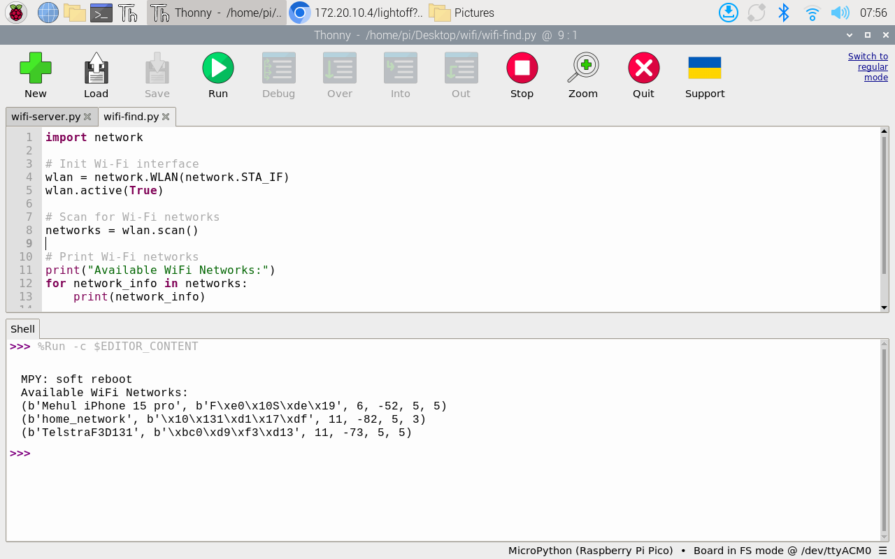
_Wi-Fi Network Scan Output_

### Step 2: Connecting to a Wi-Fi Network

Once you have identified the network you want to connect to, you can establish a connection using its SSID and password:

```python
# wifi-connect.py

import network
from time import sleep

# Wi-Fi credentials
ssid = 'YOUR_NETWORK_NAME'
password = 'YOUR_PASSWORD'

# Init Wi-Fi Interface
wlan = network.WLAN(network.STA_IF)
wlan.active(True)

# Connect to your network
wlan.connect(ssid, password)

# Wait for Wi-Fi connection
connection_timeout = 10
while connection_timeout > 0:
    if wlan.status() >= 3:
        break
    connection_timeout -= 1
    print('Waiting for Wi-Fi connection...')
    sleep(1)

# Check if connection is successful
if wlan.status() != 3:
    raise RuntimeError('Failed to establish a network connection')
else:
    print('Connection successful!')
    network_info = wlan.ifconfig()
    print('IP address:', network_info[0])
```

After running this code, your Pico 2W should be connected to the specified Wi-Fi network. Make note of the IP address that is printed - you'll need this for communication between devices.

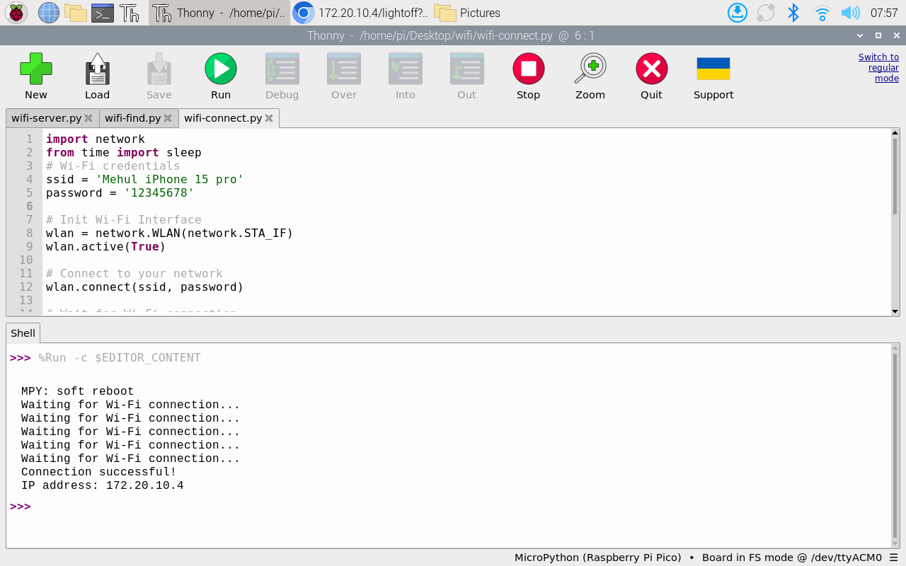
_Wi-Fi Connection Success_

Your Pico 2W is now connected to WiFi and can send and receive data wirelessly now. Connect you RPi to the same WiFi and now we can start communicating between the devices.

### Controlling hardware wirelessly

:::tip[Activity: Creating a Web Server on Pico 2W]

One of the most powerful applications of Wi-Fi connectivity is creating a web server. This allows any device on the same network to interact with the Pico 2W through a web browser, making it perfect for control panels, data visualization, and remote monitoring.

In this activity, we'll set up the Pico 2W as a web server that controls and displays the onboard LED state. The Raspberry Pi 4B (or any device on the network) can access this web page.

**Step 1: Program the Pico 2W as a Web Server**

```python
# wifi-server.py

import network
from time import sleep
import socket
# Import necessary classes for hardware control
from machine import Pin

# Create a Pin object for the onboard LED
led = Pin("LED", Pin.OUT)

# Wi-Fi credentials
ssid = 'YOUR_NETWORK_NAME'
password = 'YOUR_PASSWORD'

def connect():
    # Init Wi-Fi Interface
    wlan = network.WLAN(network.STA_IF)
    wlan.active(True)

    # Connect to your network
    wlan.connect(ssid, password)

    # Wait for Wi-Fi connection
    connection_timeout = 10
    while connection_timeout > 0:
        if wlan.status() >= 3:
            break
        connection_timeout -= 1
        print('Waiting for Wi-Fi connection...')
        sleep(1)

    # Check if connection is successful
    if wlan.status() != 3:
        raise RuntimeError('Failed to establish a network connection')
    else:
        print('Connection successful!')
        network_info = wlan.ifconfig()
        print('IP address:', network_info[0])
        return network_info[0]

def open_socket(ip):
    # Open a socket
    address = (ip, 80)
    connection = socket.socket()
    connection.bind(address)
    connection.listen(1)
    print(connection)
    return connection

def webpage(state):
    #Template HTML
    html = f"""
            <!DOCTYPE html>
            <html>
            <form action="./lighton">
            <input type="submit" value="Light on" />
            </form>
            <form action="./lightoff">
            <input type="submit" value="Light off" />
            </form>
            <p>LED is {state}</p>
            </body>
            </html>
            """
    return str(html)

def serve(connection):
    #Start a web server
    state = 'OFF'
    led.off()
    while True:
        client = connection.accept()[0]
        request = client.recv(1024)
        request = str(request)
        try:
            request = request.split()[1]
        except IndexError:
            pass
        if request == '/lighton?':
            led.on()
            state = 'ON'
        elif request =='/lightoff?':
            led.off()
            state = 'OFF'
        html = webpage(state)
        client.send(html)
        client.close()

try:
    ip = connect()
    connection = open_socket(ip)
    serve(connection)
except KeyboardInterrupt:
    machine.reset()
```

**Step 2: Access the Web Server from Raspberry Pi 4B**

1. After uploading the code to the Pico 2W, note the IP address printed in the Thonny shell.
   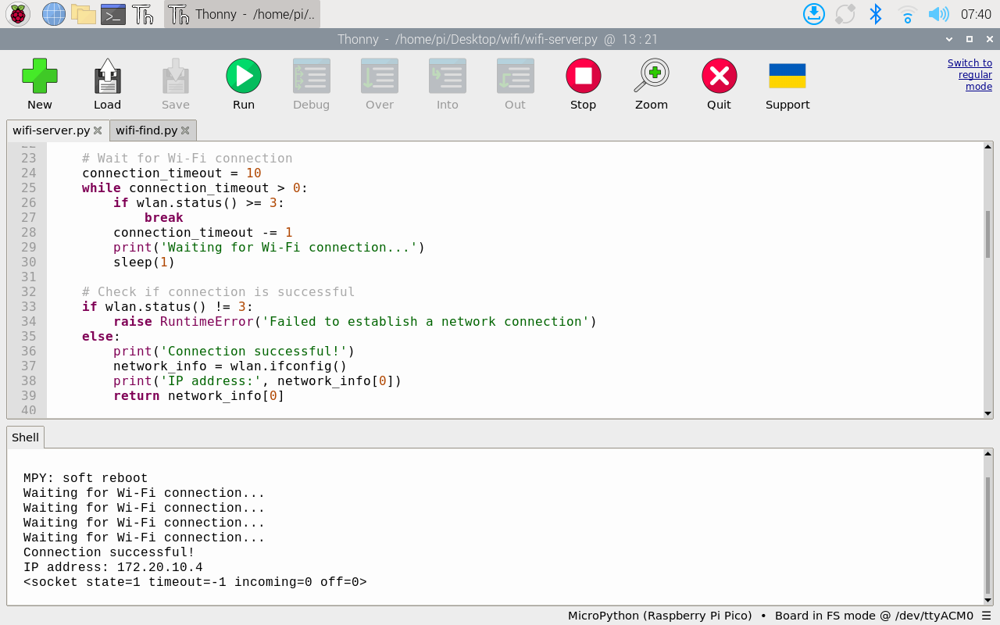
   _Wi-Fi Connection Success_
2. Open a web browser on the Raspberry Pi 4B and enter the IP address of the Pico 2W in the address bar. You should see a web page displaying the current LED satate and two buttons to control the LED from the Pico 2W.
   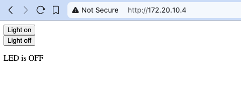
   _Wi-Fi server_

**Step 3: Controlling the hardware through WiFi**

1. Once you are able to access the server via the browser, you will be able to control the onboard LED using the buttons on the webpage. Click the `Turn on` button to turn the LED on.

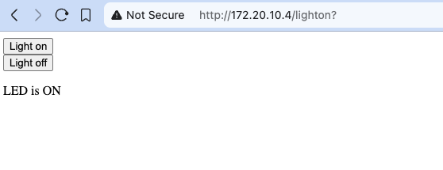
_Wi-Fi server turn on_
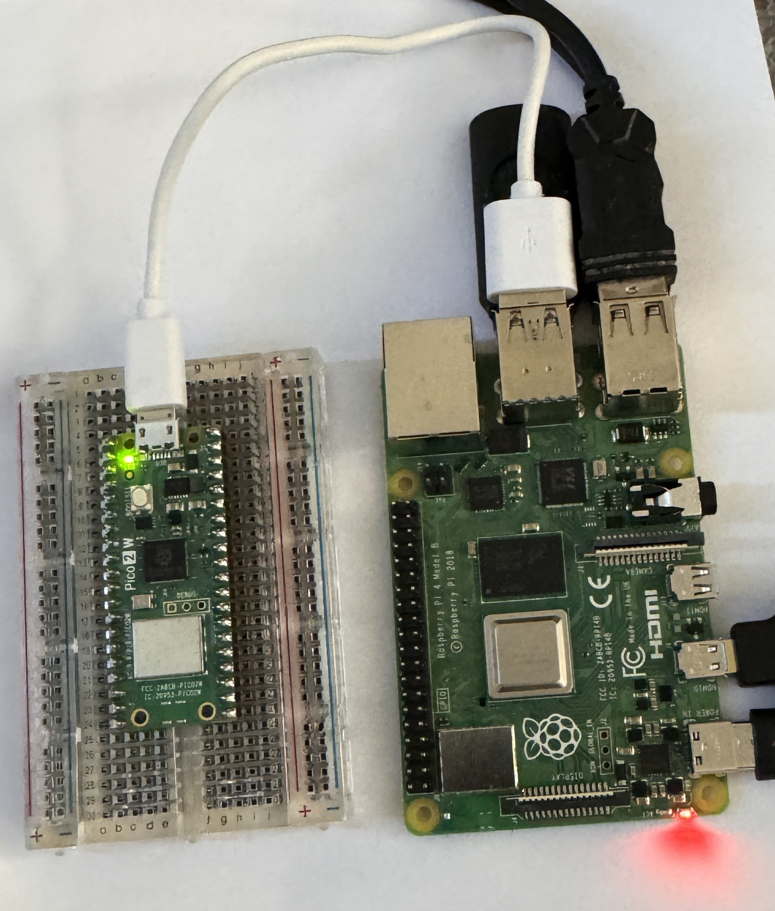
_Wi-Fi server turn on_

1. Similarly the `Turn off` button to turns the LED off.

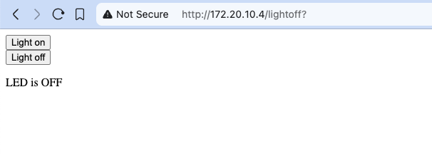
_Wi-Fi server turn off_
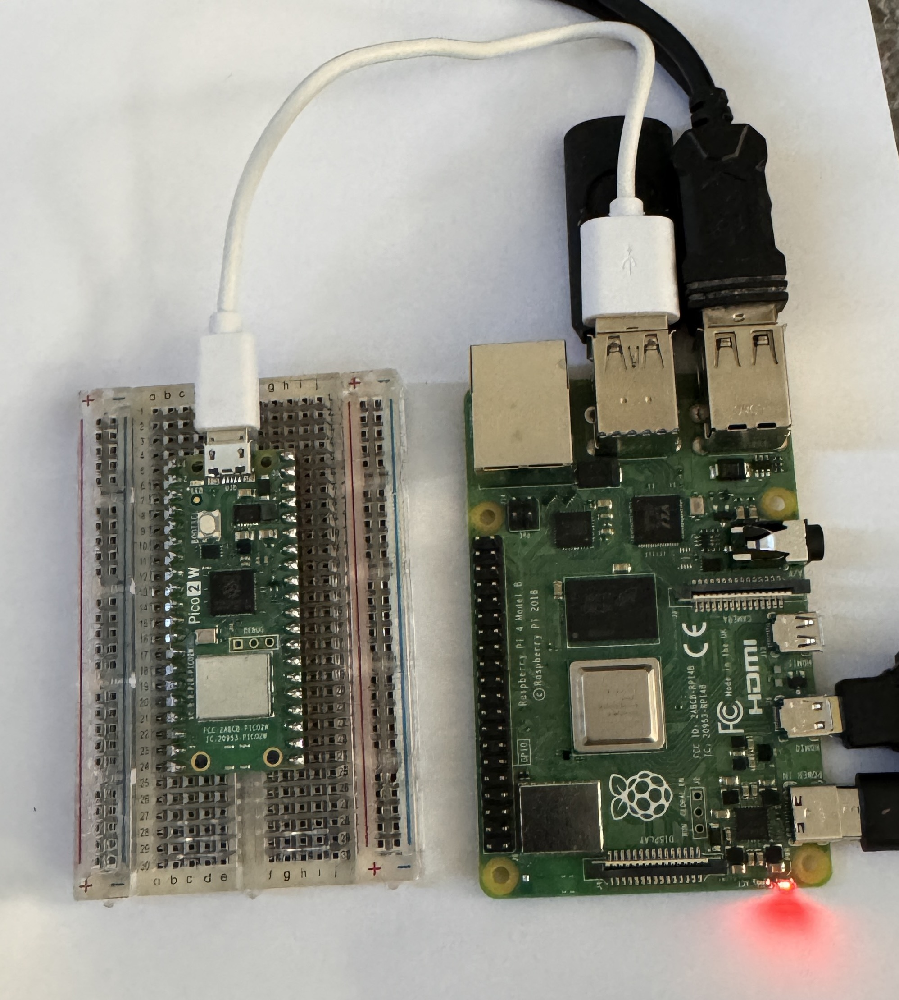
_Wi-Fi server turn off_

**What's Happening?**

- The Pico 2W connects to your WiFi network.
- It starts a web server listening on port 80.
- When a browser (from any device on the network) connects to its IP address, it responds with HTML code that the browser displays as web page.
- The web page displays the current LED state and two buttons to control the LED.
- This demonstrates IoT principles with a device providing data over the network

**Understanding the code**

1. `Connection Setup`: `The connect()` function establishes a Wi-Fi connection and returns the assigned IP address
2. `Socket Creation`: `open_socket()` creates a network socket listening on port 80 (standard HTTP port)
3. `HTML Generation`: `webpage()` generates a simple HTML page with buttons to control the LED
4. `Request Handling`: `serve()` processes incoming HTTP requests and updates the LED state
5. `User Interaction`: From any device on the same network, opening a browser and navigating to the Pico's IP address displays the control page

This example demonstrates core concepts in IoT (Internet of Things) development, where physical devices can be controlled through standard web interfaces.

:::

## Method 2: Bluetooth Communication

The Raspberry Pi Pico 2W also has Bluetooth capabilities, allowing for direct device-to-device communication without needing a network infrastructure. While Wi-Fi excels at longer range and higher bandwidth applications, Bluetooth offers better power efficiency and direct device-to-device connectivity without requiring a network infrastructure. The Raspberry Pi Pico 2W supports Bluetooth Low Energy (BLE), which is perfect for lower-power applications.

### Understanding BLE on Pico 2W

Bluetooth Low Energy works on a peripheral/central device model:

- **Peripheral**: A device that advertises its presence and provides data or services (in our case the `Pico 2W`)
- **Central**: A device that scans for and connects to peripherals (in our case `Raspberry Pi 4B`)

Communication happens through defined characteristics that can be read from or written to.

### Setting Up BLE on Pico 2W

### Step 1: Preparing the Required Files for Pico 2W

For Bluetooth communication, we need three Python files on the Pico 2W. Make sure to store these files on the Pico 2W and not the Rpi:

1. **ble_advertising.py** - Helper module for generating BLE advertising payloads
2. **ble_simple_peripheral.py** - Module for implementing a BLE peripheral device
3. **main.py** - Our main code that uses the above modules to communicate

Let's start by creating these files one by one.

#### File 1: ble_advertising.py

```python
# ble_advertising.py
# Helpers for generating BLE advertising payloads.

from micropython import const
import struct
import bluetooth

# Advertising payloads are repeated packets of the following form:
#   1 byte data length (N + 1)
#   1 byte type (see constants below)
#   N bytes type-specific data

_ADV_TYPE_FLAGS = const(0x01)
_ADV_TYPE_NAME = const(0x09)
_ADV_TYPE_UUID16_COMPLETE = const(0x3)
_ADV_TYPE_UUID32_COMPLETE = const(0x5)
_ADV_TYPE_UUID128_COMPLETE = const(0x7)
_ADV_TYPE_UUID16_MORE = const(0x2)
_ADV_TYPE_UUID32_MORE = const(0x4)
_ADV_TYPE_UUID128_MORE = const(0x6)
_ADV_TYPE_APPEARANCE = const(0x19)

# Generate a payload to be passed to gap_advertise(adv_data=...).
def advertising_payload(limited_disc=False, br_edr=False, name=None, services=None, appearance=0):
    payload = bytearray()

    def _append(adv_type, value):
        nonlocal payload
        payload += struct.pack("BB", len(value) + 1, adv_type) + value

    _append(
        _ADV_TYPE_FLAGS,
        struct.pack("B", (0x01 if limited_disc else 0x02) + (0x18 if br_edr else 0x04)),
    )

    if name:
        _append(_ADV_TYPE_NAME, name)

    if services:
        for uuid in services:
            b = bytes(uuid)
            if len(b) == 2:
                _append(_ADV_TYPE_UUID16_COMPLETE, b)
            elif len(b) == 4:
                _append(_ADV_TYPE_UUID32_COMPLETE, b)
            elif len(b) == 16:
                _append(_ADV_TYPE_UUID128_COMPLETE, b)

    # See org.bluetooth.characteristic.gap.appearance.xml
    if appearance:
        _append(_ADV_TYPE_APPEARANCE, struct.pack("<h", appearance))

    return payload


def decode_field(payload, adv_type):
    i = 0
    result = []
    while i + 1 < len(payload):
        if payload[i + 1] == adv_type:
            result.append(payload[i + 2 : i + payload[i] + 1])
        i += 1 + payload[i]
    return result


def decode_name(payload):
    n = decode_field(payload, _ADV_TYPE_NAME)
    return str(n[0], "utf-8") if n else ""


def decode_services(payload):
    services = []
    for u in decode_field(payload, _ADV_TYPE_UUID16_COMPLETE):
        services.append(bluetooth.UUID(struct.unpack("<h", u)[0]))
    for u in decode_field(payload, _ADV_TYPE_UUID32_COMPLETE):
        services.append(bluetooth.UUID(struct.unpack("<d", u)[0]))
    for u in decode_field(payload, _ADV_TYPE_UUID128_COMPLETE):
        services.append(bluetooth.UUID(u))
    return services
```

#### File 2: ble_simple_peripheral.py

```python
# ble_simple_peripheral.py

import bluetooth
import random
import struct
import time
from ble_advertising import advertising_payload

from micropython import const

_IRQ_CENTRAL_CONNECT = const(1)
_IRQ_CENTRAL_DISCONNECT = const(2)
_IRQ_GATTS_WRITE = const(3)

_FLAG_READ = const(0x0002)
_FLAG_WRITE_NO_RESPONSE = const(0x0004)
_FLAG_WRITE = const(0x0008)
_FLAG_NOTIFY = const(0x0010)

_UART_UUID = bluetooth.UUID("6E400001-B5A3-F393-E0A9-E50E24DCCA9E")
_UART_TX = (
    bluetooth.UUID("6E400003-B5A3-F393-E0A9-E50E24DCCA9E"),
    _FLAG_READ | _FLAG_NOTIFY,
)
_UART_RX = (
    bluetooth.UUID("6E400002-B5A3-F393-E0A9-E50E24DCCA9E"),
    _FLAG_WRITE | _FLAG_WRITE_NO_RESPONSE,
)
_UART_SERVICE = (
    _UART_UUID,
    (_UART_TX, _UART_RX),
)

class BLESimplePeripheral:
    def __init__(self, ble, name="mpy-uart"): # Make sure to use your own "name", you can use your first name or student id as part of "name" such as "mpy-uart-EDT703" 
        self._ble = ble
        self._ble.active(True)
        self._ble.irq(self._irq)
        ((self._handle_tx, self._handle_rx),) = self._ble.gatts_register_services((_UART_SERVICE,))
        self._connections = set()
        self._write_callback = None
        self._payload = advertising_payload(name=name, services=[_UART_UUID])
        self._advertise()

    def _irq(self, event, data):
        # Track connections so we can send notifications.
        if event == _IRQ_CENTRAL_CONNECT:
            conn_handle, _, _ = data
            print("New connection", conn_handle)
            self._connections.add(conn_handle)
        elif event == _IRQ_CENTRAL_DISCONNECT:
            conn_handle, _, _ = data
            print("Disconnected", conn_handle)
            self._connections.remove(conn_handle)
            # Start advertising again to allow a new connection.
            self._advertise()
        elif event == _IRQ_GATTS_WRITE:
            conn_handle, value_handle = data
            if conn_handle in self._connections and value_handle == self._handle_rx and self._write_callback:
                data = self._ble.gatts_read(self._handle_rx)
                self._write_callback(data)

    def send(self, data):
        for conn_handle in self._connections:
            self._ble.gatts_notify(conn_handle, self._handle_tx, data)

    def is_connected(self):
        return len(self._connections) > 0

    def _advertise(self, interval_us=500000):
        print("Starting advertising")
        self._ble.gap_advertise(interval_us, adv_data=self._payload)

    def on_write(self, callback):
        self._write_callback = callback
```

#### File 3: main.py (Pico 2W LED Control)

```python
# main.py

from machine import Pin
import bluetooth
from ble_simple_peripheral import BLESimplePeripheral

# Create a Bluetooth Low Energy (BLE) object
ble = bluetooth.BLE()

# Create an instance of the BLESimplePeripheral class with the BLE object
sp = BLESimplePeripheral(ble)

# Create a Pin object for the onboard LED, configure it as an output
led = Pin("LED", Pin.OUT)

# Initialize the LED state to 0 (off)
led_state = 0

# Define a callback function to handle received data
def on_rx(data):
    print("Data received: ", data)  # Print the received data
    global led_state  # Access the global variable led_state
    if data == b'o':  # Check if the received data is "o"
        led.value(not led_state)  # Toggle the LED state (on/off)
        led_state = 1 - led_state  # Update the LED state

# Start an infinite loop
while True:
    if sp.is_connected():  # Check if a BLE connection is established
        sp.on_write(on_rx)  # Set the callback function for data reception
```

### Step 2: Flashing the Files to Pico 2W

Follow these steps to upload the files to your Pico 2W using Thonny:

1. Connect your Pico 2W to your computer via USB
2. Open Thonny IDE
3. Click on the bottom right corner where it says "Python" and select "MicroPython (Raspberry Pi Pico)"
4. Create three new files and copy the code for each file provided above
5. Save each file to the Pico by selecting "Save as..." and choosing "Raspberry Pi Pico" as the location
   - Save the first file as `ble_advertising.py`
   - Save the second file as `ble_simple_peripheral.py`
   - Save the third file as `main.py` (this will run automatically on boot)

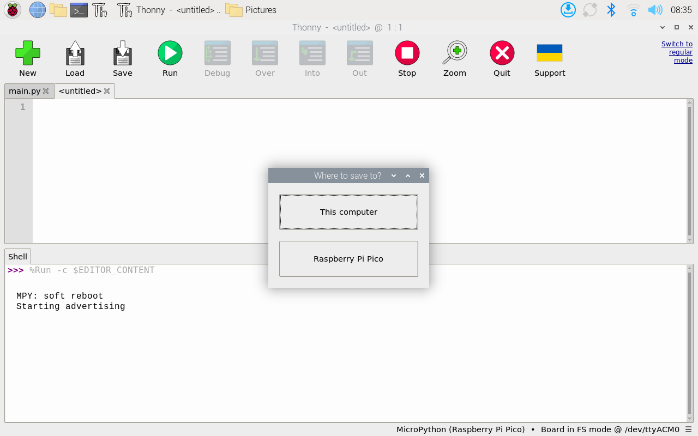
_BLE Pico store on pico_

6. Disconnect the Pico from your computer (if needed)

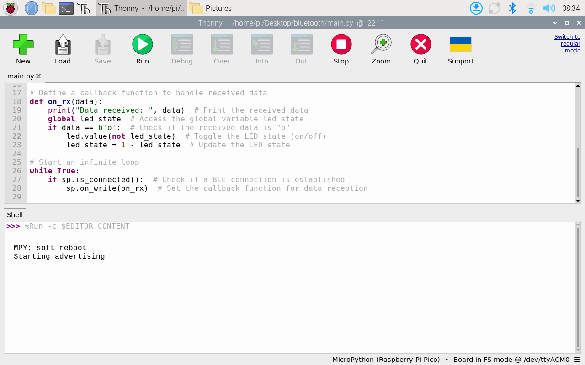
_BLE Pico advertise_

Now your Pico 2W is set up as a BLE peripheral device that will toggle its onboard LED when it receives the character 'o' from a connected BLE central device.

### Step 3: Setting Up the Raspberry Pi 4B as a BLE Client

Now we'll create a Python script for the Raspberry Pi 4B to connect to the Pico 2W and send commands to control its LED. This script uses the `bluepy` library, which we need to install first.

#### Installing Dependencies on Raspberry Pi 4B

Open a terminal on your Raspberry Pi 4B and run the following commands. The installation make take long time so let it complete the installation successfully:

```bash
sudo apt-get update
sudo apt-get install python3-pip libglib2.0-dev
sudo pip3 install bluepy --break-system-packages
```

#### Python Script for Raspberry Pi 4B

Create a new file named `ble_client.py` on your Raspberry Pi 4B:

```python
# ble_client.py

import time
from bluepy import btle
import argparse

# UART service UUID
UART_SERVICE_UUID = "6E400001-B5A3-F393-E0A9-E50E24DCCA9E"
# UART RX characteristic UUID (for sending data to Pico)
UART_RX_CHAR_UUID = "6E400002-B5A3-F393-E0A9-E50E24DCCA9E"
# UART TX characteristic UUID (for receiving data from Pico)
UART_TX_CHAR_UUID = "6E400003-B5A3-F393-E0A9-E50E24DCCA9E"

# Notification handler class
class NotificationHandler(btle.DefaultDelegate):
    def __init__(self):
        btle.DefaultDelegate.__init__(self)
        self.data = []
        
    def handleNotification(self, cHandle, data):
        print(f"Notification received from handle {cHandle}: {data.decode()}")
        self.data.append(data)

# Function to scan for BLE devices
def scan_for_devices(timeout=5.0):
    print("Scanning for BLE devices...")
    scanner = btle.Scanner()
    devices = scanner.scan(timeout)
    
    pico_devices = []
    for device in devices:
        name = None
        for (adtype, desc, value) in device.getScanData():
            if desc == 'Complete Local Name':
                name = value
        
        if name and 'mpy' in name.lower():
            print(f"Found Pico device: {name} - {device.addr}")
            pico_devices.append((name, device.addr))
    
    return pico_devices

# Function to connect to a BLE device
def connect_to_device(addr):
    print(f"Connecting to device {addr}...")
    try:
        peripheral = btle.Peripheral(addr)
        peripheral.setDelegate(NotificationHandler())
        print("Connected successfully!")
        return peripheral
    except btle.BTLEDisconnectError:
        print("Failed to connect. Device might be out of range or turned off.")
        return None
    except Exception as e:
        print(f"Error connecting: {e}")
        return None

# Function to discover services and characteristics
def discover_characteristics(peripheral):
    print("Discovering services and characteristics...")
    
    uart_service = None
    rx_char = None
    tx_char = None
    
    # Get the UART service
    for service in peripheral.getServices():
        if service.uuid == UART_SERVICE_UUID:
            uart_service = service
            break
    
    if not uart_service:
        print("UART service not found!")
        return None, None
    
    # Get the RX and TX characteristics
    for char in uart_service.getCharacteristics():
        if char.uuid == UART_RX_CHAR_UUID:
            rx_char = char
        elif char.uuid == UART_TX_CHAR_UUID:
            tx_char = char
    
    if not rx_char or not tx_char:
        print("Could not find RX or TX characteristics!")
        return None, None
    
    print("Found UART service and characteristics!")
    return rx_char, tx_char

# Function to toggle the LED
def toggle_led(rx_char):
    try:
        rx_char.write(b'o')
        print("Sent toggle command to LED")
        return True
    except Exception as e:
        print(f"Error toggling LED: {e}")
        return False

# Main function
def main():
    parser = argparse.ArgumentParser(description='BLE client for Pico W LED control')
    parser.add_argument('--addr', help='MAC address of the Pico W (if known)')
    parser.add_argument('--toggle', action='store_true', help='Toggle the LED')
    parser.add_argument('--scan', action='store_true', help='Scan for BLE devices')
    args = parser.parse_args()
    
    if args.scan:
        scan_for_devices()
        return
    
    addr = args.addr
    if not addr:
        devices = scan_for_devices()
        if not devices:
            print("No Pico devices found. Please try again or specify the address.")
            return
        _, addr = devices[0]  # Use the first found device
    
    # Connect to the device
    peripheral = connect_to_device(addr)
    if not peripheral:
        return
    
    try:
        # Discover characteristics
        rx_char, tx_char = discover_characteristics(peripheral)
        if not rx_char or not tx_char:
            return
        
        # Toggle the LED if requested
        if args.toggle:
            toggle_led(rx_char)
            time.sleep(1)  # Wait for any notifications
        else:
            # Interactive mode
            print("\nEnter commands:")
            print("  't' to toggle the LED")
            print("  'q' to quit")
            
            while True:
                cmd = input("> ")
                if cmd.lower() == 'q':
                    break
                elif cmd.lower() == 't':
                    toggle_led(rx_char)
                    time.sleep(0.1)
                else:
                    print("Unknown command")
                
                # Check for notifications
                if peripheral.waitForNotifications(0.1):
                    # handleNotification() was called
                    continue
        
    finally:
        print("Disconnecting...")
        peripheral.disconnect()

if __name__ == "__main__":
    main()
```

### Step 4: Running the BLE Client on Raspberry Pi 4B

1. Save the code above to a file named `ble_client.py` on your Raspberry Pi 4B.

2. Run the script in scan mode to find your Pico 2W:

   ```bash
   sudo python3 ble_client.py --scan
   ```

    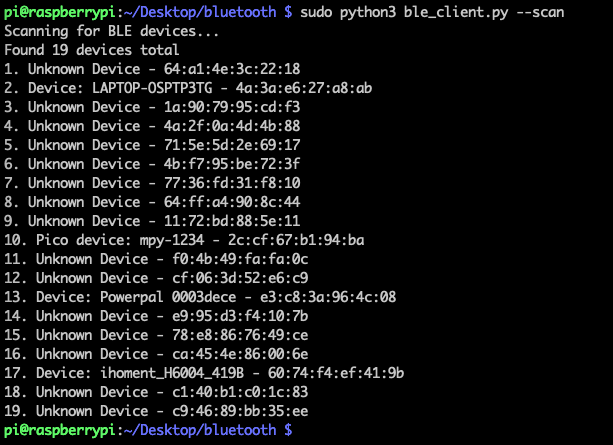
   _BLE Scan_

3. You can run the client code directly to enable the interactive mode:

   ```bash
   sudo python3 ble_client.py
   ```

   This will allow you to type commands (like 't' to toggle the LED).

    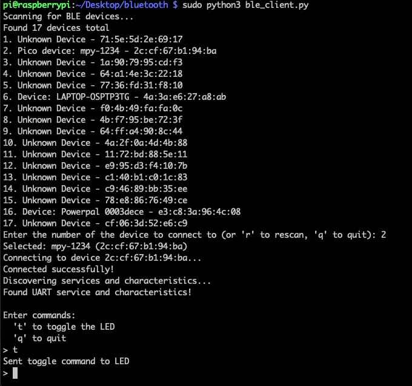
   _BLE Interactive_

4. Pressing `t` in the interactive mode will send the data via the bluetooth to Pico to toggle the LED light. See the console on Thonny to see the received data.

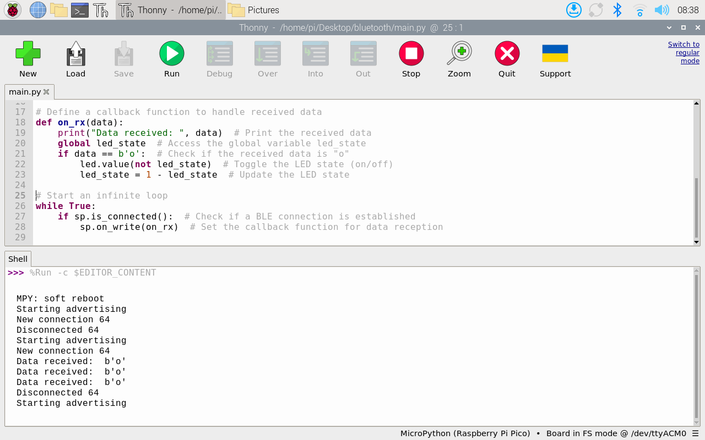
_BLE Pico main_


_Bluetooth LED toggle_

### Understanding the Communication

1. The Pico 2W acts as a peripheral device that advertises its presence.
2. The Raspberry Pi 4B acts as a central device that scans for and connects to the Pico.
3. The communication uses the Nordic UART Service (NUS), which emulates a UART connection over BLE.
4. When the Raspberry Pi sends the character 'o', the Pico toggles its onboard LED.
5. The communication is bidirectional, so the Pico can also send data back to the Raspberry Pi.

## Conclusion

You've now set up Bluetooth communication between your Raspberry Pi 4B and Pico 2W. This allows wireless control and data exchange between these devices without requiring a physical connection. The Nordic UART Service provides a simple but effective way to send commands and data in both directions, making it ideal for a wide range of IoT projects.
