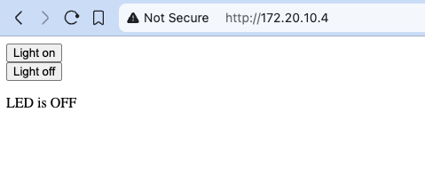
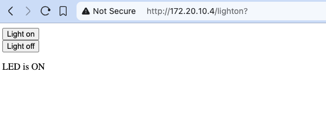

---

title: Advanced Communication
draft: true
----

Now that we've explored the basics of connecting digital systems, let's touch on some more advanced concepts that are important in modern computing systems.

### Network Communication

Modern digital systems frequently communicate over networks. Here are some key concepts:

#### The OSI Model

The OSI (Open Systems Interconnection) model divides network communication into seven layers:

1. **Physical Layer**: Hardware transmission (cables, radio signals)
2. **Data Link Layer**: Node-to-node connections and error detection
3. **Network Layer**: Routing and addressing (IP)
4. **Transport Layer**: End-to-end connections (TCP, UDP)
5. **Session Layer**: Session establishment and management
6. **Presentation Layer**: Data translation and encryption
7. **Application Layer**: Application-specific protocols (HTTP, FTP)

Our Raspberry Pi and Pico 2W are communicating at multiple layers:

- Physical/Data Link: WiFi or Bluetooth radio signals
- Network/Transport: IP and TCP/UDP protocols
- Application: Our custom protocols or HTTP

#### Internet Protocols

The most common internet protocols include:

- **IP (Internet Protocol)**: Addressing and routing packets
- **TCP (Transmission Control Protocol)**: Reliable, ordered data delivery
- **UDP (User Datagram Protocol)**: Fast, connectionless communication
- **HTTP (Hypertext Transfer Protocol)**: Web communication
- **MQTT (Message Queuing Telemetry Transport)**: Lightweight IoT messaging

:::note[MQTT for IoT]
MQTT is particularly important for IoT projects. It's a lightweight publish/subscribe protocol designed for constrained devices and low-bandwidth, high-latency networks. The Pico 2W can use MQTT to communicate with servers or cloud services with minimal overhead.
:::

### Real-Time Operating Systems (RTOS)

While the Raspberry Pi 4B runs a full Linux operating system and the Pico 2W typically runs bare-metal code, there's a middle ground: Real-Time Operating Systems (RTOS).

An RTOS is designed to:

- Process data as it comes in, with minimal delay
- Provide predictable timing for operations
- Efficiently manage resources on constrained devices

Popular RTOS options for microcontrollers include:

- **FreeRTOS**: Open-source RTOS that can run on the Pico 2W
- **Zephyr**: Scalable RTOS for connected devices
- **RIOT**: IoT-focused RTOS

Using an RTOS on the Pico 2W would allow more complex applications with:

- Task scheduling
- Resource management
- Timing guarantees

### Buses and Peripheral Communication

Modern computers and embedded systems use various buses to connect internal components and peripherals:

#### Internal Computer Buses

- **Memory Bus**: Connects CPU to RAM
- **PCI Express (PCIe)**: High-speed computer expansion bus
- **System Bus**: Connects major computer components

#### External/Peripheral Buses

- **USB (Universal Serial Bus)**: Connects external devices
- **HDMI**: Audio/video transmission
- **SATA**: Storage device connection

The Raspberry Pi 4B exposes several of these buses, allowing it to connect to displays, storage, and other peripherals.


### Method 1: Simple Countdown Synchronization

### Method 2: NTP Synchronization (Advanced)

For more precise synchronization, we can use NTP to synchronize the clocks:

#### Step 1: Set Up the Raspberry Pi

Create a file named `led_sync_ntp_server.py` on your Raspberry Pi:

```python
import socket
import time
from gpiozero import LED
import ntplib

# Set up the LED
led = LED(17)  # Change to your GPIO pin if different

# Create a socket server
server_socket = socket.socket(socket.AF_INET, socket.SOCK_STREAM)
server_socket.setsockopt(socket.SOL_SOCKET, socket.SO_REUSEADDR, 1)
server_socket.bind(('0.0.0.0', 8000))
server_socket.listen(1)

print("Server started, waiting for connection...")

# Accept connection from Pico
client_socket, address = server_socket.accept()
print(f"Connection from {address} established")

try:
    # Get precise time from NTP server
    ntp_client = ntplib.NTPClient()
    response = ntp_client.request('pool.ntp.org')
    ntp_time = response.tx_time
    
    # Round to the next 10-second interval for easy synchronization
    sync_time = ntp_time + (10 - (ntp_time % 10))
    
    # Send sync time to Pico
    client_socket.send(f"{sync_time}".encode())
    print(f"Synchronization time sent: {sync_time}")
    
    # Wait until sync time
    delay = sync_time - time.time()
    if delay > 0:
        print(f"Waiting {delay:.2f} seconds to synchronize...")
        time.sleep(delay)
    
    # Start synchronized blinking
    print("Starting synchronized blinking!")
    while True:
        current_time = time.time()
        # Blink on even seconds, off on odd seconds
        if int(current_time) % 2 == 0:
            led.on()
        else:
            led.off()
        # Sleep until next second
        time.sleep(1 - (current_time % 1))
        
except KeyboardInterrupt:
    print("Stopping...")
finally:
    client_socket.close()
    server_socket.close()
    led.off()
```

#### Step 2: Set Up the Pico W

Create a file named `led_sync_ntp_client.py` on your Pico W:

```python
import socket
import time
import network
from machine import Pin
import ntptime

# Connect to WiFi
def connect_to_wifi(ssid, password):
    wlan = network.WLAN(network.STA_IF)
    wlan.active(True)
    wlan.connect(ssid, password)
    
    # Wait for connection
    max_wait = 10
    while max_wait > 0:
        if wlan.status() < 0 or wlan.status() >= 3:
            break
        max_wait -= 1
        print('Waiting for connection...')
        time.sleep(1)
    
    if wlan.status() != 3:
        raise RuntimeError('Network connection failed')
    else:
        print('Connected')
        status = wlan.ifconfig()
        print('IP:', status[0])
    
    return wlan

# WiFi credentials - replace with your network details
ssid = 'YOUR_WIFI_SSID'
password = 'YOUR_WIFI_PASSWORD'

# Connect to WiFi
wlan = connect_to_wifi(ssid, password)

# Set up the LED
led = Pin("LED", Pin.OUT)

# Synchronize RTC with NTP
try:
    ntptime.settime()
    print("Time synchronized with NTP server")
except:
    print("Could not sync with NTP server, continuing anyway")

# Set up the client socket
client_socket = socket.socket(socket.AF_INET, socket.SOCK_STREAM)
server_address = ('RASPBERRY_PI_IP_ADDRESS', 8000)  # Replace with your Raspberry Pi's IP
print(f"Connecting to {server_address}...")
client_socket.connect(server_address)
print("Connected to server")

try:
    # Receive synchronization time from server
    sync_data = client_socket.recv(1024).decode()
    sync_time = float(sync_data)
    print(f"Received sync time: {sync_time}")
    
    # Wait until it's time to start blinking
    current_time = time.time()
    delay = sync_time - current_time
    if delay > 0:
        print(f"Waiting {delay:.2f} seconds to synchronize...")
        time.sleep(delay)
    
    # Start synchronized blinking
    print("Starting synchronized blinking!")
    while True:
        current_time = time.time()
        # Blink on even seconds, off on odd seconds
        if int(current_time) % 2 == 0:
            led.value(1)
        else:
            led.value(0)
        # Sleep until next second
        time.sleep(1 - (current_time % 1))
        
except Exception as e:
    print(f"Error: {e}")
finally:
    client_socket.close()
    led.value(0)
```

#### Step 3: Install Required Library on Raspberry Pi

Before running the advanced version, install the ntplib library on your Raspberry Pi:

```bash
pip3 install ntplib
```

#### Step 4: Run the Activity

Follow the same steps as in Method 1 to run the advanced version.

### Observations and Discussion Points

After running this activity:

1. **Observe the Synchronization**: How closely do the LEDs blink together? Is there any noticeable delay?

2. **Timing Precision**: Is Method 2 (NTP) more precise than Method 1 (simple countdown)? Why or why not?

3. **Network Effects**: What happens if there's network congestion? How does it affect synchronization?

4. **Scalability**: How would you modify this system to synchronize multiple Picos at once?

5. **Error Handling**: What would happen if the connection is lost during operation? How could you make the system more robust?

### Extension Ideas

- Add an offset parameter to intentionally delay one LED relative to the other
- Implement more complex blinking patterns while maintaining synchronization
- Create a wireless "light show" with multiple Picos, all synchronized to the Raspberry Pi
- Add buttons to control the blinking pattern in real-time while maintaining synchronization

:::

:::note[Understanding NTP]

Network Time Protocol (NTP) is a networking protocol for clock synchronization between computer systems. It's essential for many distributed systems where timing is critical.

The Raspberry Pi, running a full Linux OS, has built-in support for NTP and can maintain accurate time when connected to the internet. The Pico W can also synchronize its time using MicroPython's `ntptime` module, though with less precision than a full OS implementation.

For IoT applications, time synchronization is crucial for:
- Correctly timestamping sensor data
- Coordinating actions across multiple devices
- Implementing time-based security mechanisms
- Scheduling operations across distributed systems

:::


### Controlling hardware wirelessly

:::tip[Activity: Creating a Web Server on Pico 2W]

Creating web server  allows any device on the same network to interact with the Pico 2W through a web browser, making it perfect for control panels, data visualization, and remote monitoring.

In this activity, we'll set up the Pico 2W as a web server that controls and displays the onboard LED state. The Raspberry Pi 4B (or any device on the network) can access this web page.

**Step 1: Program the Pico 2W as a Web Server**

```python
# wifi-server.py

import network
from time import sleep
import socket
# Import necessary classes for hardware control
from machine import Pin

# Create a Pin object for the onboard LED
led = Pin("LED", Pin.OUT)

# Wi-Fi credentials
ssid = 'YOUR_NETWORK_NAME'
password = 'YOUR_PASSWORD'

def connect():
    # Init Wi-Fi Interface
    wlan = network.WLAN(network.STA_IF)
    wlan.active(True)

    # Connect to your network
    wlan.connect(ssid, password)

    # Wait for Wi-Fi connection
    connection_timeout = 10
    while connection_timeout > 0:
        if wlan.status() >= 3:
            break
        connection_timeout -= 1
        print('Waiting for Wi-Fi connection...')
        sleep(1)

    # Check if connection is successful
    if wlan.status() != 3:
        raise RuntimeError('Failed to establish a network connection')
    else:
        print('Connection successful!')
        network_info = wlan.ifconfig()
        print('IP address:', network_info[0])
        return network_info[0]

def open_socket(ip):
    # Open a socket
    address = (ip, 80)
    connection = socket.socket()
    connection.bind(address)
    connection.listen(1)
    print(connection)
    return connection

def webpage(state):
    #Template HTML
    html = f"""
            <!DOCTYPE html>
            <html>
            <form action="./lighton">
            <input type="submit" value="Light on" />
            </form>
            <form action="./lightoff">
            <input type="submit" value="Light off" />
            </form>
            <p>LED is {state}</p>
            </body>
            </html>
            """
    return str(html)

def serve(connection):
    #Start a web server
    state = 'OFF'
    led.off()
    while True:
        client = connection.accept()[0]
        request = client.recv(1024)
        request = str(request)
        try:
            request = request.split()[1]
        except IndexError:
            pass
        if request == '/lighton?':
            led.on()
            state = 'ON'
        elif request =='/lightoff?':
            led.off()
            state = 'OFF'
        html = webpage(state)
        client.send(html)
        client.close()

try:
    ip = connect()
    connection = open_socket(ip)
    serve(connection)
except KeyboardInterrupt:
    machine.reset()
```

**Step 2: Access the Web Server from Raspberry Pi 4B**

1. After uploading the code to the Pico 2W, note the IP address printed in the Thonny shell.
   
   _Wi-Fi Connection Success_
2. Open a web browser on the Raspberry Pi 4B and enter the IP address of the Pico 2W in the address bar. You should see a web page displaying the current LED satate and two buttons to control the LED from the Pico 2W.
   
   _Wi-Fi server_

**Step 3: Controlling the hardware through WiFi**

1. Once you are able to access the server via the browser, you will be able to control the onboard LED using the buttons on the webpage. Click the `Turn on` button to turn the LED on.


_Wi-Fi server turn on_

_Wi-Fi server turn on_

1. Similarly the `Turn off` button to turns the LED off.


_Wi-Fi server turn off_

_Wi-Fi server turn off_

**What's Happening?**

- The Pico 2W connects to your WiFi network.
- It starts a web server listening on port 80.
- When a browser (from any device on the network) connects to its IP address, it responds with HTML code that the browser displays as web page.
- The web page displays the current LED state and two buttons to control the LED.
- This demonstrates IoT principles with a device providing data over the network

**Understanding the code**

1. `Connection Setup`: `The connect()` function establishes a Wi-Fi connection and returns the assigned IP address
2. `Socket Creation`: `open_socket()` creates a network socket listening on port 80 (standard HTTP port)
3. `HTML Generation`: `webpage()` generates a simple HTML page with buttons to control the LED
4. `Request Handling`: `serve()` processes incoming HTTP requests and updates the LED state
5. `User Interaction`: From any device on the same network, opening a browser and navigating to the Pico's IP address displays the control page

This example demonstrates core concepts in IoT (Internet of Things) development, where physical devices can be controlled through standard web interfaces.

:::
