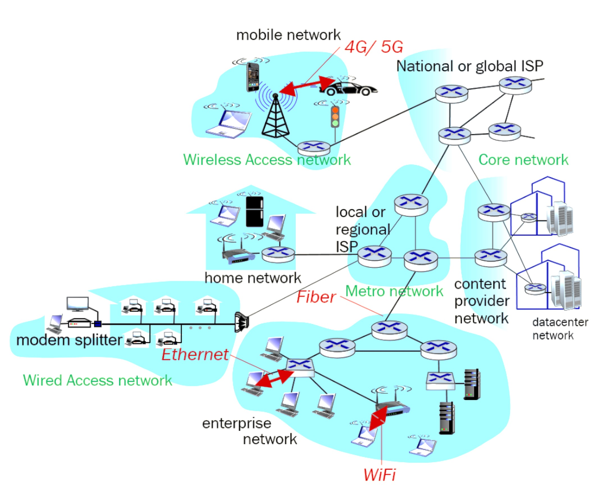

import { YouTube } from 'astro-embed';

Up to this point, We have learned how to connect individual devices such as LEDs or microcontrollers to a computer or each other using wires or serial connections. These direct links help devices communicate and share information in simple ways. But what happens when we need to connect more than just a few devices? What if we want hundreds or even thousands of devices from mobile phones and laptops to smart fridges to share data and work together?

This is where computer networks come in. Instead of connecting every device directly to every other device which would quickly become impossible to manage, we build networks—structured systems that allow devices to communicate, share resources, and stay connected efficiently. Just like cities use roads to connect homes, shops, and offices, computer networks use cables, Wi-Fi, and protocols to connect all kinds of devices.

## Understanding How Devices Talk to Each Other: An Analogy to Human Communication

Computer networking is all about enabling a wide range of digital devices such as laptops, smartphones, smartwatches, home automation tools, servers, cameras, and even self-driving cars to share information and communicate with one another to provide a service or getting a work done.

Think of it like a conversation between people. For humans to communicate successfully, two basic things must happen:

- We need to speak a common language.

- We need to hear each other clearly.

If you are speaking to someone in a noisy room, you might have to ask them to repeat what they said. If you do not understand their message, you would likely ask for clarification. We also change how we speak depending on the audience, sometimes addressing a friend casually, other times using more formal language in professional settings. Conversations often begin with greetings and end politely.

Computers communicate similarly. They follow specific rules and greetings to ensure messages are sent, received, understood, and if needed, send the message again. These rules are called network protocols, and they help devices coordinate how they exchange information.

When we talk about computer networking, we are really referring to the systems and rules that make it possible for all these machines to “talk” to each other efficiently. Just like human interaction, successful digital communication depends on clarity, shared language (protocols), and a structured process.

Computer networking uses models to explain how these protocols operate at different levels, from physical signals to complete messages, ensuring that devices can communicate reliably even in complex, noisy digital environments.

## What is Internet?

The internet is a network of networks and we have different types of networks. The following short video gives a good introduction to Internet.

  <YouTube id='Dxcc6ycZ73M' params='fs=1&modestbranding=1&rel=0&autoplay=1' />

Computer networks are typically structured in layers to efficiently deliver data, and the three key types are core, metro, and access networks. The access network is the first layer and connects end-user devices such as your computer, phone, your television to the rest of the network.  Technologies such as 4G (fourth generation wireless networks), 5G (fifth generation wireless networks), Wi-Fi, and fibre to the home (FTTH) are used in access network. The metro network, or metropolitan network, connects multiple access networks within a city or region. It acts as a bridge, aggregating data from many neighbourhoods or business areas and routing it toward the wider network. At the top is the core network, which forms the Internet’s backbone. It uses extremely high-speed connections and powerful routing infrastructure to transport large volumes of data across countries and continents. These three layers ensure that data can travel from a user’s device all the way to global services and back. This layered network architecture is illustrated in the below figure.  

_High level network diagram_

Watch the first 4 minutes of the following video to understand different types of networks that make Internet.

  <YouTube id='sMHzfigUxz4' params='fs=1&modestbranding=1&rel=0&autoplay=1' />

Computer networks can be understood both by their function, i.e., core, metro, and access and their scale or scope, i.e., Personal Area Network, Local Area Networks and so on. The access network includes Personal Area Networks (PANs), which link personal devices such as your smartwatch connects to your mobile phone via Bluetooth. Local Area Networks (LANs) are used in homes, schools, or offices for device communication such as WiFi networks. The metro network, which collects traffic from multiple access networks, is closely related to Metropolitan Area Networks (MANs) that cover an entire city or campus. Above that is the core network, which connects regions, countries, and continents—this forms part of Wide Area Networks (WANs), especially the global Internet.

Networks consist of different types of devices that provide a specific function to support the complex operation of networking. We will learn about the network functions of devices in details in next sections. Watch the following video to have a basic understanding of different types of networking devices.

  <YouTube id='MXr_cyY0BVc' params='fs=1&modestbranding=1&rel=0&autoplay=1' />

:::tip[Activity: Think about the network around you]

 Network map is a visual representation of how devices are connected within a network, such as at home or in a school. It shows the types of devices (laptops, phones, and printers), how they connect (using Wi-Fi or cables), and the roles of key components.

 1. Create a network map of your school and illustrate the different types of networks that a data packet from your mobile phone travels through as it connects to the school network and accesses a webpage on the internet. Show the path the packet takes from your phone, through the local school network, and out to the wider internet highlighting each network type it passes through.

 2. Reflect on the complexity of the process.

:::

## How Do Devices Share Information Over a Network?

When a computer or other digital device (called a host) sends or receives information, it does not transmit one giant message all at once. Instead, it breaks that message into smaller units called packets. These packets travel across the network—through cables, Wi-Fi, and other devices like routers—until they reach their destination. Eventually, the receiving host reassembles the original message from those packets.

Now, this sounds simple in theory, but in practice, it is much more complex (something we will explore in greater detail in later modules). A key idea to understand right now is that communication links, the paths the packets travel do not have unlimited capacity. Imagine them like water pipes. A small pipe can only carry a certain amount of water at a time. Similarly, a network link can only transmit a certain amount of data per second. This capacity is often called bandwidth, link capacity, or transmission rate.

Because of this limitation, only a specific number of packets can travel across a link during a given time. This creates something called transmission delay, which is the time it takes for a packet to move from one end of the link to the other. The longer the packet or the slower the link, the more delay you will experience.

To estimate the transmission delay, we use a simple formula:

Transmission delay = L / R
(where L is the size of the packet in bits, and R is the transmission rate in bits per second)

It is important to note that this delay can vary depending on whether the link is wireless or wired, and other factors. And how these packets actually travel between devices, which is a complex process involving routing, switching, and protocols. We will unpack as we go deeper into networking.

:::tip[Activity: Think about the delay]
We have all experienced the frustration of waiting for a web page or YouTube video to load. This delay often happens because data packets take time to travel through the network. But what causes these delays, and what factors affect how long packets take to reach their destination?
 :::
