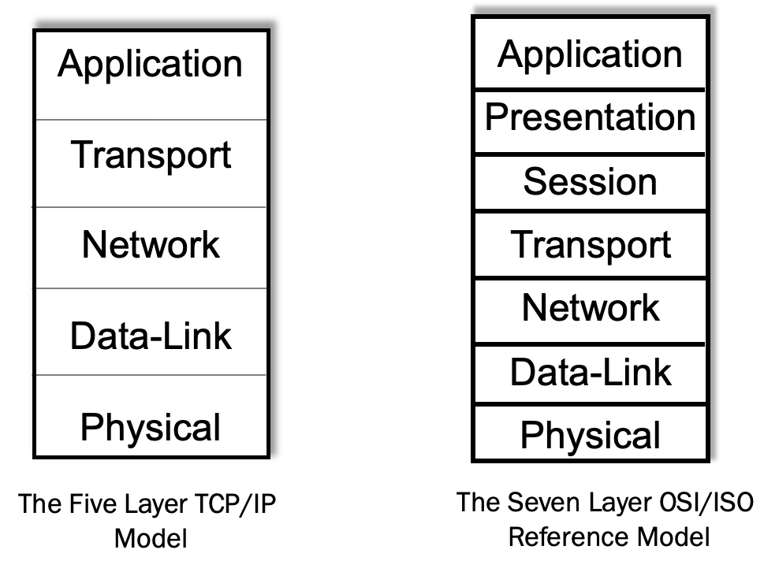
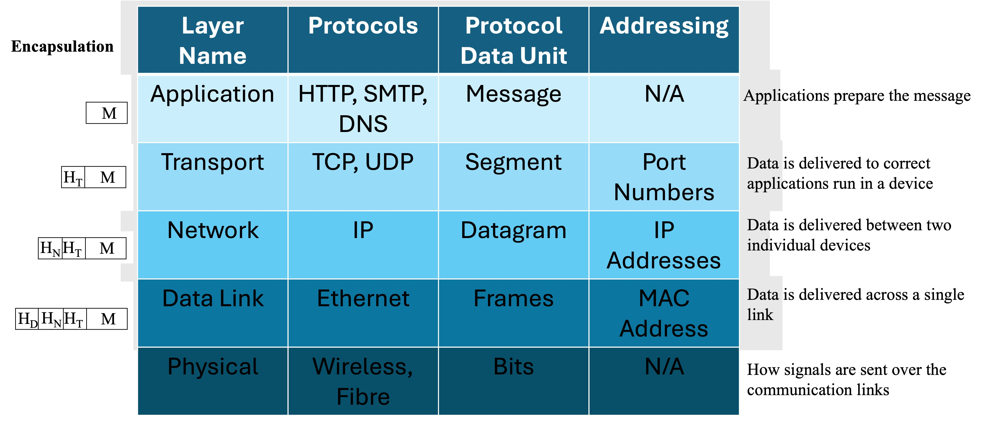
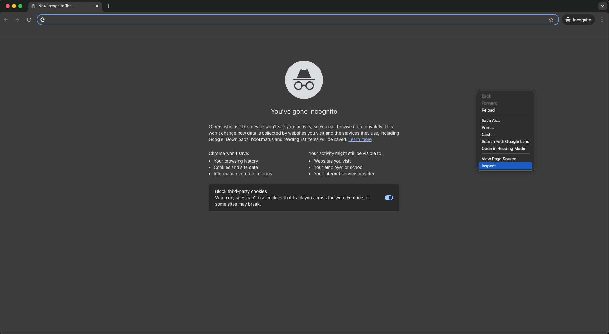
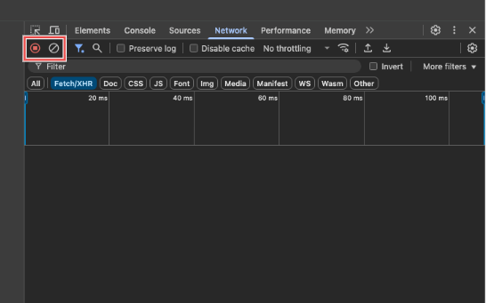
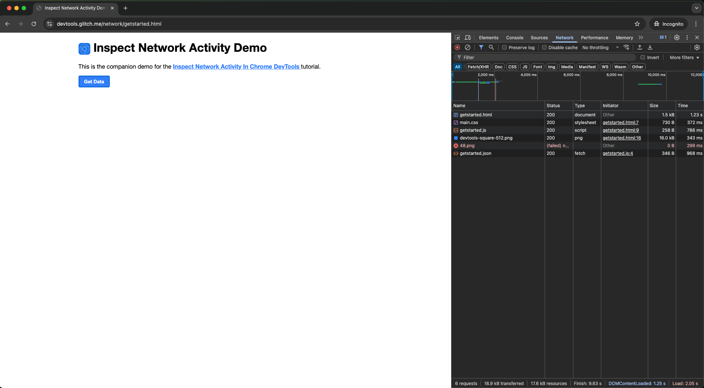
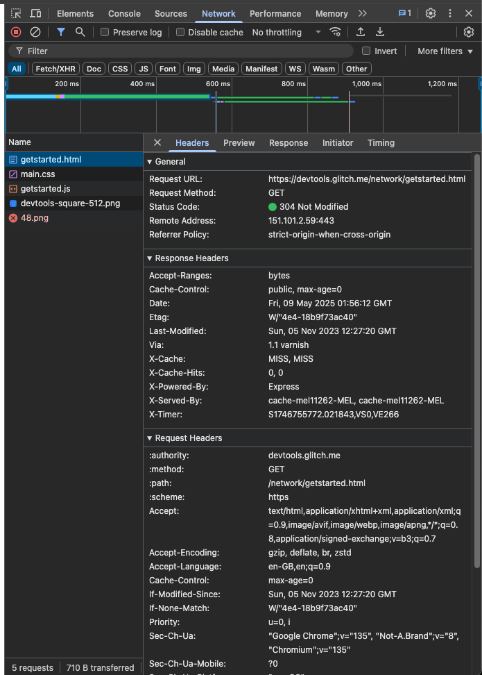

import { YouTube } from 'astro-embed';

Computer networks can seem complicated involving numerous hardware and software components that need to work together seamlessly, but so are many systems we encounter every day. To make things easier to understand, let’s begin with something more familiar before diving into the models used in networking and the Internet.

Imagine someone asked you to describe how the airline system works when you travel from your home to another city or country. A clear way to explain it would be to walk through each step in the process from preparing at home to arriving at your destination. Just like a journey through the airline system involves several steps including booking a ticket, checking in, passing through security, boarding the plane, flying, and then going through customs at your destination, baggage claim and clearance, sending information across the Internet follows a sequence of well-defined stages too.

In networking, we use layered models to describe this process. Each layer has a specific role. One layer might break your message into smaller parts, another determines how it should travel across the network, and another ensures it gets to the correct device. These layers work together just like the airline staff, airport infrastructure, and pilots all cooperate to get you safely to your destination.

When you send a message from your phone or computer, think of it like sending yourself on a trip. It is not just one step, but a whole coordinated journey across systems and checkpoints.

## The Concept of Layered Network Model

Layered model/ architecture breaks down the complex process of network communication into manageable and modular components. This approach offers several benefits:

- **Simplification**: Complex systems become easier to understand and develop
- **Standardisation**: Different vendors can create interoperable products
- **Modularity**: Layers can evolve independently without affecting others
- **Troubleshooting**: Problems can be isolated to specific layers and can be addressed

The two most commonly used models are the OSI (Open Systems Interconnection) model and the TCP/IP (Transmission Control Protocol/Internet Protocol) model.

### OSI Model

The Open Systems Interconnection (OSI) model, developed by the International Organisation for Standardisation (ISO), divides network communication into seven distinct layers, ranging from how data is physically transmitted to how applications interact with the network. The layers and their functions of OSI model are,

| Layer | Name | Function | Example Protocols |
|-------|------|----------|-------------------|
| 7 | Application | User interface and application access | HTTP, FTP, SMTP, DNS |
| 6 | Presentation | Data translation, encryption, compression | SSL/TLS, JPEG, MPEG |
| 5 | Session | Session establishment, maintenance, termination | NetBIOS, RPC |
| 4 | Transport | End-to-end connections, reliability, flow control | TCP, UDP |
| 3 | Network | Logical addressing, routing | IP, ICMP, OSPF |
| 2 | Data Link | Physical addressing, access to media, error detection | Ethernet, Wi-Fi, PPP |
| 1 | Physical | Transmission of raw bit streams | USB, Bluetooth, Ethernet physical layer |

### TCP/IP Model

The TCP/IP model (also known as the Internet Protocol Suite) is the foundation of Internet communications. This model is a more practical, simplified model with four layers (standardised) and there is another commonly used TCP/IP model considered in the literature is a 5-layed TCP/IP model.

| TCP/IP Layer | Corresponds to OSI Layers | Function | Example Protocols |
|--------------|---------------------------|----------|-------------------|
| Application | 5-7 (Session, Presentation, Application) | User applications and services | HTTP, SMTP, FTP, DNS |
| Transport | 4 (Transport) | End-to-end communication | TCP, UDP |
| Internet | 3 (Network) | Addressing and routing | IP, ICMP |
| Link | 1-2 (Physical, Data Link) | Physical network connection | Ethernet, Wi-Fi, ARP |

In the 5-layed TCP/IP model, the link layer of 4-layed TCP/Ip model was divided into two layers which are Data link layer and Physical layer. Therefore, whether it is a 4-layer or 5-layer model, the operation of TCP/IP model remain the same.

_A comparison of the 5 layer TCP/IP model with the 7 layer OSI/ISO reference model_

:::note[OSI vs TCP/IP]
While the OSI model is more comprehensive and used for understanding and discussing network concepts, the TCP/IP model is widely implemented in today's networks including Internet. Therefore, in this chapter, we focus on TCP/IP model.
:::

:::note [How do the network providers know which protocols to use?]
Network protocols are like a shared language that devices use to exchange information over a network. These protocols outline the rules and procedures that enable reliable communication between computers and other digital devices. Just like we need to speak the same language to understand each other, devices must follow the same protocol standards to communicate effectively.

To ensure compatibility and smooth communication, these protocols must be standardised. This means organisations around the world agree on how the protocols should work, enabling developers to build systems and applications that can interact seamlessly.

One of the major organisations responsible for these standards is the Internet Engineering Task Force (IETF). They create and publish technical specifications called Requests for Comments (RFCs), which define many core internet protocols such as TCP, IP, and HTTP. There are now thousands of RFCs that guide how the Internet functions today. Other important standardisation bodies include the Institute of Electrical and Electronics Engineers (IEEE)—known for setting standards like Ethernet and Wi-Fi under the IEEE 802 series—and the 3rd Generation Partnership Project (3GPP), which focuses on mobile communication technologies such as 4G and 5G.
:::

## TCP/IP Model in Detail

The key characteristics of TCP/IP model are use open standard, works across different hardware and operating systems, and scalable model that can be used from small home networks to the global Internet. 

### Encapsulation Process

Data travels down through the layers on the sending device and up through the layers on the receiving device. At each layer, the data is encapsulated with additional information:

1. **Application layer**: Creates the data to be sent
2. **Transport layer**: Adds TCP/UDP header (port numbers, sequence information)
3. **Internet layer**: Adds IP header (source and destination IP addresses)
4. **Data Link layer**: Adds Ethernet/Wi-Fi header and trailer (MAC addresses)
5. **Physical Layer**: Defined how signals are sent over the communication links​
   

_TCP/IP Model, layers, encapsulation and functions_

:::note[Think about It: Postal system analogy- Another example of layered architecture]
The layered networking model is similar to how postal systems work:

- **Physical layer**: The vehicles that transport mail (trucks, planes)
- **Data link layer**: The sorting facilities that organize mail by region
- **Network layer**: The addressing system that determines routing
- **Transport layer**: Packaging (envelopes, boxes) that protects contents
- **Application layer**: The content of the letter and its formatting

Each layer has its own protocols and standards but works with other layers to deliver the complete message.
:::

## Common Application Layer Protocols

The application layer contains many specialized protocols for different services:

### HTTP/HTTPS (Hypertext Transfer Protocol)
- Used for web browsing
- HTTP operates on port 80, HTTPS on port 443
- Request-response model between clients and servers

### DNS (Domain Name System)
- Translates domain names to IP addresses
- Hierarchical, distributed database
- Critical for user-friendly web browsing

### SMTP/POP3/IMAP (Email Protocols)
- SMTP: Simple Mail Transfer Protocol (sending email)
- POP3/IMAP: Retrieving email from servers
- Uses different ports (25, 110, 143, etc.)

### FTP (File Transfer Protocol)
- Specialized for file uploads and downloads
- Separate control and data connections
- Still used despite being an older protocol

### SSH (Secure Shell)
- Secure remote login and command execution
- Encrypts all traffic
- Common for server administration

## Common Transport Layer Protocols

The transport layer has two primary protocols:

### TCP (Transmission Control Protocol)
- Connection-oriented and reliable
- Guarantees delivery and correct order
- Flow control and congestion management
- Higher overhead but ensures data integrity

_TCP connection_

### UDP (User Datagram Protocol)
- Connectionless and unreliable
- No guarantee of delivery, order, or duplicate protection
- Lower overhead and faster
- Used for time-sensitive applications (video streaming, gaming)

_UDP connection_

## Deciphering Web Browsing

We use the Internet all the time to access information. How do you access all these services online or visit a website that provides a specific service? You just type the address of the webpage in the address bar of your browser. Do you know that is just the start of a lengthy process? The browser contacts the relevant web server and requests data and then assembles the webpage from the information received within few milliseconds. Before you blink, you can see the webpage you requested. 

To understand the complexity of this process, let's trace what happens when you browse a website:

:::tip[Activity: Analyze Web Traffic with Browser Developer Tools]

Learn how to use browser developer tools to analyze network traffic and understand the HTTP protocol in action.

**Materials Needed:**
- Computer with a modern web browser (Chrome, Firefox, Edge, or Safari)
- Internet connection

**Steps:**

1. **Open your browser's developer tools:**
   - Chrome/Edge: Press F12 or Ctrl+Shift+I (Cmd+Option+I on Mac)
   - Firefox: Press F12 or right-click and select "Inspect Element"
   - Safari: Enable developer tools in Preferences > Advanced, then press Cmd+Option+I

_Opening devtools_

2. **Navigate to the Network tab:**
   - This shows all resources loaded by the webpage

_Networks tab_

3. **Clear the current entries and enable recording:**
   - Look for a clear button (often a 🚫 icon)
   - Make sure recording is enabled (usually a red circle)

_Clear the Networks tab_

4. **Visit a website:**
   - Head over to `https://devtools.glitch.me/network/getstarted.html` (a simple site)
   - Watch the network requests appear in real-time

_Capturing the network requests_

5. **Analyze the main HTML request:**
   - Click on the first entry (usually the HTML document)
   - Examine the following tabs:
     - **Headers**: Request and response headers, including HTTP method, status code, and content type
     - **Preview/Response**: The actual content received
     - **Timing**: How long each phase of the request took

_Analyzing the document_

6. **Examine HTTP headers in detail:**
   - Look at the Request URL, Method, Status Code
   - Note important headers like Content-Type, Content-Length, and Cookie
   - Identify caching mechanisms (Cache-Control, ETag, etc.)

7. **Analyze additional resources:**
   - Look at requests for images, CSS, JavaScript
   - Note how resources are loaded in parallel
   - Check if resources come from different domains

**Questions to Answer:**
1. How many requests were needed to load the complete webpage?
2. What different types of resources were requested?
3. What was the total size of the page?
4. How long did it take for the page to fully load?
5. What HTTP status codes did you observe and what do they mean?
6. What security-related headers did you find in HTTPS connections?
7. How do browsers optimize loading multiple resources?

**Submit a screenshot of your developer tools network panel with a brief analysis of what you observed.**
:::