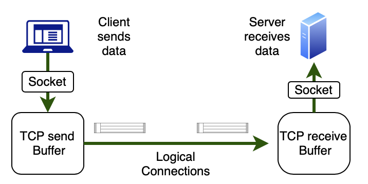
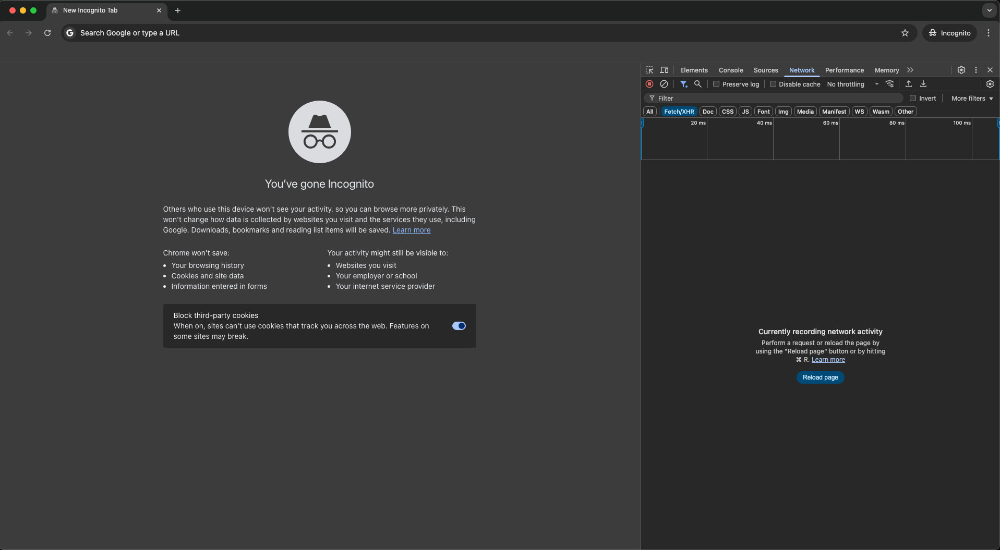

import { YouTube } from 'astro-embed';

Network communication is inherently complex, involving numerous hardware and software components that need to work together seamlessly. To manage this complexity, networking is organized into layers, with each layer handling specific aspects of communication.

## The Concept of Layered Architecture

Layered architecture breaks down the complex process of network communication into manageable, modular components. This approach offers several benefits:

1. **Simplification**: Complex systems become easier to understand and develop
2. **Standardization**: Different vendors can create interoperable products
3. **Modularity**: Layers can evolve independently without affecting others
4. **Troubleshooting**: Problems can be isolated to specific layers

:::note[Think about It: Postal System Analogy]
The layered networking model is similar to how postal systems work:

- **Physical layer**: The vehicles that transport mail (trucks, planes)
- **Data link layer**: The sorting facilities that organize mail by region
- **Network layer**: The addressing system that determines routing
- **Transport layer**: Packaging (envelopes, boxes) that protects contents
- **Application layer**: The content of the letter and its formatting

Each layer has its own protocols and standards but works with other layers to deliver the complete message.
:::

## Two Major Layered Models

Two primary models describe network communication layers: the OSI model and the TCP/IP model.

### The OSI Model

The Open Systems Interconnection (OSI) model, developed by the International Organization for Standardization (ISO), divides network communication into seven distinct layers.

| Layer | Name | Function | Example Protocols |
|-------|------|----------|-------------------|
| 7 | Application | User interface and application access | HTTP, FTP, SMTP, DNS |
| 6 | Presentation | Data translation, encryption, compression | SSL/TLS, JPEG, MPEG |
| 5 | Session | Session establishment, maintenance, termination | NetBIOS, RPC |
| 4 | Transport | End-to-end connections, reliability, flow control | TCP, UDP |
| 3 | Network | Logical addressing, routing | IP, ICMP, OSPF |
| 2 | Data Link | Physical addressing, access to media, error detection | Ethernet, Wi-Fi, PPP |
| 1 | Physical | Transmission of raw bit streams | USB, Bluetooth, Ethernet physical layer |

### The TCP/IP Model

The TCP/IP model (also known as the Internet Protocol Suite) is the foundation of Internet communications. It's a more practical, simplified model with four layers that correspond roughly to the OSI model.

| TCP/IP Layer | Corresponds to OSI Layers | Function | Example Protocols |
|--------------|---------------------------|----------|-------------------|
| Application | 5-7 (Session, Presentation, Application) | User applications and services | HTTP, SMTP, FTP, DNS |
| Transport | 4 (Transport) | End-to-end communication | TCP, UDP |
| Internet | 3 (Network) | Addressing and routing | IP, ICMP |
| Link | 1-2 (Physical, Data Link) | Physical network connection | Ethernet, Wi-Fi, ARP |

_A comparison of the 5 layer TCP/IP model with the 7 layer OSI/ISO reference model_

:::note[OSI vs TCP/IP]
While the OSI model is more comprehensive and used for understanding and discussing network concepts, the TCP/IP model is more practical and is actually implemented in today's networks. Most networking professionals need to understand both models.
:::

## TCP/IP Model in Detail

As the foundation of the Internet, the TCP/IP protocol suite deserves special attention.

### Key Characteristics:

- **Open standard**: Not controlled by any single company
- **Interoperable**: Works across different hardware and operating systems
- **Scalable**: From small home networks to the global Internet
- **Robust**: Designed to work despite network failures

### Encapsulation Process

Data travels down through the layers on the sending device and up through the layers on the receiving device. At each layer, the data is encapsulated with additional information:

1. **Application layer**: Creates the data to be sent
2. **Transport layer**: Adds TCP/UDP header (port numbers, sequence information)
3. **Internet layer**: Adds IP header (source and destination IP addresses)
4. **Link layer**: Adds Ethernet/Wi-Fi header and trailer (MAC addresses)

## Common Application Layer Protocols

The application layer contains many specialized protocols for different services:

### HTTP/HTTPS (Hypertext Transfer Protocol)
- Used for web browsing
- HTTP operates on port 80, HTTPS on port 443
- Request-response model between clients and servers

### DNS (Domain Name System)
- Translates domain names to IP addresses
- Hierarchical, distributed database
- Critical for user-friendly web browsing

### SMTP/POP3/IMAP (Email Protocols)
- SMTP: Simple Mail Transfer Protocol (sending email)
- POP3/IMAP: Retrieving email from servers
- Uses different ports (25, 110, 143, etc.)

### FTP (File Transfer Protocol)
- Specialized for file uploads and downloads
- Separate control and data connections
- Still used despite being an older protocol

### SSH (Secure Shell)
- Secure remote login and command execution
- Encrypts all traffic
- Common for server administration

## Common Transport Layer Protocols

The transport layer has two primary protocols:

### TCP (Transmission Control Protocol)
- Connection-oriented and reliable
- Guarantees delivery and correct order
- Flow control and congestion management
- Higher overhead but ensures data integrity

_TCP connection_

### UDP (User Datagram Protocol)
- Connectionless and unreliable
- No guarantee of delivery, order, or duplicate protection
- Lower overhead and faster
- Used for time-sensitive applications (video streaming, gaming)

_UDP connection_

## Deciphering Web Browsing

We use the Internet all the time to access information. How do you access all these services online or visit a website that provides a specific service? You just type the address of the webpage in the address bar of your browser. Do you know that is just the start of a lengthy process? The browser contacts the relevant web server and requests data and then assembles the webpage from the information received within few milliseconds. Before you blink, you can see the webpage you requested. 

To understand the complexity of this process, let's trace what happens when you browse a website:

:::tip[Activity: Analyze Web Traffic with Browser Developer Tools]

Learn how to use browser developer tools to analyze network traffic and understand the HTTP protocol in action.

**Materials Needed:**
- Computer with a modern web browser (Chrome, Firefox, Edge, or Safari)
- Internet connection

**Steps:**

1. **Open your browser's developer tools:**
   - Chrome/Edge: Press F12 or Ctrl+Shift+I (Cmd+Option+I on Mac)
   - Firefox: Press F12 or right-click and select "Inspect Element"
   - Safari: Enable developer tools in Preferences > Advanced, then press Cmd+Option+I

_Opening devtools_

2. **Navigate to the Network tab:**
   - This shows all resources loaded by the webpage

_Networks tab_

3. **Clear the current entries and enable recording:**
   - Look for a clear button (often a 🚫 icon)
   - Make sure recording is enabled (usually a red circle)

_Clear the Networks tab_

4. **Visit a website:**
   - Head over to `https://devtools.glitch.me/network/getstarted.html` (a simple site)
   - Watch the network requests appear in real-time

_Capturing the network requests_

5. **Analyze the main HTML request:**
   - Click on the first entry (usually the HTML document)
   - Examine the following tabs:
     - **Headers**: Request and response headers, including HTTP method, status code, and content type
     - **Preview/Response**: The actual content received
     - **Timing**: How long each phase of the request took

_Analyzing the document_

6. **Examine HTTP headers in detail:**
   - Look at the Request URL, Method, Status Code
   - Note important headers like Content-Type, Content-Length, and Cookie
   - Identify caching mechanisms (Cache-Control, ETag, etc.)

7. **Analyze additional resources:**
   - Look at requests for images, CSS, JavaScript
   - Note how resources are loaded in parallel
   - Check if resources come from different domains

**Questions to Answer:**
1. How many requests were needed to load the complete webpage?
2. What different types of resources were requested?
3. What was the total size of the page?
4. How long did it take for the page to fully load?
5. What HTTP status codes did you observe and what do they mean?
6. What security-related headers did you find in HTTPS connections?
7. How do browsers optimize loading multiple resources?

**Submit a screenshot of your developer tools network panel with a brief analysis of what you observed.**
:::