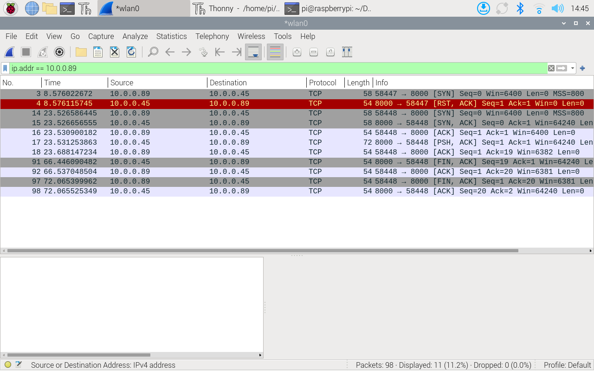
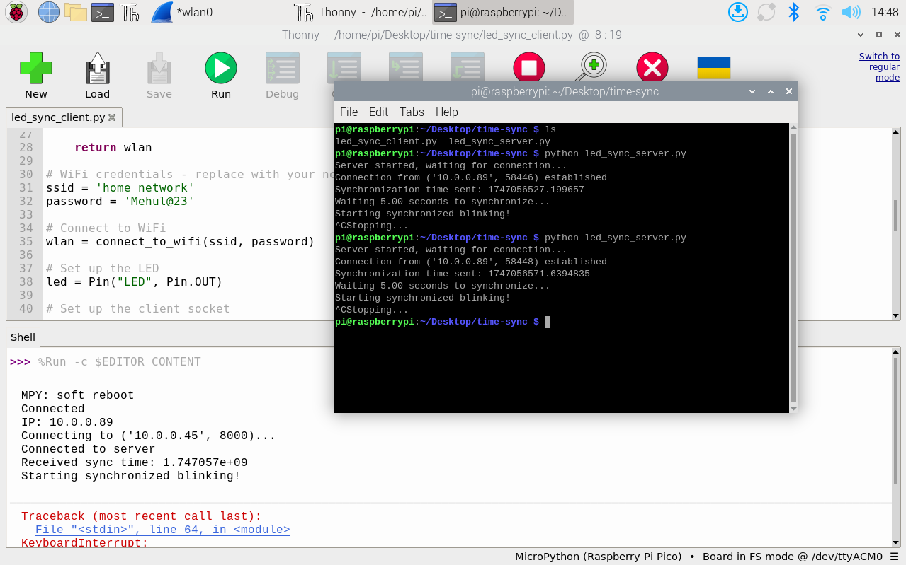
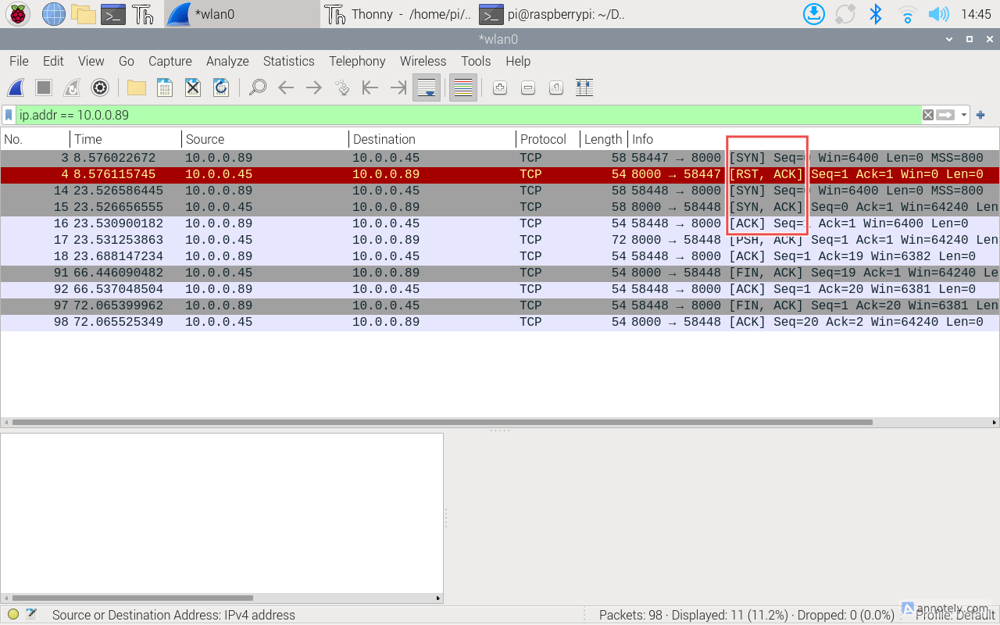
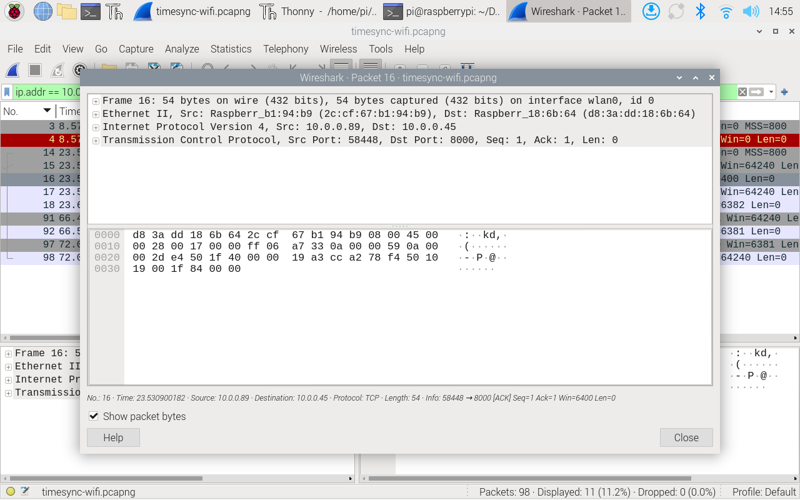
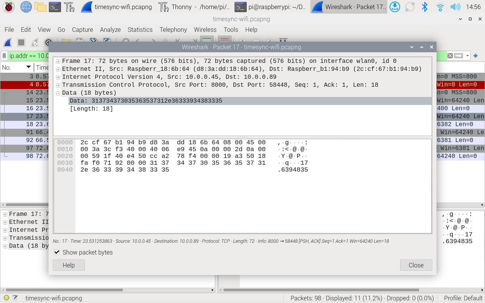

import { YouTube } from 'astro-embed';

In this section, we are going to look at a tool that is used in networking industry to analyse the traffic beyond the browser's developer tool that we have looked at in the previous section.

The basic tools that we use to monitor the messages exchanged between executing protocols and applications are called packet sniffers. A packet sniffer is a passive program. It copies (sniffs) messages being sent from and received by your device, and it displays the contents of the various protocol fields of these captured messages. It does not send or receive packets itself. Instead, it receives a copy of the packets that are being transferred in your device.  In this section, we will focus on Wireshark, which is a popular free open source packet sniffer used in the networking industry which will allow us to observe and decode network traffic, providing a window into the communication happening between devices.

## Introduction to Wireshark

Wireshark is one of the most popular network protocol analysers in the world. It lets you capture and interactively browse the traffic running on a computer network, providing detailed information about each packet.

#### Key Capabilities:

- **Live packet capture**: Watch network traffic in real-time
- **Deep inspection**: Decode hundreds of protocols
- **Advanced filtering**: Focus on specific traffic types
- **Visualization tools**: Graph traffic patterns
- **Cross-platform**: Available for Windows, macOS, Linux (including Raspberry Pi)


_Operating of Wireshark_

:::note[Ethical and Legal Considerations]
Packet sniffing can raise privacy and security concerns. Always:
- Only analyze networks you own or have explicit permission to monitor
- Be aware of privacy laws and regulations
- Never attempt to capture sensitive information like passwords
- Inform users if you're monitoring a shared network for educational purposes

In educational settings, create controlled environments for network analysis rather than analysing general traffic.
:::

The following video provides quick introduction to Wireshark before we walk you through how to install and use Wireshark in RPi.

<div class='not-content'>
  <YouTube id='lb1Dw0elw0Q' params='fs=1&modestbranding=1&rel=0&autoplay=1' />
</div>

## Installing Wireshark on Raspberry Pi

Our Raspberry Pi 4B makes an excellent platform for network analysis with Wireshark. Let's install and configure it.

:::tip[Activity: Installing and Configuring Wireshark on Raspberry Pi]

Follow these steps to set up Wireshark on your Raspberry Pi for network traffic analysis.

**Materials Needed:**
- Raspberry Pi 4B with Raspberry Pi OS
- Internet connection
- Terminal access

**Step 1: Update your system**

Open a terminal and run:
```bash
sudo apt update
sudo apt upgrade
```

**Step 2: Install Wireshark**

Install Wireshark using:
```bash
sudo apt install wireshark
```

During installation, you'll be asked if non-superusers should be able to capture packets. Select "Yes" for easier use.


_Wireshark Configuration_

**Step 3: Add your user to the wireshark group**

To capture packets without running as root:
```bash
sudo usermod -a -G wireshark $USER
```

You'll need to log out with `logout` command and back in for this change to take effect or you can just restart the RPi to apply the effect.

**Step 4: Start Wireshark**

You can start Wireshark through the desktop environment:
1. Click the Raspberry Pi menu
2. Go to Internet
3. Select Wireshark


_Starting Wireshark from menu_

Alternatively, start it from the terminal:
```bash
wireshark
```


_Starting Wireshark from Terminal_

**Step 5: Select an interface to capture**

When Wireshark opens:
1. You'll see a list of network interfaces
2. For wired connections, select "eth0"
3. For wireless connections, select "wlan0"
4. Click the shark fin icon to start capturing


_Wireshark Home Page_

If you do not see the interfaces like `wlan` or `bluetooth0`, then most probably your Step 3 failed and the program does not have permission to access those interfaces. Try Step 3 again and logout from the menu and log back in to enable the command.

**Step 6: Observe traffic**

Watch as packets start appearing in the main window. Each line represents a single packet, with columns showing:
- Packet number
- Time
- Source address
- Destination address
- Protocol
- Length
- Info about the packet


_Wireshark WLAN Capture

**Step 7: Stop the capture**

Click the red square button to stop capturing when you have sufficient data to analyze.

**Step 8: Save your capture (optional)**

If you want to save the capture for later analysis:
1. Click File > Save
2. Choose a location and filename
3. Save with the .pcapng extension

**Troubleshooting:**

- **No permission to capture**: Run `sudo chmod 750 /usr/bin/dumpcap` to set the correct permissions
- **No interfaces shown**: Try running with sudo: `sudo wireshark`
- **Slow performance**: Limit the capture with display filters to reduce processing load
- **Raspberry Pi freezing**: Use capture filters to reduce the amount of data captured
:::

## Capturing and Analysing WiFi Data

:::tip[Activity: Capturing WiFi Data Between RPi and Pico 2W]

In this activity, we'll use Wireshark to capture and analyze the WiFi communication between your Raspberry Pi 4B and Pico 2W during the time-synchronized LED blinking exercise we performed earlier. This will give you insight into what's happening "under the hood" when devices communicate wirelessly.

#### Learning Objectives:
- Capture real-time WiFi traffic using Wireshark
- Analyze packet structure and timing in device communication
- Understand TCP/IP networking principles in practice
- Visualize the data exchange in a real IoT application

#### Materials Needed:
- Raspberry Pi 4B with Wireshark installed (from previous setup)
- Raspberry Pi Pico 2W
- Both devices configured for the time-synchronized LED blinking activity
- Both devices connected to the same WiFi network


#### Step 1: Prepare for Packet Capture

1. Open Wireshark on your Raspberry Pi (through the menu or terminal)
2. When Wireshark launches, select the **wlan0** interface
3. Before starting the capture, let's create a display filter to focus on the relevant traffic:
   - Click in the filter box at the top of the window
   - Enter the following filter to show only traffic between your Pi and Pico:
     ```
     ip.addr == PICO_IP_ADDRESS
     ```
     (Replace PICO_IP_ADDRESS with your Pico 2W's actual IP address)
   - Click the blue arrow or press Enter to apply the filter


_Setting a Wireshark display filter_


#### Step 2: Start Capturing and Run the Time Sync Activity

1. Click the shark fin icon to start capturing packets
2. Now run the time-synchronized LED activity:
   - Start the server script on your Raspberry Pi
   - Start the client script on your Pico W
   - Observe the LEDs starting to blink in synchronization


_Time sync activity_

3. Watch as Wireshark displays the packets being exchanged between the devices


_Setting a Wireshark display filter_

#### Step 3: Analyze the Initial Connection

After a minute or so of capturing, stop the capture by clicking the red square button.

Now let's analyze what happened during the initial connection:

1. Look for the **TCP handshake** that established the connection:
   - Find three packets showing the TCP three-way handshake (SYN, SYN-ACK, ACK)
   - Click on each to examine the details in the packet breakdown pane


_Example of a TCP handshake in Wireshark_


_Expanded capture packet_

2. Find the **time synchronization message**:
   - Look for TCP packets with a length that indicates data transfer
   - Click on these packets and expand the "Data" section in the packet details
   - You should see the time when the data was sent from the Pi to the Pico


_Data field for a packet_

#### Discussion Questions:

1. **Protocol Analysis**: What transport layer protocol is used for the time synchronization (TCP or UDP)? Why do you think this protocol was chosen?

2. **Packet Structure**: What information can you find in the packet headers? How does this information help ensure reliable communication?

3. **Timing Analysis**: From the Wireshark capture, estimate the network latency between the devices. How might this affect the LED synchronization?

4. **Data Volume**: How much data was actually transferred during this seemingly simple application? Is it more or less than you expected?

5. **Security Considerations**: What security concerns can you identify by examining the packet contents? Is the data encrypted?

:::


{/*

:::note[You can install Wireshark in your laptop]

Please visit https://www.wireshark.org/#download to download Wireshark. We use the current stable release of Wireshark which is 3.4.5. Please download the relevant file that is suitable for your operating system and install Wireshark in your device.

More details on the Wireshark and the user guide can be access via https://www.wireshark.org/docs/wsug_html/
:::

:::tip[Activity: Capturing Bluetooth traffic]
In the last module, you connected RPi and Pico via Bluetooth connection and controlled the Pico LED by sending Bluetooth commands.

- Rerun the activity and start capturing the activity on the bluetooth interface.

- You should see traffic like below. Capture and store the data for further analysis.


_Wireshark Bluetooth Capture_

- What are the different types of protocols used?
- What are the source and destinations?
- Can you identify the source and destination addresses?
  
:::

*/}