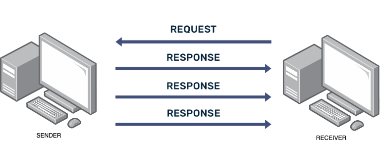
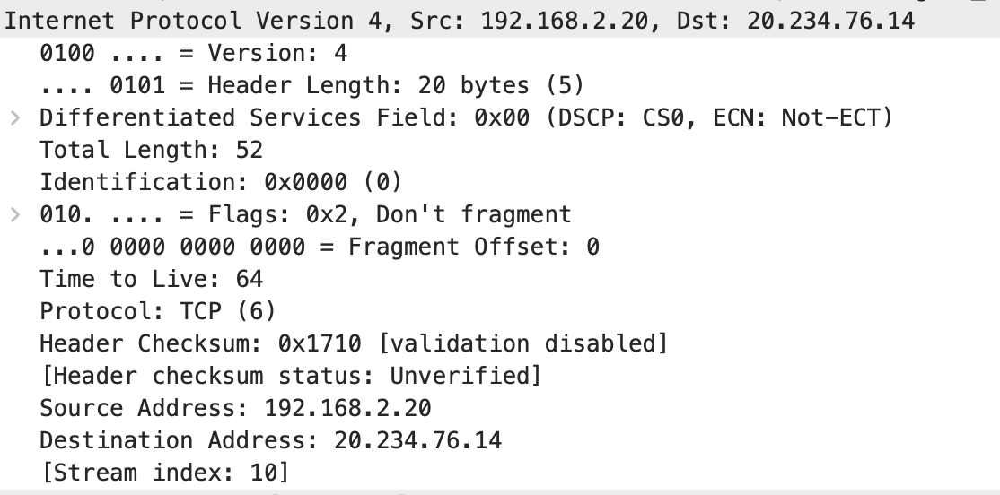

import { YouTube } from 'astro-embed';

Now that we have captured network traffic, it is time to understand network protocols in details and analyse them. This will give us practical insight into the TCP/IP model and help us understand how protocols work at each layer.

## The TCP/IP Layers in Action

Let’s explore each layer of the TCP/IP model by examining how data flows through them, focusing on the specific roles and protocols at each stage. We will start from the top, the application layer since that is where network interaction begins from the user’s perspective and will go slowly down the protocol stack. By analysing traffic at each level, we will gain a clearer understanding of how these layers work together to make communication across the Internet possible.

### Application Layer

The main reason we study computer networks is because of the powerful and exciting applications they enable such as browsing the web, streaming videos, or chatting online. Without these kinds of applications, there would be little need for the complex systems and protocols that make networking possible. The rapid pace of innovation in Internet-based tools shows no signs of slowing down.

Application layer protocols operate exclusively on end-user devices like laptops, smartphones, and servers and not on intermediary network hardware like routers or switches. These end devices exchange information with one another across the network using the underlying infrastructure of links and networking equipment.

One of the reasons we have seen such a boom in the number and variety of network applications in recent years is because these applications only need to run on end systems. The core of the network remains focused on forwarding data and does not have to deal with user-facing software.

When designing a network application, it is important to first understand the type of architecture that best supports your communication needs. This is different from the protocol stack we have discussed. It is more about how the application components are distributed and how they interact across devices.

Today’s applications typically follow one of two main architectural models:

- Client-Server Architecture

- Peer-to-Peer (P2P) Architecture

The following video explains client-server and peer-to-peer (P2P) architectures

<div class='not-content'>
  <YouTube id='pGGDdKZvYpI' params='fs=1&modestbranding=1&rel=0&autoplay=1' />
</div>

In computer networking, client and server programs exchange messages through the network using a mechanism called a "socket". A socket acts as a connection point between an application and the transport layer, allowing data to flow between them. Think of it as a doorway through which the application and the transport system interact. While the application handles the content, the transport layer is responsible for delivering the messages reliably (or not, depending on the protocol used).

When building a networked application, developers need to choose the appropriate transport protocol based on what the application needs similar to choosing a postage method depending on whether you care more about speed or cost. 

In networking, the two main transport protocols available are:

- TCP (Transmission Control Protocol): Offers reliable, connection-based communication with features like error checking and flow control.

- UDP (User Datagram Protocol): Provides faster, connectionless communication, suitable when speed matters more than reliability.

Choosing between TCP and UDP depends on the application's requirements, such as how much delay it can tolerate, whether it needs guaranteed delivery, and how sensitive it is to packet loss.

:::tip[Activity: Discuss with your group]

We explored how end systems use sockets to exchange messages across a network. Did you think about the following:

- What those messages actually look like?
- What kind of information needs to be included?
- How each device knows when to send or process a message? 

:::

For successful communication, both ends using the application need to follow the same rules similar to how we need a common language to understand one another. This is where "application layer protocols" come in.

These protocols define the rules that applications follow to exchange information. They specify the types of messages that can be sent, how those messages are structured, what information is included, and the order in which communication should happen. In short, application layer protocols ensure both sides know how to talk, listen, and respond appropriately in a networked conversation.

Hypertext Transfer Protocol (HTTP) which we use in web browsing and Domain Name System (DNS) which we use in any network application are two popular application layer protocols.

**HTTP**

The following video explains HTTP and its secure counterpart HTTPS where S stands for "secure".

<div class='not-content'>
  <YouTube id='kBXQZMmiA4s' params='fs=1&modestbranding=1&rel=0&autoplay=1' />
</div>

**DNS**

When you enter a website address into your browser, your device does not immediately understand it—network devices operate using IP addresses, not human-readable names. So, there needs to be a step that translates the website name into its corresponding IP address. This important task is handled by Domain Name System (DNS) servers, which act like the Internet’s phone book, matching web addresses to their numerical IP equivalents. The following video explains DNS.  

<div class='not-content'>
  <YouTube id='mpQZVYPuDGU' params='fs=1&modestbranding=1&rel=0&autoplay=1' />
</div>

:::tip[Activity: Application layer analysis in Wireshark]

In Wireshark:

- Look at the application protocol-specific section (HTTP, DNS, etc.)
- Can you identify the entries related to application layer protocols?
- Check request and response content and their headers and parameters
- Can you identify the transport layer protocol used for each application?
- Check status codes and error messages
- Take screenshots and notes on your analysis
  
:::

### Transport Layer

The transport layer is responsible for enabling logical communication between application processes running on separate devices or hosts. In contrast, the network layer focuses on creating a communication path between those hosts themselves. The packet unit at this layer is called segments.
Network applications use two main transport layer protocols depending on the requirements of the applications. They are TCP (Transmission Control Protocol) and (User Datagram Protocol).

**TCP (Transmission Control Protocol):**

- Connection-oriented with three-way handshake, session is established before the client and server started to coomunicate
- Reliable delivery with acknowledgments and retransmissions
- Flow control and congestion management
- Identified by ports (e.g., HTTP on port 80, HTTPS on port 443)


_TCP connection_

**UDP (User Datagram Protocol):**

- Connectionless with no handshaking
- No guaranteed delivery or ordering
- Lower overhead and latency
- Uses ports for service identification


_UDP connection_

The following video explains the TCP, its three-way handshake and UDP. 

<div class='not-content'>
  <YouTube id='uwoD5YsGACg' params='fs=1&modestbranding=1&rel=0&autoplay=1' />
</div>

**In Wireshark:**

- Identify which applications use TCP or UDP
- Source and destination ports used
- Sequence and acknowledgement numbers (if TCP)
- Flags (SYN, ACK, FIN, etc. for TCP)

### Network Layer

The network layer is responsible for directing and delivering data packets between hosts located in separate networks. It creates a logical communication between host devices. To perform these tasks, it relies on a range of protocols, with the Internet Protocol (IP) being the most fundamental and widely used among them.

Network layer's primary responsibilities include routing packets from a source to a destination, determining the best path through the network, and handling logical addressing through IP. The network layer is conceptually divided into two key components:

- Data plane,
- Control plane.

The data plane is responsible for the actual forwarding of packets through routers and switches based on established rules—this is where decisions are made quickly to move data from one point to another. In contrast, the control plane handles the decision-making processes that guide how packets should be forwarded. It includes routing protocols like OSPF and BGP that calculate optimal paths and update routing tables. Together, these planes ensure that data travels efficiently and accurately through complex, interconnected networks.

**Key Components:**
- **IP Addresses**: Logical addresses for internetwork routing (IPv4- IP version 4 or IPv6- IP version 6)
- **Datagram**: Data units at this layer
- **Routing**: Determining paths through different networks
- **Fragmentation**: Breaking large packets into smaller ones if needed

IPV4 is 32 bits long address. Example IPV4 address is 192.168.10. 1IPv6, or Internet Protocol version 6, was developed to address the limitations of IPv4, particularly the exhaustion of its 32-bit address space due to the rapid increase in internet-connected devices. To overcome this, IPv6 uses 128-bit addresses, allowing for a vastly larger number of unique IP addresses. A typical IPv6 address looks like this: 2001:0db8:0000:0000:0000:ff00:0370:7334.

The following video explains IP addressing in details. Note: start watching the video into 1 minute 45 seconds.

<div class='not-content'>
  <YouTube id='5WfiTHiU4x8' params='fs=1&modestbranding=1&rel=0&autoplay=1' />
</div>

You can check the details of IP header in Wireshark. A sample header structure is shown below.


_IP header showing in Wireshark_

**IP Address Ranges:**
- Private ranges (not routable on the internet):
  - 10.0.0.0/8 (10.0.0.0 - 10.255.255.255)
  - 172.16.0.0/12 (172.16.0.0 - 172.31.255.255)
  - 192.168.0.0/16 (192.168.0.0 - 192.168.255.255)
- Local loopback: 127.0.0.0/8 (typically 127.0.0.1)
- Link-local: 169.254.0.0/16 (auto-assigned when DHCP fails)

### Data Link Layer

The data-link layer is in charge of moving data between two directly connected devices across a physical communication link. This link might be wired, such as Ethernet or optical fibre, or wireless such as WiFi or cellular technologies (e.g., 5G and 4G). Because links vary in nature, different data-link protocols are used depending on the type of connection. The main services offered by the data-link layer include:

- Framing: organising data into frames which are the basic unit of transmission at this layer
- Error detection : identifying transmission errors using techniques such as CRC (Cyclic Redundancy Check) to verify frame integrity
- flow control (managing data transmission rates),
- Reliable delivery over the link
- Multiple access using multiple access control protocols that allow a number of nodes (or users) to access a shared network channel (link) simultaneously

**LAN and MAC Address**

The data-link layer is responsible for moving data between two devices that are directly connected over the same physical link. These devices often exist within a Local Area Network (LAN), which is a group of interconnected nodes located within a limited area like a home, school, or office. The size and complexity of a LAN can vary depending on the environment. To ensure data is delivered to the correct device within the LAN, the data link layer uses unique identifiers known as MAC addresses also called physical or Ethernet addresses which help identify each device on the network. Mac Address is a 48-bit hardware address assigned to the network interface of a device

:::note[MAC vs. IP Addresses]

MAC addresses are physical addresses tied to specific hardware, while IP addresses are logical addresses that can be assigned and changed. MAC addresses operate at the data link layer for local delivery, while IP addresses work at the Network layer for inter-network routing.
:::

**MAC and IP translation**

Now that we understand the link layer uses MAC addresses and the network layer uses IP addresses, a translation mechanism is needed to bridge these two types of addresses. This is where the Address Resolution Protocol (ARP) comes in. ARP plays a crucial role in local networks by mapping IP addresses to their corresponding MAC addresses, enabling devices to communicate effectively within a LAN. However, ARP has known security weaknesses due to its lack of built-in authentication. These vulnerabilities can be exploited in attacks such as ARP spoofing where a malicious device falsely claims another IP address to intercept traffic and ARP cache poisoning, which involves inserting false information into a device’s ARP table, potentially disrupting normal network communication.

## Physical Layer

We have learned that the link layer creates and passes frames to physical layer to send over a physical medium. At the physical layer which is the bottom-most layer in the protocol stack, the data must be converted into signals to be transmitted over channels.

Modern computer networks rely on various types of transmission media to carry signals between devices. These media are generally divided into two main categories:

- Wired (guided media) such as copper cables and fibre-optic cables, where the signals travel along a physical path.

- Wireless (unguided media) including technologies like WiFi, 4G, and 5G, which transmit signals through the air without a fixed path.

Each medium comes with its own set of characteristics, which influence how networks are structured and how efficiently they operate. To understand the signals are transmitted over different medium, we need to go to the fundamentals of electronics and electrical engineering which is not the focus of this study. Therefore, we will wrap our discussion on computer networks by putting what we have learned into practice.

## Analysing Wi-Fi Communication

Let's analyse the Wi-Fi communication between our Raspberry Pi and the Pico 2W web server in detail.

:::tip[Activity: Analysing Wi-Fi Traffic Between Pi and Pico]

In this activity, we will analyse the captured Wi-Fi traffic between your Raspberry Pi and Pico 2W web server.

**Materials Needed:**
- Wireshark installed on Raspberry Pi
- Previously captured Wi-Fi traffic file (or create a new capture)

**Step 1: Open your capture file**

Open Wireshark and load your saved capture file:
1. Click File > Open
2. Navigate to your saved capture
3. Click Open

**Step 2: Apply a display filter to focus on relevant traffic**

If you know the IP address of your Pico 2W, enter a filter like:
```
ip.addr == 192.168.1.X
```
Replace the IP address with your Pico's actual address.

**Step 3: Identify the TCP three-way handshake**

1. Look for TCP packets with the SYN flag set:
   ```
   tcp.flags.syn == 1
   ```
2. Find the complete handshake sequence:
   - SYN (Client → Server)
   - SYN, ACK (Server → Client)
   - ACK (Client → Server)
3. Note the IP addresses and ports involved
4. What do these port numbers tell you about the communication?

**Step 4: Examine HTTP requests and responses**

1. Apply a filter to show only HTTP traffic:
   ```
   http
   ```
2. Find an HTTP GET request from the Pi to the Pico
3. Analyze the request details:
   - Request method and URI
   - Headers (Host, User-Agent, etc.)
   - Any query parameters or cookies

4. Find the corresponding HTTP response
5. Analyze the response:
   - Status code (200 OK, 404 Not Found, etc.)
   - Headers (Content-Type, Content-Length, etc.)
   - Content/payload

**Step 5: Follow the TCP stream**

1. Right-click on one of the HTTP packets
2. Select Follow > TCP Stream
3. Review the complete HTTP conversation
4. Identify the HTML code being served by the Pico

**Step 6: Examine each layer in detail**

For a selected HTTP packet, examine each layer:

1. **Link Layer**
   - Note the source and destination MAC addresses
   - What devices do these MAC addresses belong to?

2. **Internet Layer**
   - Record the source and destination IP addresses
   - Check the TTL value
   - Is there any fragmentation?

3. **Transport Layer**
   - Note the source and destination ports
   - For TCP packets, examine sequence and acknowledgment numbers
   - What do the flags indicate?

4. **Application Layer**
   - What is being requested or served?
   - Are there any notable headers?
   - If it's controlling the LED, what parameters are being sent?

**Step 7: Analyze LED control traffic**

1. Apply a filter to find requests that control the LED:
   ```
   http contains "lighton" or http contains "lightoff"
   ```
2. Examine how the command is transmitted
3. Find the server's response to these commands
4. Trace the complete request-response cycle

**Questions to Answer:**

1. What transport protocol is used for communication between the Pi and Pico? Why is this appropriate?
2. How does the client (Pi) specify which resource it wants from the server (Pico)?
3. What content type is the Pico serving? How can you tell?
4. How does the web interface send commands to control the LED?
5. Does the communication use any encryption? How would this change if HTTPS was used?
6. What happens at the network level when you refresh the web page?
7. How does the browser know when it has received all the data?
8. Can you identify any inefficiencies or potential improvements in the communication?

**Submit a screenshot of your Wireshark analysis with annotations highlighting the key aspects of the communication.**
:::

## Analysing Bluetooth Communication

Now let's analyze the Bluetooth Low Energy (BLE) communication between our Raspberry Pi and Pico 2W.

### BLE Protocol Structure

BLE uses a different protocol stack than traditional TCP/IP, but we can still analyze it in terms of layers:

1. **Physical Layer**: Radio transmission at 2.4 GHz
2. **Link Layer**: Advertising, scanning, and connection management
3. **L2CAP (Logical Link Control and Adaptation Protocol)**: Multiplexing, fragmentation
4. **ATT (Attribute Protocol)**: Simple client/server operations
5. **GATT (Generic Attribute Profile)**: Higher-level service framework
6. **GAP (Generic Access Profile)**: Device discovery and connection

:::tip[Activity: Analyzing Bluetooth Traffic Between Pi and Pico]

In this activity, we'll analyze the captured Bluetooth traffic between your Raspberry Pi and Pico 2W.

**Materials Needed:**
- Wireshark installed on Raspberry Pi
- Previously captured Bluetooth traffic file (or create a new capture)
- Pen and paper for notes

**Step 1: Open your Bluetooth capture file**

1. Open Wireshark
2. Load your saved Bluetooth capture file
3. If you used btmon, the file should open correctly as a Bluetooth capture

**Step 2: Understand BLE packet structure**

Bluetooth Low Energy packets have a different structure than TCP/IP packets. Look for:
1. **Advertising packets**: How the Pico announces its presence
2. **Connection establishment**: When the Pi connects to the Pico
3. **GATT operations**: Reading/writing characteristics
4. **Notifications**: Data sent from Pico to Pi

**Step 3: Identify device roles and addresses**

1. Find the BLE advertising packets
2. Note the Bluetooth addresses of both devices
3. Identify which device is the Central (the Pi) and which is the Peripheral (the Pico)

**Step 4: Locate service discovery**

After connection establishment, the Central device discovers the Peripheral's services:
1. Look for "Read By Group Type Request" packets
2. Note the services being discovered
3. Find the GATT service (typically a UART service in our implementation)

**Step 5: Analyze characteristic operations**

1. Find "Write Request" packets from Pi to Pico
   - These contain commands like "led_on" or "read_temp"
   - Note the handle being written to
   - Examine the data being sent

2. Find "Notification" packets from Pico to Pi
   - These contain responses or sensor data
   - Note the handle and the data format

**Step 6: Follow a complete command-response sequence**

Track a complete interaction:
1. Find a command sent from the Pi (e.g., "read_temp")
2. Locate the corresponding notification response from the Pico
3. Note the timing between command and response
4. Examine the format of the data being exchanged

**Step 7: Compare with Wi-Fi communication**

Consider how BLE communication differs from the Wi-Fi/HTTP approach:
1. Connection establishment
2. Addressing
3. Data format
4. Overhead
5. Power efficiency

**Questions to Answer:**

1. How does a BLE device advertise its presence? What information is included?
2. What services and characteristics does the Pico expose? How are they identified?
3. How are commands formatted when sent from the Pi to the Pico?
4. How does notification work for sending data from the Pico to the Pi?
5. What advantages does BLE provide for this type of communication compared to Wi-Fi?
6. What are the limitations of BLE for this application?
7. How is security implemented in the BLE communication?
8. How would you modify the communication to be more efficient or secure?

**Submit a screenshot of your Wireshark analysis with annotations highlighting the key aspects of the BLE communication.**
:::

## Key TCP/IP Concepts in Detail

Now that we've seen TCP/IP in action, let's dive deeper into some key concepts:

### IP Addressing and Subnetting

IP addresses are 32-bit (IPv4) or 128-bit (IPv6) numbers that identify network interfaces. Subnetting divides IP networks into smaller subnetworks.

**Key Concepts:**
- **CIDR Notation**: e.g., 192.168.1.0/24 (the /24 indicates 24 bits for network portion)
- **Subnet Mask**: e.g., 255.255.255.0 (corresponds to /24)
- **Network Address**: The first address in a subnet (e.g., 192.168.1.0)
- **Broadcast Address**: The last address in a subnet (e.g., 192.168.1.255)
- **Available Hosts**: Number of usable addresses in a subnet

### DNS Resolution

DNS (Domain Name System) translates human-readable domain names into IP addresses.

**DNS Resolution Process:**
1. Client queries local DNS server
2. If not cached, local DNS server queries root servers
3. Root servers direct to TLD (Top-Level Domain) servers
4. TLD servers direct to authoritative name servers
5. Authoritative servers provide the IP address
6. Result is cached at various levels

**In Wireshark:**
- DNS queries show the domain being looked up
- DNS responses contain the IP addresses
- Both queries and responses include various flags and parameters


_DNS query and response in Wireshark_

### TCP Connection Management

TCP establishes, maintains, and terminates connections in an orderly way.

**Connection Establishment (Three-Way Handshake):**
1. SYN: Client sends a synchronization packet
2. SYN-ACK: Server acknowledges and sends its own synchronization
3. ACK: Client acknowledges the server's synchronization

**Connection Termination (Four-Way Handshake):**
1. FIN: One endpoint sends a finish packet
2. ACK: Other endpoint acknowledges
3. FIN: Other endpoint sends its own finish packet
4. ACK: First endpoint acknowledges

**TCP States:**
- CLOSED: No connection
- LISTEN: Server waiting for connections
- SYN-SENT: Client sent SYN, waiting for SYN-ACK
- SYN-RECEIVED: Server received SYN, sent SYN-ACK
- ESTABLISHED: Connection established, data transfer possible
- FIN-WAIT: Sent FIN, waiting for ACK
- CLOSE-WAIT: Received FIN, sent ACK
- TIME-WAIT: Waiting to ensure all packets processed

### ARP (Address Resolution Protocol)

ARP resolves IP addresses to MAC addresses on local networks.

**ARP Process:**
1. Device needs to send data to an IP on the same network
2. Checks ARP cache for matching MAC address
3. If not found, broadcasts an ARP request
4. Device with matching IP sends an ARP reply
5. Sending device updates its ARP cache
6. Communication proceeds using the MAC address

**In Wireshark:**
- ARP requests are broadcast to all devices
- ARP replies are sent directly to the requester
- Both include IP and MAC address pairs


_ARP request and reply in Wireshark_

## Advanced Wireshark Features

To deepen your analysis, explore these advanced Wireshark features:

### Protocol Statistics

Wireshark provides various statistical analyses:

1. **Protocol Hierarchy**: Statistics > Protocol Hierarchy
   - Shows distribution of protocols in your capture
   - Helps identify predominant traffic types

2. **Conversations**: Statistics > Conversations
   - Lists all observed connections
   - Organized by Ethernet, IP, TCP, or UDP
   - Shows bytes transferred and connection duration

3. **Endpoints**: Statistics > Endpoints
   - Lists all devices observed in the capture
   - Helps identify busy hosts on the network

4. **I/O Graphs**: Statistics > I/O Graph
   - Visualizes traffic patterns over time
   - Can plot multiple filters on the same graph

### Expert Information

Wireshark's "Expert Information" highlights potential issues:

1. Access via Analyze > Expert Information
2. Categories include:
   - Errors (red): Serious problems
   - Warnings (yellow): Notable issues
   - Notes (blue): Unusual but not problematic
   - Chats (green): Normal protocol behavior

This feature helps identify network problems, retransmissions, and protocol violations.

### Time Analysis

Wireshark offers several timing features:

1. **Time display formats**: View > Time Display Format
   - Absolute time
   - Time since previous packet
   - Time since reference packet

2. **TCP stream graph**: Statistics > TCP Stream Graphs
   - Round-trip time graph
   - Throughput graph
   - Window scaling graph

These tools help identify latency issues and performance bottlenecks.

In the next section, we'll introduce basic concepts of network security, explaining how the communication we've been analyzing can be protected from various threats.
