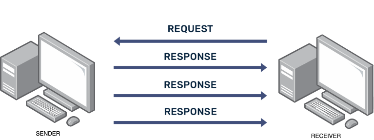

## Deciphering Web Browsing
### Step 1: Application Layer
1. You type `www.example.com` in your browser
2. Your browser prepares an HTTP request
3. The application needs to resolve the domain name to an IP address using DNS

### Step 2: Transport Layer
1. The HTTP request is broken into segments
2. TCP headers are added to each segment
3. These headers include source and destination port numbers (typically port 80 or 443 for web browsing)
4. TCP establishes a connection via three-way handshake (SYN, SYN-ACK, ACK)

### Step 3: Internet Layer
1. IP headers are added to create packets
2. Headers include source and destination IP addresses
3. Routing decisions are made

### Step 4: Link Layer
1. Frames are created with MAC address headers
2. The data is converted to electrical, radio, or light signals

### Step 5: Transmission and Response
1. Data travels across networks to the destination
2. The web server processes the request
3. A response follows the same process in reverse
4. Your browser renders the webpage


8. **Compare HTTP vs HTTPS:**
   - Visit `https://example.com` (note the 's')
   - Look for security-related headers
   - Notice any performance differences

9. **Simulate different conditions:**
   - Use the throttling feature to simulate slower connections
   - Try disabling cache to see how pages load from scratch

**Extension (for advanced students):**
Try testing a more complex website like a news site or social media platform. Identify third-party resources, tracking pixels, and content delivery networks.


## Basic Wireshark Usage

Now that you have Wireshark installed, let's learn how to use it effectively.

### Understanding the Wireshark Interface

Wireshark's interface consists of three main panes:

1. **Packet List Pane (Top)**: Shows all captured packets in sequential order
2. **Packet Details Pane (Middle)**: Shows the protocols and fields of the selected packet in a tree view
3. **Packet Bytes Pane (Bottom)**: Shows the raw bytes of the selected packet in hex and ASCII

### Capture and Display Filters

Wireshark offers two types of filters:

1. **Capture Filters**: Applied before packets are captured, reducing the amount of data processed
   - Simple syntax: `host 192.168.1.1` or `port 80`
   - Set before starting a capture
   - Reduces system load by capturing only relevant traffic

2. **Display Filters**: Applied to packets that have already been captured, helping you focus on specific traffic
   - Rich syntax: `http`, `tcp.port == 443`, `ip.addr == 192.168.1.1`
   - Can be changed on the fly
   - More powerful and flexible than capture filters


_Capture filters are set before capturing, while display filters can be applied to already captured packets_

### Common Display Filters

Here are some useful display filters to start with:

| Filter Expression | Purpose |
|-------------------|---------|
| `ip.addr == 192.168.1.1` | Traffic to/from a specific IP address |
| `http` | Show only HTTP traffic |
| `tcp.port == 80 or tcp.port == 443` | Web traffic (HTTP and HTTPS) |
| `dns` | Show only DNS queries and responses |
| `!arp and !dns` | Exclude ARP and DNS traffic |
| `tcp.flags.syn == 1` | Show TCP connection establishments |
| `http.request.method == "GET"` | Show only HTTP GET requests |
| `ip.src == 192.168.1.5 and ip.dst == 8.8.8.8` | Traffic from your device to Google's DNS |

:::note[Filter Expressions]
Display filters can use logical operators (`and`, `or`, `not`/`!`), comparison operators (`==`, `!=`, `>`, `<`), and can be combined into complex expressions. The filter expression button turns green when the syntax is valid.
:::

### Following TCP Streams

One of Wireshark's most useful features is the ability to follow TCP streams:

1. Right-click on a TCP packet
2. Select "Follow" > "TCP Stream"
3. View the entire conversation in a readable format
4. Color-coding separates client and server communications

This feature is invaluable for analyzing application-layer protocols like HTTP.


_Following a TCP stream shows the complete conversation between client and server_

## Preparing for Packet Capture Activities

Before we dive into our main activity, let's prepare our system to capture different types of traffic. We want to ensure we have interesting data to analyze, particularly from our previous Raspberry Pi to Pico 2W communication.

### Setup for Capturing Wi-Fi and Bluetooth Communication

To capture both Wi-Fi and Bluetooth traffic from our experiments, we need to enable monitoring mode for these interfaces.

#### For Wi-Fi Monitoring:

```bash
sudo airmon-ng start wlan0
```

This converts your wireless interface to monitoring mode. Note that this may disrupt your current Wi-Fi connection, so you might need to use an Ethernet connection for internet access while monitoring Wi-Fi.

#### For Bluetooth Monitoring:

Bluetooth capture requires special configuration:

```bash
sudo apt install bluez-hcidump
sudo hcidump -i hci0 -w bluetooth_capture.pcap
```

This starts capturing Bluetooth packets to a file that can be opened in Wireshark later.

:::tip[Preparing for the Main Activity]

Before the next class session where we'll analyze packets in detail, complete these preparation steps:

1. **Generate communication data:**
   - Set up the Wi-Fi or Bluetooth communication between your Raspberry Pi and Pico 2W as we did in the previous module
   - For Wi-Fi: Run the web server on Pico 2W and access it from the Pi
   - For Bluetooth: Run the BLE communication script between the devices

2. **Capture the traffic:**
   - Use Wireshark to capture Wi-Fi traffic during the communication
   - Use hcidump to capture Bluetooth communication
   - Save the capture files with descriptive names

3. **Basic exploration:**
   - Identify the IP addresses of your devices in the captures
   - Try applying basic filters to isolate the traffic between your devices
   - Flag any interesting packets or patterns you notice for discussion

In our next session, we'll analyze these captures in detail to understand exactly how our devices are communicating at each networking layer.
:::

## Capturing Traffic Between Raspberry Pi and Pico 2W

Let's now specifically focus on capturing traffic between our Raspberry Pi and the Pico 2W. This will prepare us for the detailed analysis in the next section.

### Wi-Fi Communication Capture

If you're using the Pico 2W as a web server (as in our previous module), follow these steps:

1. Start Wireshark on the Raspberry Pi
2. Select the wlan0 interface (or eth0 if you're connecting via Ethernet)
3. Set a capture filter to focus on traffic to/from the Pico: `host [Pico-IP-Address]`
4. Start the capture
5. Access the Pico's web server from the Pi's browser
6. Control the LED or read sensor data through the web interface
7. Stop the capture after sufficient interaction
8. Save the capture file

### Bluetooth Communication Capture

For Bluetooth communication between the Pi and Pico:

1. Run the Bluetooth connection scripts from our previous module
2. In a separate terminal, capture the Bluetooth traffic:
   ```bash
   sudo btmon -w bluetooth_pi_pico.btsnoop
   ```
3. Perform various operations: toggle the LED, request temperature readings
4. Stop the capture with Ctrl+C
5. Open the capture file in Wireshark:
   ```bash
   wireshark bluetooth_pi_pico.btsnoop
   ```

:::note[For Best Results]
To get a clean capture that's easier to analyze, minimize other network traffic during capture. Consider temporarily disconnecting from the Internet or setting up a dedicated network for your Pi and Pico devices.
:::

In the next section, we'll dive deep into analyzing these captures to understand every layer of the communication process between our devices.
